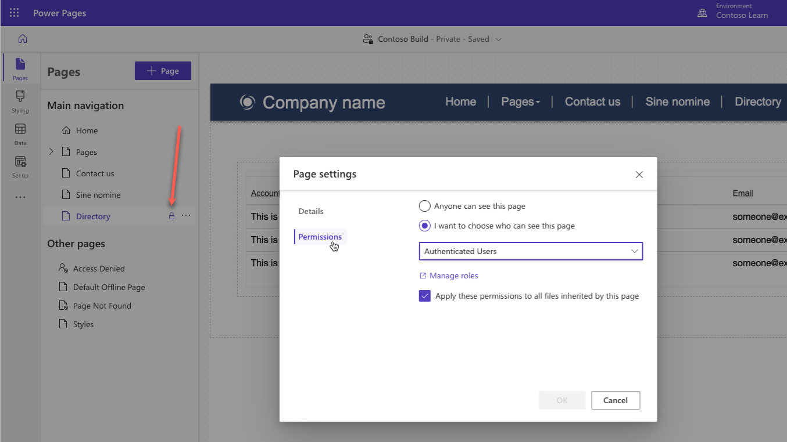
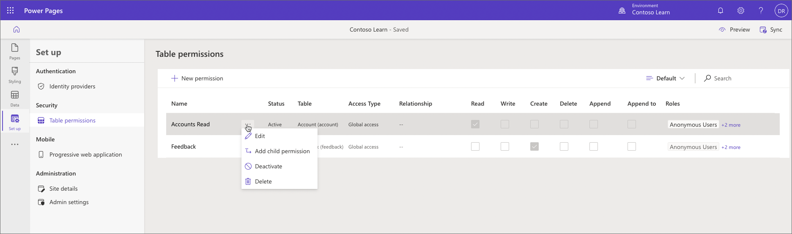

All visitors of a Power Pages site are associated with one or more web roles. These roles, together with page and table permissions, define user access restrictions for the site pages and data.

> [!NOTE]
> Anonymous visitors can only be associated with a single web role marked as **Anonymous Users Role**. Authenticated users are automatically assigned the role marked as **Authenticated Users Role**, plus unlimited number of other web roles.

## Page permissions

You can use page permissions to control user access to individual site pages and files. Page settings can be adjusted to make content available anonymously for public access, or to restrict page access to the users with specific roles.

You can access **Page settings** dialog from the **Pages** workspace using the ellipsis located next to each individual page. You can then use **Permissions** tab to restrict page access to one or more web roles. Pages with access restrictions are marked with a padlock icon in the page hierarchy.     

> [!NOTE]
> You cannot restrict page access to Anonymous Users role. Instead, use **Anyone can see this page** option.

By default, pages with access restrictions are hidden from the site navigation. If anonymous visitor tries to access a protected page using direct link, they'll be redirected to the sign-in page. If a user is signed-in but their roles don't grant them access to the page, they'll be redirected to the **Access denied** page instead.

Page read restrictions are automatically applied to the child pages as well. If more granular control is required, you can use Portal Management app. For more information, see [Manage page permissions with the Portal Management app](/power-apps/maker/portals/configure/webpage-access-control#manage-page-permissions-with-the-portal-management-app).

## Table permissions

You control access to individual pages using page permissions. For more granular control you'll also want to secure page components built with [lists](/power-pages/getting-started/add-list), [forms](/power-pages/getting-started/add-form), [Liquid](/power-pages/configure/liquid-overview), and [Web API](/power-pages/configure/web-api-overview). To secure these individual features, you can configure table permissions to allow different levels of access and privileges to Dataverse rows. Table permissions are associated with web roles to grant appropriate access to users.

> [!IMPORTANT]
> By default, site visitors are denied access to Dataverse data regardless of the web roles assigned to them. Permissions to access table rows must always be granted explicitly regardless of the access method.   

To access the table permissions page in Power Pages design studio, select **Set up** workspace and then select **Table permissions**.

Selecting individual table permissions row will open a new panel where table permissions can be managed, and have the web roles assigned to them.

For more information about Table permissions, see [Configuring table permissions in Power Pages.](/power-pages/security/table-permissions).

