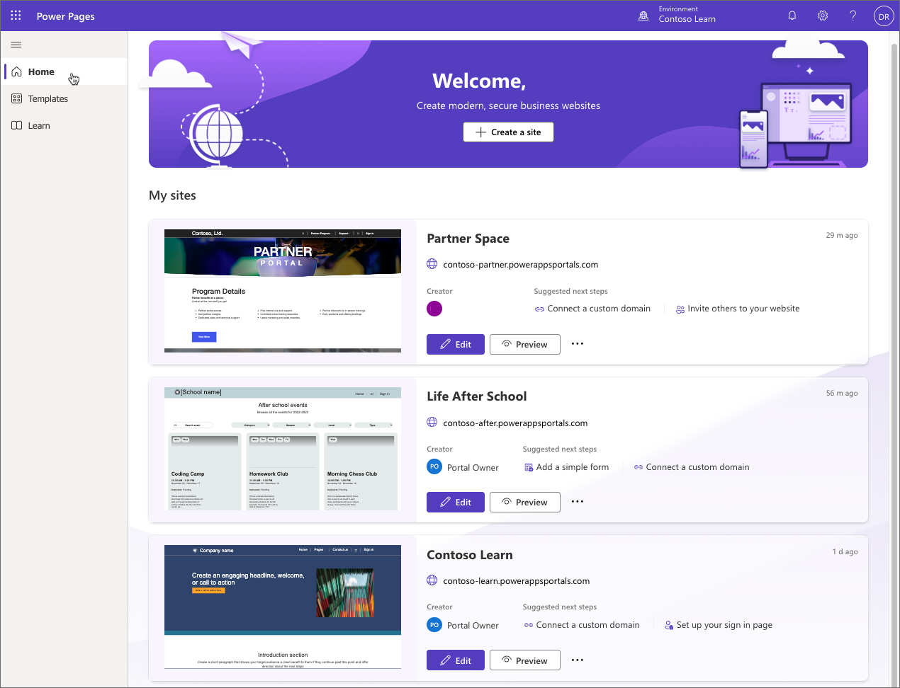
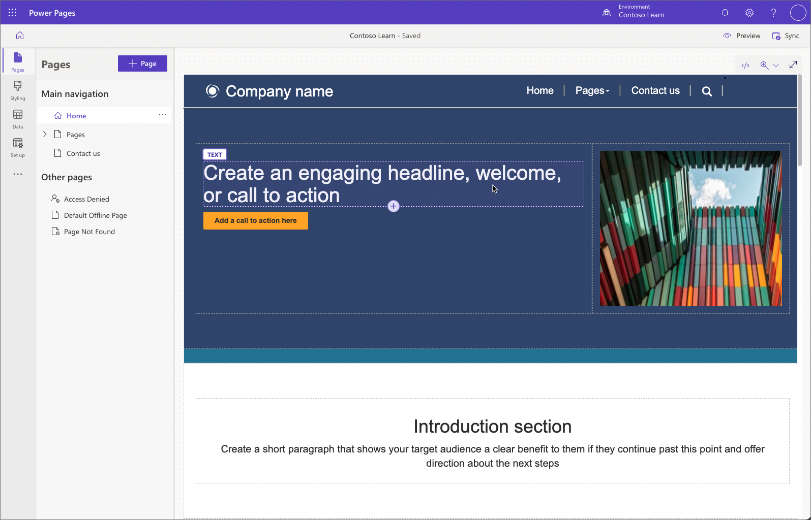
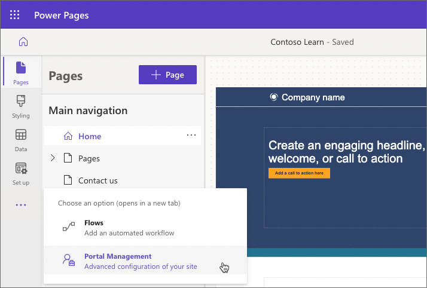

Power Pages provides a unified intuitive experience for makers to create, customize, and manage modern data-driven business websites. Just sign in to [https://make.powerpages.microsoft.com/](https://make.powerpages.microsoft.com/) to get started.

**Power Pages Home** provides a single view of all your websites in an environment and allows you to create more sites using the available templates.

**Template hub** accelerates creation of the new sites using feature-rich templates targeting specific business scenarios. To solve unique business needs start with one of the generic design templates that include page structures, navigation, and commonly used pages.

**Learn hub** helps makers, administrators, and developers learn how to design, build, administer, and extend sites through documentation, guided tutorials, and videos.

## Power Pages design studio

To start with Power Pages design studio, sign in to [Power Pages Home](https://make.powerpages.microsoft.com/), select a site and then select **Edit**. Use **Create a site** to provision a new site if required.

The design studio is organized into workspaces that help makers focus on specific tasks.

* Design and build web pages in the **Pages workspace**, organize site navigation and add content in a low-code environment.
* Create modern look and feel, apply corporate branding, and manage global site styles in the **Styling workspace**.
* Model, visualize, and manage business data in the **Data workspace**. 
* Configure key aspects of your Power Pages site including authentication and permissions in the **Set up workspace**.

Power Pages is built on the foundation of Power Apps portals. Many of the tools and methods used to configure Power Pages use the functionality of Power Apps portals. For advanced configurations that aren't available in the Power Pages design studio, the [Portal Management app](/power-pages/configure/portal-management-app) is accessible from the overflow menu (**...**).

