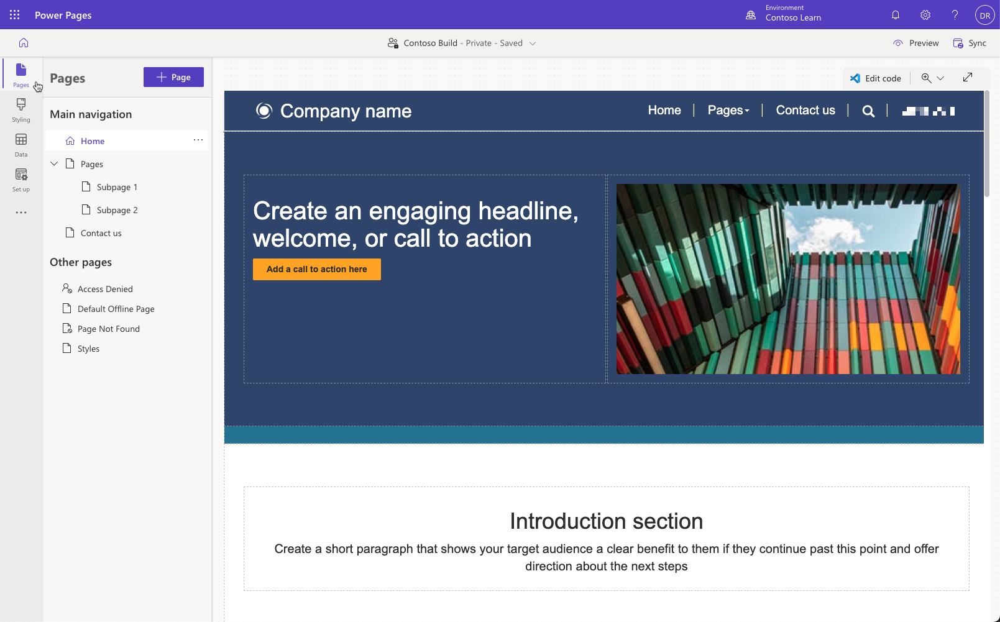
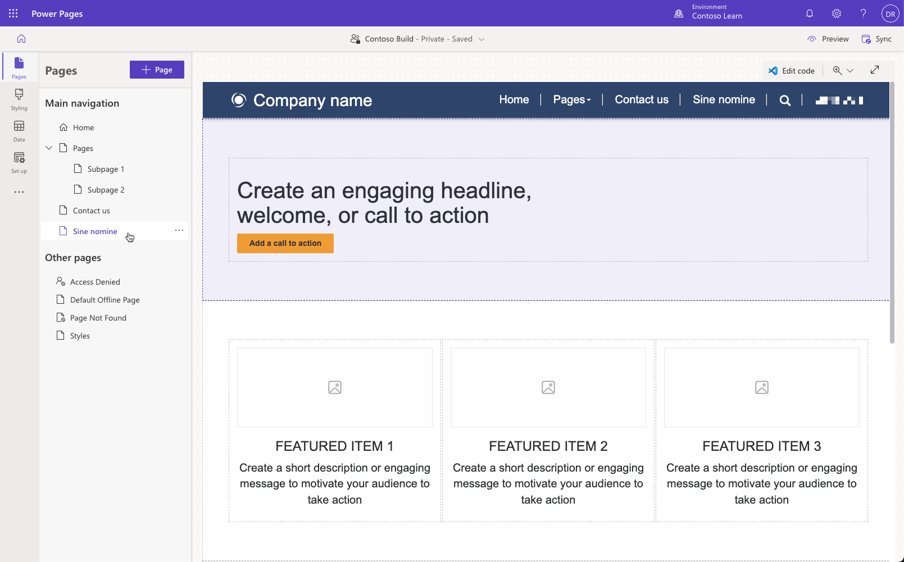
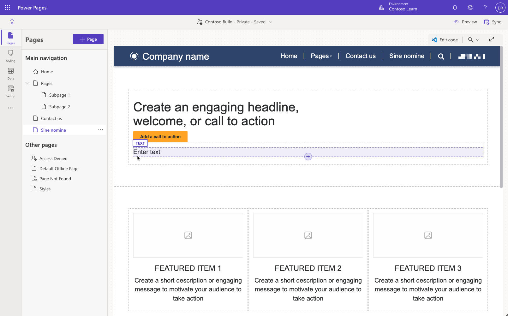
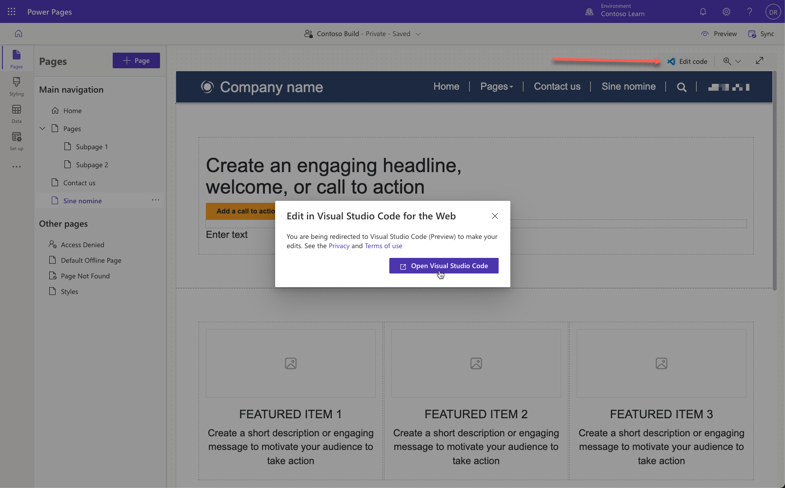
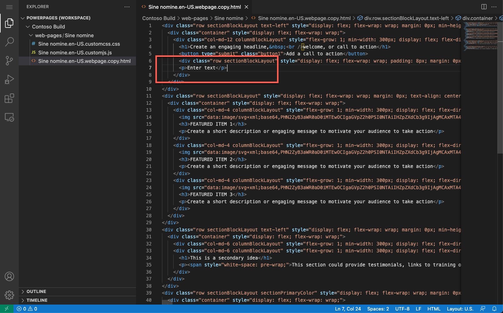
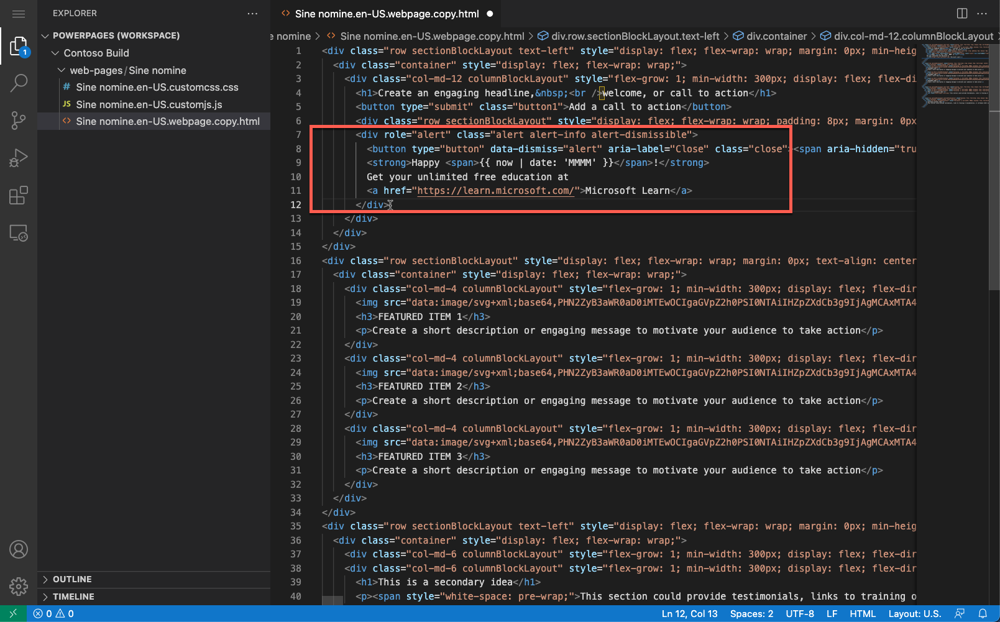
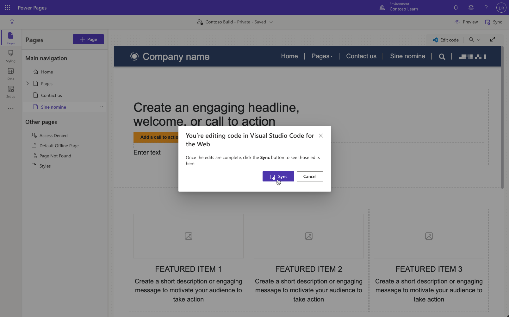
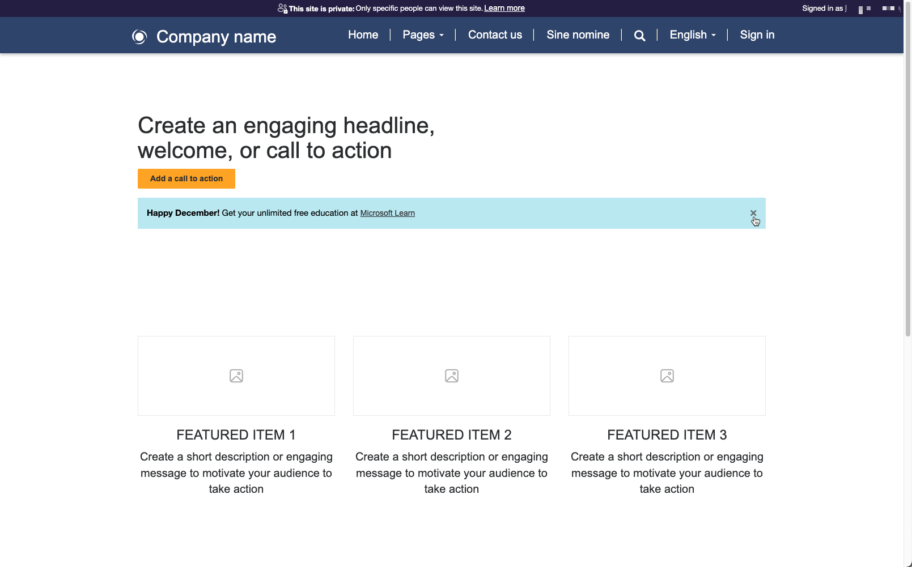

The purpose of this hands-on-lab is to create a web page and edit source code by using Power Pages design studio.

At the end of these exercises, you'll be able to:

- Open Power Pages design studio to edit your portal.
- Create new page using a standard template.
- View the source code of the page.
- Add custom HTML code directly.

For this exercise, you'll need to have the following things:

- A provisioned Power Pages site in your environment. If you don't have a Power Pages site available, follow the [Create and manage Power Pages sites](/power-pages/getting-started/create-manage) instructions to create one.

## Scenario

To enhance the website experience for visitors, sometimes it's necessary to add custom HTML content to a page. In this exercise, you'll add HTML code that creates a dismissible alert. The code will also include a small fragment in [Liquid language](/power-apps/maker/portals/liquid/liquid-overview) creating a dynamic greeting for the visitor.

### High-level steps

1. Open your portal in Power Pages design studio.
2. Create a new landing webpage.
3. Edit page, add a spacer and content placeholder then add HTML code.
4. Save the page and browse the site to view the results.

## Detailed steps

### Launch Power Pages design studio

1. Sign in to [Power Pages](https://make.powerpages.microsoft.com/?azure-portal=true).

1. Select a target environment by using the environment selector in the upper-right corner.

1. Select your site then select **Edit** to launch the design studio.

1. Make sure **Pages** workspace is selected.

   

### Create a web page

1. Select **+ Page** button.
6. Enter a page name.
3. Select **Landing Page** standard layout, then press **Add**.
   

### Edit page

1. Select the first button on the page. Press the plus sign (**+**), then select **Spacer** element. That command will add small space before our custom content.

2. Select the spacer, press the plus sign (**+**), then select **Text** element. That command will add a placeholder for our custom content.

3. Your page should look like this:

   

4. Press **Edit code** to open the page in Visual Studio Code for the Web editor. 

5. When prompted, select Open Visual Studio Code:
    

6. This selection will open a new window or a tab with Visual Studio Code for the Web. Locate the text element created earlier with the words `Enter text`:
   

7. Copy the following code and paste it into the page source replacing `<p>Enter text</p>` content:

    ```html
    <div role="alert" class="alert alert-info alert-dismissible">
      <button type="button" data-dismiss="alert" aria-label="Close" class="close"><span aria-hidden="true">×</span></button>
      <strong>Happy <span>{{ now | date: 'MMMM' }}</span>!</strong>
      Get your unlimited free education at 
      <a href="https://learn.microsoft.com/">Microsoft Learn</a>
    </div>
    ```

8. Your content should now look like this:
    

9. Press **Ctrl-S** (**⌘-S** on macOS) to save the file.

10. Switch to design studio window. Press **Sync** button to synchronize the editors and show the updated content on the canvas:
    

11. The changes will appear on the design studio canvas. Press **Preview** button in the top right corner then select **Desktop**.

12. Your custom page with a dismissible alert will open. 

13. Check that the greeting includes current month.

14. Press cross (x) icon to dismiss the alert.
