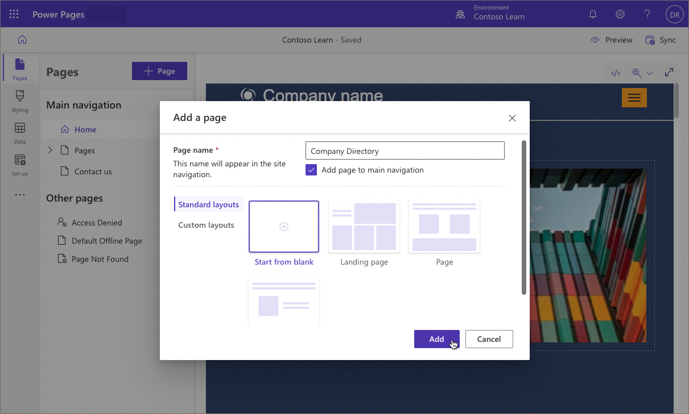
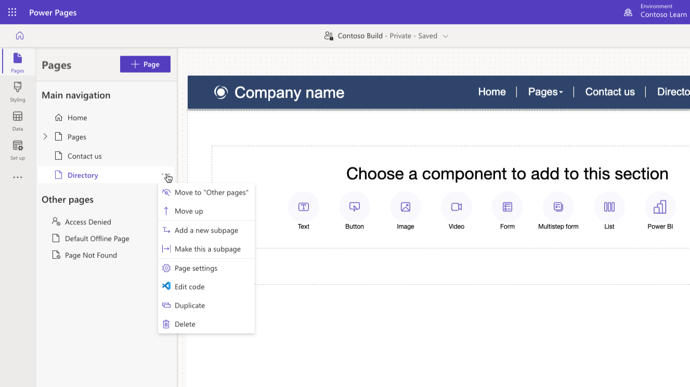
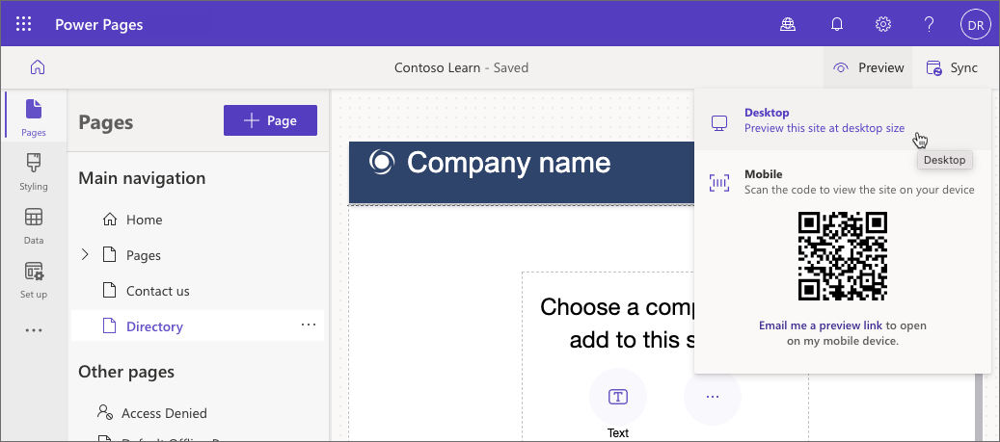

You can quickly add and organize new pages in the **Pages** workspace of Power Pages design studio.

## Create a page

In the Power Pages design studio, select **Pages workspace**, and then select **+ Page**. You'll be presented with the option to select from either standard or custom layouts. The standard layout choices depend on the site template used and the custom layouts are the page templates added to the site by makers and pro developers.

After you've entered a page name and selected a layout, the page will appear on the canvas, and you can start adding and editing components to the page.

## Configure site structure 

You can configure where and how the page appears in the site navigation. Select the ellipsis (**...**) next the page you want to move and then perform one of the available actions.

> [!NOTE]
> The selection of available actions depends on the page position in the navigation. 

You can move the page up and down, make it a subpage, hide it from the main navigation by moving to the **Other pages** group (the page will still be accessible via a URL), duplicate the entire page, or delete it. You can also change the page hierarchy in the **Main navigation** section by dragging and dropping the page name. For the full list and detailed description of available actions, go to [Create site structure](/power-pages/getting-started/structure-site).

## Preview a page

You can preview the page by selecting **Preview** from the command bar. 

Select **Desktop** to preview your page in a browser, or scan the QR code to view the page on a mobile device.

> [!NOTE]
> Using preview command resets the site cache. System will retrieve a fresh copy of the site configuration and the relevant business data. That may have a brief impact on the page performance.
