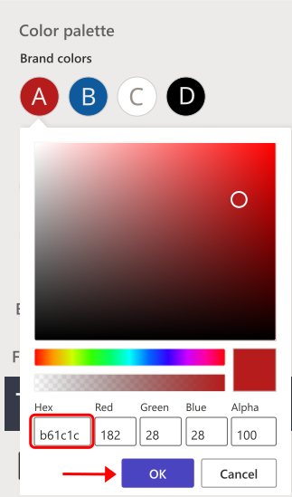

In this exercise, you'll modify styles on the Contoso Coffee Website. 

1. Navigate to your [Power Page](https://make.powerpages.microsoft.com), and select **Edit** on the Power Page site you've created. 

    > [!NOTE]
    > If you don't see your page you've created, double check at the top right that you are in the developer environment you've created, and not a Personal Productivity environment. 

	> [!div class="mx-imgBorder"]
	> 

1. From within the Power Pages design Studio, select **Styling** on the left panel to access the Styling Workspace.

	> [!IMPORTANT]
	> In this styling panel, you have options to change certain styles across your site, including setting a theme, changing the color palette to match your brand colors, updating the spacing and margins, customizing the look of site-wide buttons, and updating the font styles used across the site. 

    > [!div class="mx-imgBorder"]
    > 

1. Under **Color palette**, change the **Brand colors** from the default colors to the Contoso Coffee brand colors (listed  below). When you're finished, select the OK button. 
   
	- Hex: b61c1c

	- Hex: 0e5a9d

	- Hex: ffffff

	- Hex: 000000

	> [!div class="mx-imgBorder"]
	> 
	
	> [!div class="mx-imgBorder"]
	>  

1.  Change each of the **Fonts** to **Helvetica**. Make sure your title is set to a color that is easy to see. 

	> [!div class="mx-imgBorder"]
	> 

1. Under **Site Navigation**, set the font color to **red** (or a color that is easy to see for the options you've chosen). This will make it easier for users to see the navigation options. Set the font to **Helvetica**, and the **On-hover outline** color to **red**. 

	> [!div class="mx-imgBorder"]
	> 

1.  Under the **Buttons + links** area, set the **Primary** button's brand color to the color **black**, and the **Style** to **Filled** if it not already. Set the button's **Font** to **Helvetica** and the font color to **white**. For the **On-hover**, set the **Style** to **Filled**, the **Fill** to **white**, and the **Font** to **black**.

	> [!div class="mx-imgBorder"]
	> 

1.  Set the **Secondary** button's brand color to the color **red** and the font to **white**. Set the **Style** to **Filled** if it isn't already, and set the **Font** to **Helvetica**. For the **On-hover**, set the **Style** to **Filled**, the **Fill** to **white**, and the **Font** to **red**.

	> [!div class="mx-imgBorder"]
	>  

1.  Under **Sections > Margins & spacing**, set the column margin to **10 px** and the column padding to **16 px**.

	> [!div class="mx-imgBorder"]
	>  

1.  Select the **Save** button to save your changes.

	> [!div class="mx-imgBorder"]
	> 
