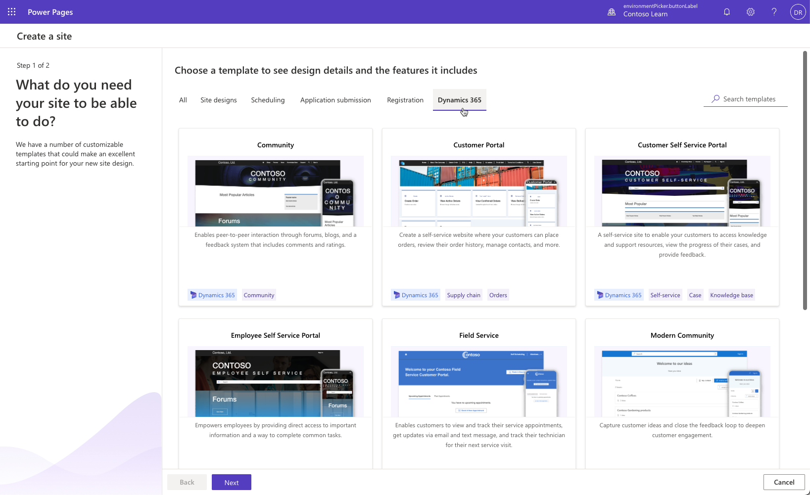
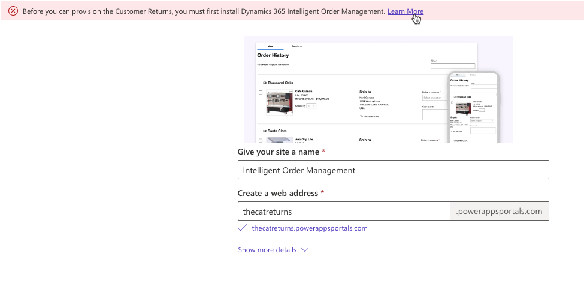

If you're using Microsoft Dynamics 365 apps such as Dynamics 365 Sales or Dynamics 365 Service, you have a choice of more **Dynamics 365 templates**.

> [!div class="mx-imgBorder"]
> 

The following Dynamics 365 templates are available:

- Community and Modern Community

- Customer and Employee Self Service Portals

- Partner Portal

- Field Service

- Customer Portal (Dynamics 365 Supply Chain Management)

- Order Returns (Intelligent Order Management)

> [!NOTE]
> Some of the templates depend on specific Dynamics 365 solutions and features. If these prerequisites are not met, specific template may not be listed or the installation may fail.

> [!div class="mx-imgBorder"]
> 

## Dynamics 365 site templates

Each Dynamics 365 site template includes a particular set of features designed to accelerate solution development that targets selected audience.

> [!WARNING]
> Currently, some components in these templates may not work as expected when opened in the Power Pages design studio and editing may require pro-developer experience and site editing using Portal Management app.

| Portal template              | Audience                       | Workload                                                     |
| ---------------------------- | ------------------------------ | ------------------------------------------------------------ |
| Community                    | Partner, Customer              | Choose this template to provision a site that is focused on an online community. This site will contain features such as forums, ideas, blogs, and case management. |
| Modern Community             | Customer, Community            | This site is designed to make it easier to capture and evaluate customer ideas and collaborate with your target audience in a simple, engaging way. It includes popular interactions like up-votes, comments, following, and more. Requires Dynamics 365 Customer Service Community solutions installed from App Source. |
| Customer self-service        | Partner, Customer              | This template provides the ability for your customers to access self-service support resources, including a searchable knowledge base, activity updates, and feedback options. |
| Employee self-service        | Employee                       | This site enables your workforce to access information, resources, and complete common tasks through simplified workflows. |
| Partner                      | Partner, Customer, Field Agent | Enables organizations with resellers, distributors, suppliers, or partners to provide real-time interactions for every step of shared activities. Add-ons are available for Dynamics 365 Field Service or Dynamics 365 Project Service. |
| Field Service                | Customer                       | This site provides a simplified way for your customers to book new appointments, manage existing appointments, and track their assigned technician. It delivers updates and estimated times of arrival to your customers using email and text messages. |
| Customer portal              | Enterprise B2B                 | This customer-centric site enables your target audience to engage, place orders, review order history, manage contacts, and other information from Dynamics 365 Supply Chain Management. |
| Intelligent Order Management | Customer                       | This customer-centric site enables your target audience to engage, place returns, review return order history, and monitor their refund status from Dynamics 365 Intelligent Order Management. |

> [!IMPORTANT]
> Review current licensing guides to determine the licenses, subscriptions, and capacity that is required for internal and external authenticated users and anonymous page views. For more information, see the [Dynamics 365 Licensing Guide](https://go.microsoft.com/fwlink/p/?LinkId=866544) or the [Power Apps Licensing Guide](https://go.microsoft.com/fwlink/?linkid=2085130). Integration to other services such as SharePoint or Power BI will require appropriate capacity and licensing.

Power Pages is evolution of [Power Apps portals](/power-apps/maker/portals/?azure-portal=true). It's built on the Power Apps portals platform used by thousands of customers today, providing the same robust capabilities and pro developer experiences. One of the benefits of the established foundation is availability of Dynamics 365 templates offering rich, tried and tested functionality and features that can help you get started quickly.

> [!VIDEO https://www.microsoft.com/videoplayer/embed/RWrEVT]
