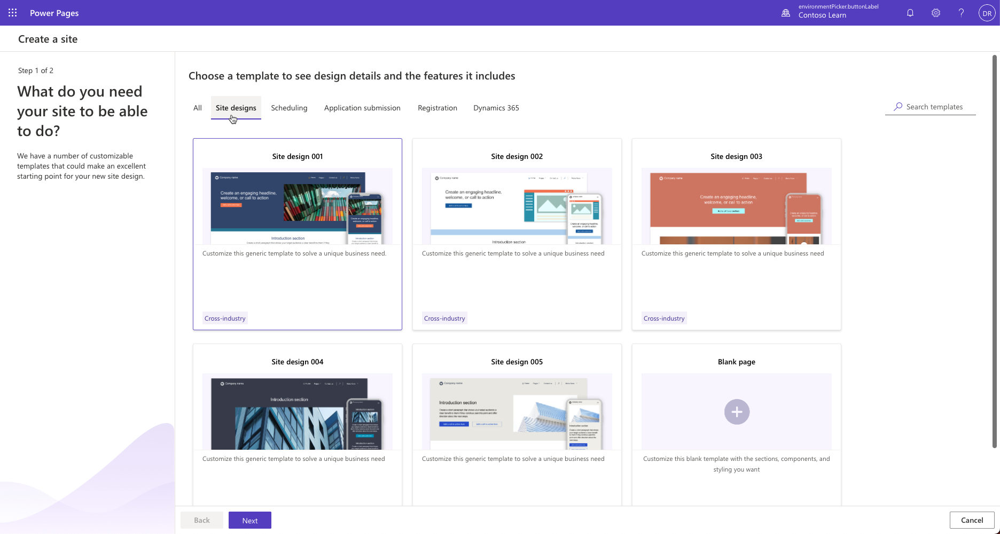
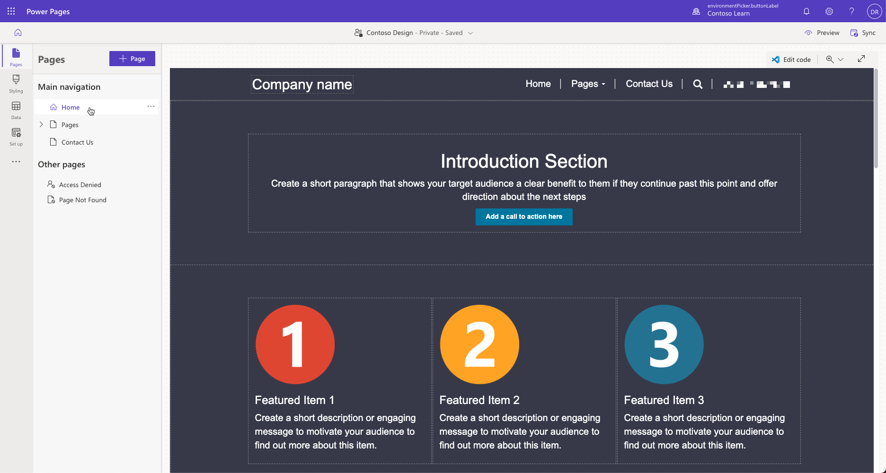
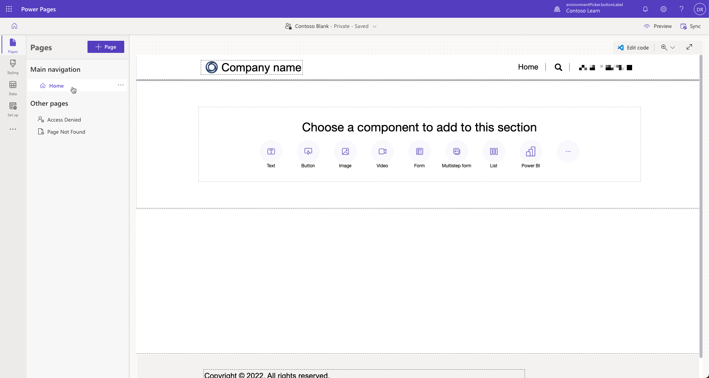

If your business scenario doesn't align with any of the scenario-based templates, you can select one of the **site design** templates. They provide building blocks for you to create custom sites. There are multiple variations of this template, each with different layout, images, and colors that can be used as-is or customized to meet your needs. You can see the full list of the available site design templates available by selecting the **Site designs** tab during the site provisioning process.

> [!div class="mx-imgBorder"]
> 

There are common pages, forms, and customizable tables provided in each of the site design templates. You can modify these components to align functionality and design with your specific project needs.

Each template includes a home page, many subpages with various sample layouts, a contact us feedback form, and a search results page.

> [!div class="mx-imgBorder"]
> 

For a complete list of the included components, see [Site design templates](/power-pages/templates/site-design/?azure-portal=true).

## Blank page template

You can select the **blank page template** to create a custom site with no preset sections or components. This template includes just a home page with a header, footer, and a single section. Use this template to build a site to your exact specifications.

> [!div class="mx-imgBorder"]
> 
