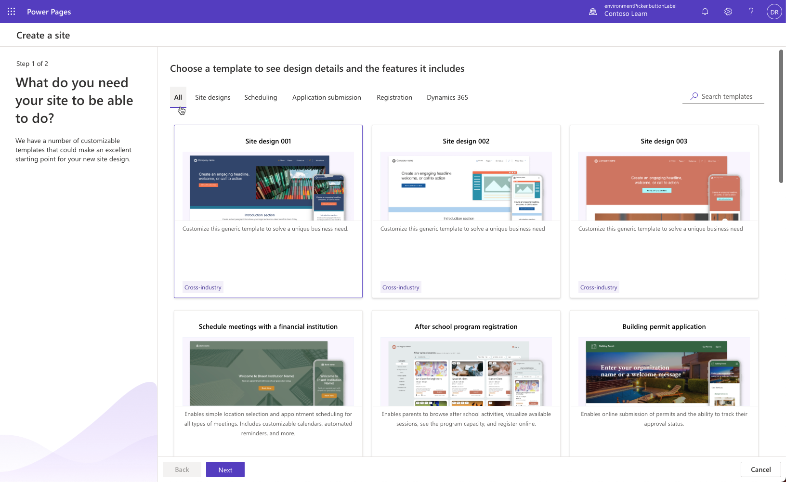

When you create a new Power Pages site, you can choose a specific site template that would best align with the particular business requirements. These templates accelerate the configuration of a site based on the intended audience and workload.

> [!div class="mx-imgBorder"]
> 

Power Pages offer many customizable templates.

* To solve unique business needs, start with one of the **generic design template** that includes page structures, navigation, and commonly used pages.

* Use a one-page **blank template** as a simple starting point to create a custom site with no preset sections or components.

* Choose a **scenario-based template** if your business requirements align with the solution included in the template.

* If you're using Microsoft Dynamics 365 apps such as Dynamics 365 Sales or Dynamics 365 Service, you have a choice of more **Dynamics 365 templates**.

All site templates include many design and data components addressing specific requirements and functionality. A template may include Dataverse tables, views, and forms, multiple page templates, custom code and code components. In more complex scenarios, it may also include a template-specific app, automation components, security elements, and more.

Makers can modify some of the components to align the site with the specific project needs. Pro developers can use the [Microsoft Power Platform CLI](/power-pages/configure/cli-tutorial/?azure-portal=true) to download the site metadata, and use Visual Studio Code to view and modify the source code.

All Power Pages templates are built on common foundation and include the following features:

* Build the site in Power Pages design studio.

* Content management, including content publishing, design, theming, search, multi-lingual support, and templating.

* Extensibility built on web pages, templates, forms, lists, and more.

* Security that is based on identity management, web roles, page and table permissions.
