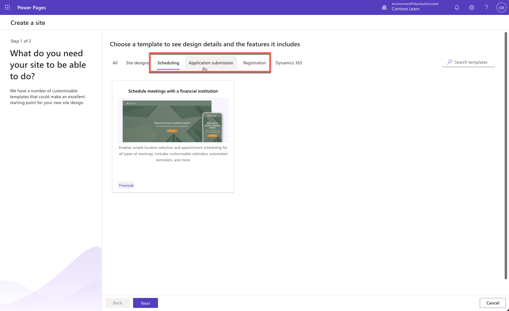

You can accelerate Power Pages site development by choosing a **scenario-based template** if your business requirements align with the solution included in the template.

> [!div class="mx-imgBorder"]
> 

You can select one of the following templates:

* The **after school program registration** template if your scenario requires a registration site to create events and allow stakeholders to register. For more information including a complete list of components and template capabilities, see [After school program registration template](/power-pages/templates/after-school/?azure-portal=true).

* The **schedule meetings with a financial institution** template if your site requires scheduling capabilities, view availability and schedule a meeting online. More information: [Schedule meetings with a financial institution template](/power-pages/templates/book-a-meeting/?azure-portal=true).

* The **building permit application** template if you need to build a site to allow customers to submit applications and receive email notifications on the status of their application. More information: [Building permit application template](/power-pages/templates/building-permit/?azure-portal=true).
