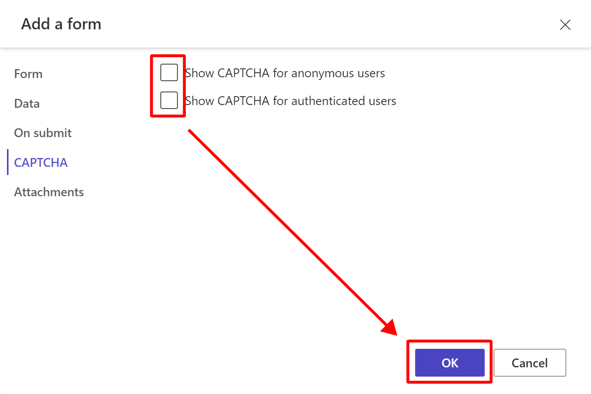

In this exercise, you add a form to a webpage.

1. On the Machine Orders Details page, hover your mouse cursor over the header you added in the previous lab and then select the plus (**+**) icon beneath the text component. Select the **Form** option.

   > [!div class="mx-imgBorder"]
   > 

1. From the modal, select **+ New form**.

   > [!div class="mx-imgBorder"]
   > 

1. Select the **Machine Order** table, select **Supplier Form** from the **Select a form** dropdown menu, and then name your form as **Supplier Form**.

   > [!div class="mx-imgBorder"]
   >   

1. Select the **Data** tab and then modify the value to **Updates an existing record**. Suppliers only update orders. They don't create them.

   > [!div class="mx-imgBorder"]
   > 

   > [!NOTE]
   > In the event that a supplier would need to create a new record, instead, you would select the **Creates a new record** option. This will allow for authenticated users of your site to create a record.

1. Select the **CAPTCHA** tab, clear both checkboxes, and then select **OK**.

   > [!div class="mx-imgBorder"]
   > 

The form should load and appear on the webpage as shown in the following screenshot. If a blank form displays, wait 1-3 seconds for the component to finish rendering on the webpage.

> [!div class="mx-imgBorder"]
> 
