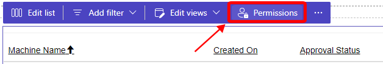
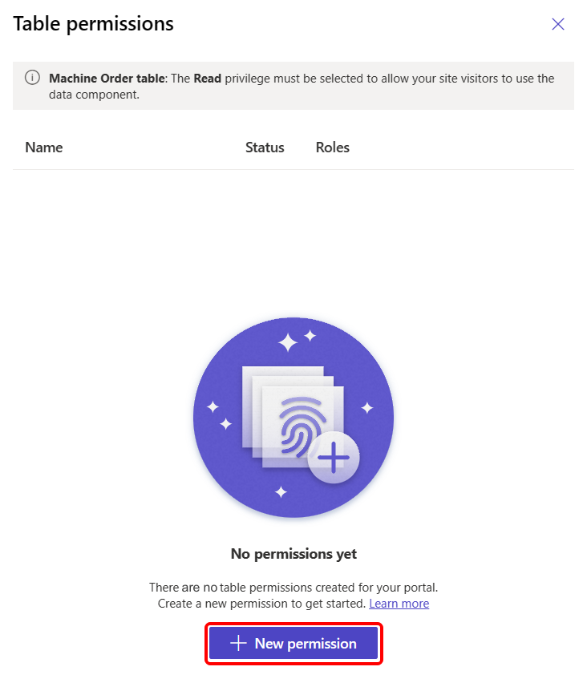
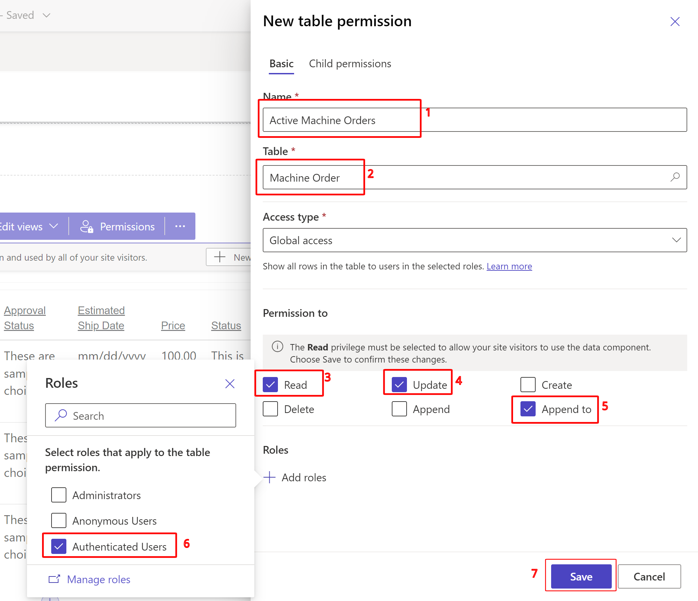

To resolve the error from the previous task, you create a table permission. Access to Microsoft Dataverse records is automatically restricted in Power Pages when you're using forms, lists, Liquid, the Portals Web API, and other components that access Dataverse tables. You need to create table permissions to allow access to Dataverse records in Power Pages sites.

1. Return to the Power Pages design studio tab.

1. Hover your mouse cursor over the **Machine Orders** list and select **Permissions** from within the purple rectangle.

   > [!div class="mx-imgBorder"]
   > .

1. At the bottom right of the pop-up dialog, select **+ New permission**.

   > [!div class="mx-imgBorder"]
   > 

1. In the **New table permission** dialog, fill in the fields with the following values:

   **Name** - Active Machine Orders

   **Table** - Machine Order

   **Access type** - Global access

   **Permission to** - Read, Update, Append to

   **Roles** - Authenticated User

   > [!div class="mx-imgBorder"]
   > 

   The **Authenticated Users Role** is a default web role that doesn't need to be assigned to users technically. When a user is signed in to the website, they get the permissions that are associated with this role. Commonly, you'd use this web role to provide a predetermined access for users who aren't associated with any other web roles. Contoso Coffee only has one user persona for this website: the suppliers. Therefore, Authenticated User = Supplier.

1. Select **Save**.
