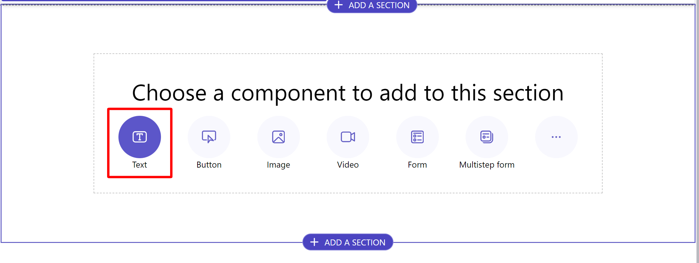

The Power Pages site needs a way for the suppliers to navigate to their order details. To help meet the requirement, you create a list.

1. Create a new webpage named **Machine Orders** that uses the blank layout, and make sure that the **Add page to main navigation** checkbox is selected.

   > [!div class="mx-imgBorder"]
   > 

1. Within the prompt to **Choose a component to add to this section**, select **Text**.

   > [!div class="mx-imgBorder"]
   > 

1. Enter **Machine Orders** in the text box and then change **Paragraph** to **Heading 1**.

   > [!div class="mx-imgBorder"]
   > 

1. Select the plus (**+**) icon beneath the heading you created and select **List** from the options.

   > [!div class="mx-imgBorder"]
   > 

1. In the **Set up** tab, select the **Machine Order** table, set the data view to **Active Machine Orders**, and then name the list **Active Machine Orders**. You can select multiple views, but you only use one for this lab.

   > [!div class="mx-imgBorder"]
   > 

1. Select **Actions** and then scroll down to **Row actions**.

1. Turn on the **Edit record** toggle. Set the **Target type** to **Webpage**, the **Webpage** to **Machine Order Details**, and then change the **Display label** to **Update**. Select **Done**.

   > [!div class="mx-imgBorder"]
   > 

## Bug workaround

For this scenario, a bug was found in websites that use the enhanced data model, and the Edit record configuration wasn't saved from the design studio. To fix this bug, follow these steps:

> [!NOTE]
> If you are not using the enhanced data model, skip to **Step 4** of this lab.

1. In the **List settings** window, select **More options** and then select **Open the Portal Management App**.

   > [!div class="mx-imgBorder"]
   > 

   The Power Pages Management app opens, where you can edit the website configuration data directly.

1. Select the **Options** tab and then scroll down to the **Grid Configuration** section. In the **Item Actions** area, select **Edit** and then fill in the following values:

   **Target Type** - Basic Form

   **Basic Form** - Supplier Form

   **Button Label** - Update

   > [!div class="mx-imgBorder"]
   > 

1. Select **Save & Close**.

   > [!div class="mx-imgBorder"]
   > 

1. Return to the design studio, and then select **Sync**.

   > [!div class="mx-imgBorder"]
   > 

    The preview in the studio should resemble the following screenshot.

   > [!div class="mx-imgBorder"]
   > 

   > [!NOTE]
   > If you did not need to perform the bug workaround, continue from this step.

1. In the upper-right corner of the screen, select **Preview > Desktop**.

   > [!div class="mx-imgBorder"]
   > 

1. The website loads in a new tab. Within the list on the page, an error message appears, stating that you don't have permission to view the records. The next task will address this issue.

   > [!div class="mx-imgBorder"]
   > 
