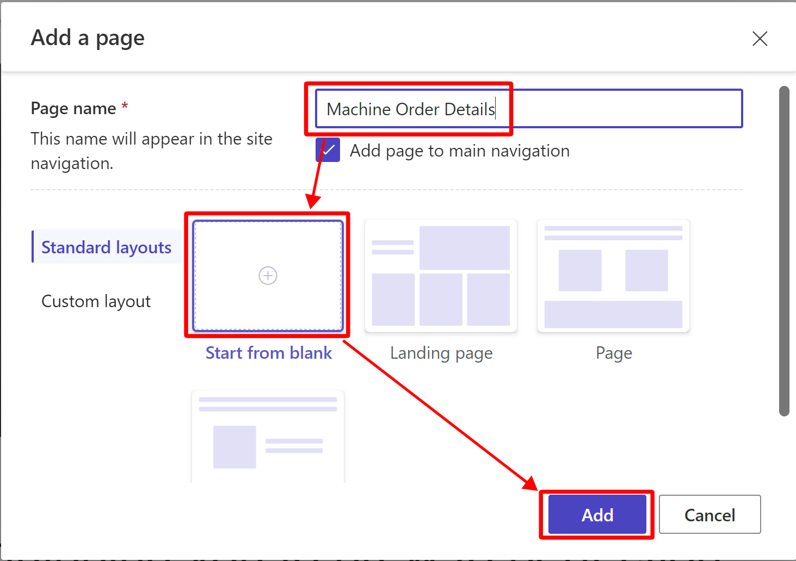

A Power Pages site is a website, and it's made up of webpages. Contoso Coffee's suppliers need a way to update their orders' forms, so you'll create the webpage that hosts the form.

1.  From the **Data** workspace, return to the **Pages** workspace.

	> [!div class="mx-imgBorder"]
	> 

1.  Within the **Pages** pane, select **+ Page** to add a new page.

	> [!div class="mx-imgBorder"]
	>  

1.  Name the page **Machine Order Details**, clear the **Add page to main navigation** checkbox, and then leave the **Start from blank** layout selected. Select **Add** once complete.

	> [!div class="mx-imgBorder"]
	>  

1.  Within the prompt to **Choose a component to add to this section**, select **Text**.

	> [!div class="mx-imgBorder"]
	> 

1.  Enter **Order details** in the text box and then change **Paragraph** to **Heading 1**.

	> [!div class="mx-imgBorder"]
	> 
