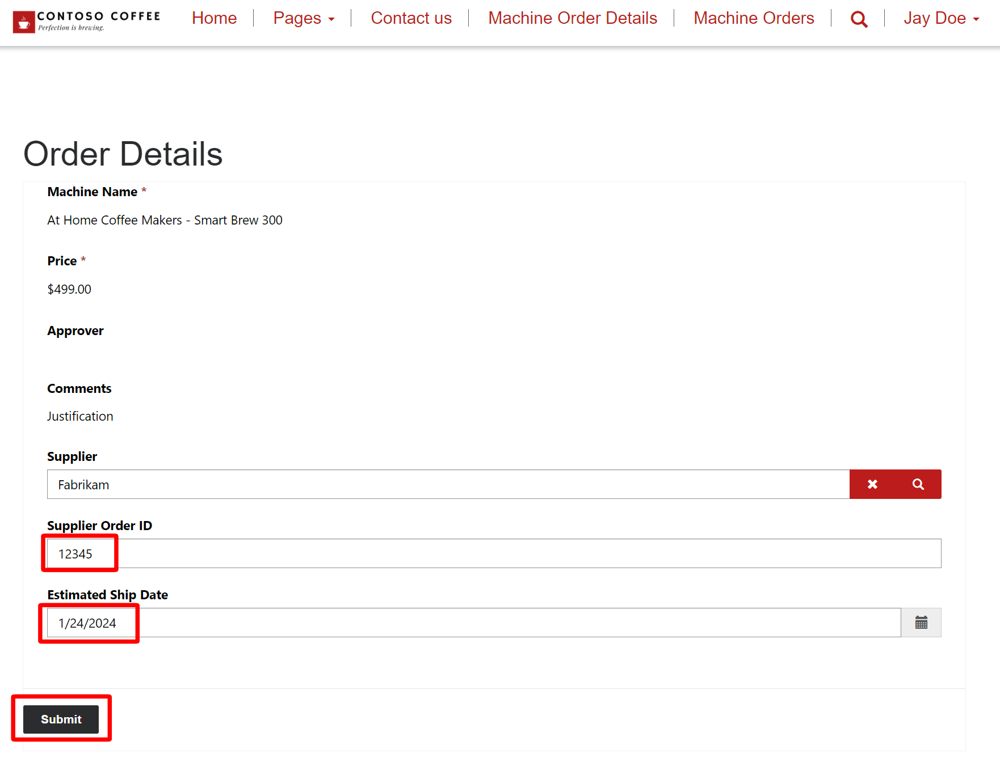

Contoso Coffee works with several different supplier accounts. Your site's users are part of different companies, so you need to ensure that a supplier from Account A can't view orders for Account B. However, employees of Account A must be able to view all orders for Account A. In the previous task, you set up the Machine Order table permission to be set to **global**, meaning that users can view all orders, regardless of the account.

An example of this scenario would be three separate Contoso Coffee Suppliers.

### Contoso Supplier A

Employees:

- Miles Abolrous

- Jelena Vojnovic

### Contoso Supplier B

Employees:

- Henrikas Martinkus

- Isioma Jidefor

### Contoso Supplier C

Employees:

- Petra Balciunas

- Yashita Krishnamurti

> [!div class="mx-imgBorder"]
> 

Each supplier group should only see the records related to them, and not records related to another supplier group.

We also want to prohibit any anonymous or unauthorized users from viewing records that aren't associated with them. These images show a detailed diagram displaying what permissions each group would have in relation to records for a given supply group.

### Supplier Group A

> [!div class="mx-imgBorder"]
> 

### Supplier Group B

> [!div class="mx-imgBorder"]
> 

### Supplier Group C

> [!div class="mx-imgBorder"]
> 

Your first task in this exercise is to set up a few components to enable this granular control over data.

1. From Power Pages design studio, go to the **Data** workspace. Under **Tables**, select **Machine Orders > Forms > Supplier Form**.

1. From the ribbon at the top, select **+ Add field**. Scroll down and select the **Supplier** column to add it to the form.

   > [!div class="mx-imgBorder"]
   > 

1. Select **Save and Publish** in the upper-right corner of the screen.

   > [!div class="mx-imgBorder"]
   > 

1. By creating the Supplier/Account lookup field, you create a relationship with the Machine Orders table.

1. Go to the **Setup** workspace and then select **Table permissions**.

   > [!div class="mx-imgBorder"]
   > 

1. Locate the **Active Machine Orders** permission.

1. Deactivate the permission by selecting the **...** next to the permission name, then selecting **Deactivate**.

   > [!div class="mx-imgBorder"]
   > 

1. Select **Yes** to deactivate the permission.

   > [!div class="mx-imgBorder"]
   > 

1. The **Active Machine Orders** permission should now be inactive. Select **+ New Permission** at the top of the list of table permissions.

   > [!div class="mx-imgBorder"]
   > 

1. Create a new permission with the following settings:

   - **Name:** Active Account Orders
   - **Table:** Machine Order
   - **Access Type:** Account Access
   - **Relationship:** ppcat_ppcat_machineorder_Supplier_account
   - **Permissions:** Read, Update, Append to

   > [!div class="mx-imgBorder"]
   > 

1. Select **Save**.

1. Select **Preview > Desktop**.

   Returned records are no longer visible in the **Machine Orders** list because your contact record isn't related to accounts that have machine orders associated with them.

   > [!div class="mx-imgBorder"]
   > 

1. Return to the Power Pages home page.

   > [!div class="mx-imgBorder"]
   > .

1. Select **Solutions**.

   > [!div class="mx-imgBorder"]
   > 

1. Open the **Pages in a Day** solution.

1. In the **Apps** node, select **Contoso Coffee Supply Management** and then select **Play** to open the model-driven app.

   > [!div class="mx-imgBorder"]
   > 

   A new tab opens in your browser, where you can view a list of records that you created from the canvas app.

   > [!div class="mx-imgBorder"]
   > 

1. From the **Machine Names** list, select a machine name to open its record and view its form.

1. On the **Supplier** form, go to **Supplier**, put your cursor into the field, and then select **+ New Account**. Because you don't have **Account** records yet, you need to create one.

   > [!div class="mx-imgBorder"]
   > 

1. On the **Quick Create: New Account** form, enter a fictitious supplier name in the **Account Name** field then select **Save & Close**.

   > [!div class="mx-imgBorder"]
   > 

1. You're returned to the **Machine Order** form. If the **Supplier** field isn't already filled in, go to **Supplier**, select the field, and then press the **Enter** key on your keyboard. Select the name of the account that you created.

   > [!div class="mx-imgBorder"]
   > 

1. Select **Save & Close**.

   > [!div class="mx-imgBorder"]
   > 

1. Return to the Power Pages home page and then edit your site to return to the design studio.

1. Go to the **Data** workspace. Search for the Contact table and then select your contact record. Select **Edit row using form**.

   > [!div class="mx-imgBorder"]
   > 

1. In the contact form that appears, change the form source from **Contact** to **Portal Contact**.

   > [!div class="mx-imgBorder"]
   > 

1. Select the **company** field and assign the supplier **account** that you created in a previous step.

   > [!div class="mx-imgBorder"]
   > 

1. Select **Save & Close**.

   > [!div class="mx-imgBorder"]
   > 

1. Return to your tab with Power Pages design studio and select **Done** to sync the changes made.

   > [!div class="mx-imgBorder"]
   > 

1. Select **Preview > Desktop** in the upper-right corner of the studio. A machine order record should now show on the page.

   > [!div class="mx-imgBorder"]
   > 

1. Select the machine name to open its form. Update **Supplier Order ID** and **Estimated Ship Date** and then select **Submit**.

   > [!div class="mx-imgBorder"]
   > 

1. Because you're still missing a permission, you receive an error message. Though you have a table permission for Machine Orders, it now references the Account table on its form. You need to create a permission for the Account table.

   > [!div class="mx-imgBorder"]
   > 

1. Return to Power Pages design studio. Go to the **Set up** workspace if you aren't already there and then select **Table permissions**, and the **More Commands (...) > Add Child Permission** next to **Active Account Orders**.

   > [!div class="mx-imgBorder"]
   > 

1. Add a new child permission and then set the following permission values:

   - **Name** - Machine Orders > Supplier

   - **Table** - Account

   - **Relationship** - Select the available relationship from the dropdown menu

   - **Permissions** - Read, Update, and Append

   > [!div class="mx-imgBorder"]
   > 

1. Select **Save**. You should see the following permission appear once you're finished.

   > [!div class="mx-imgBorder"]
   > 

1. In Power Pages design studio, select **Preview > Desktop**.

1. On the **Machine Order** page, again attempt to update a record's **Supplier Order ID** and **Estimated Ship Date**.

   > [!div class="mx-imgBorder"]
   > 

You see the following message once you submit the update:

> [!div class="mx-imgBorder"]
> 
