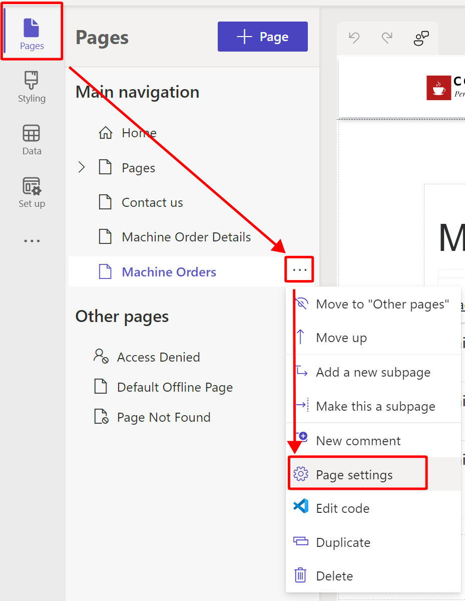
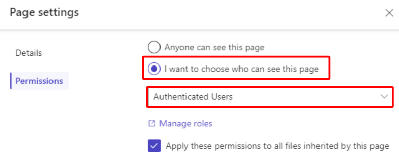

You've set up security for the Dataverse tables, and now you'll ensure that the actual pages are more secure. You don't want unauthenticated users going to the **Machine Orders** page and getting a permissions error because you'd rather lock down the page.

1.  Return to the tab with Power Pages design studio and then go to the **Pages** workspace. 

1.  Select the ellipses (**...**) menu to the right of the **Machine Orders** page and then select **Page settings**.

	> [!div class="mx-imgBorder"]
	>  

1.  Select the **Permissions** tab, select the **I want to choose who can see this page** option, and then specify **Authenticated Users**. Select **OK**.

	> [!div class="mx-imgBorder"]
	>  

1.  Repeat this process for the **Machine Order Details** page.

1.  Select **Preview > Desktop**, sign out of the site by selecting your name in the upper-right corner, and then select **Sign out**.

1.  Machine Order Details is no longer in the navigation. You can try entering the URL of that page directly, but you'll get a **page not found** error.
