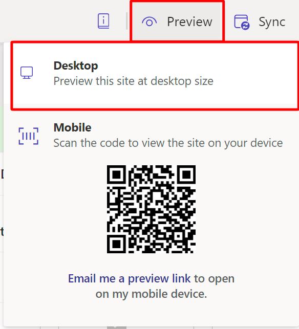

You now test the permission that you created.

1. From the Power Pages designer studio, select **Preview > Desktop** to get to the Power Pages site.

   > [!div class="mx-imgBorder"]
   > 

1. If you aren't already there, go to **Machine Orders** from the navigation bar in the upper right.

1. Assuming that you aren't yet signed in to this site, the same error appears in the list stating that you don't have access.

   > [!NOTE]
   > If you are signed in, you can view this error by selecting your name at the top right, then selecting **Sign out**.

   > [!div class="mx-imgBorder"]
   > 

1. From the upper-right corner of the screen, select **Sign in**.

   > [!div class="mx-imgBorder"]
   > 

1. Sign in by using Microsoft Entra ID, not with a username and password. Microsoft Entra ID, authentication is set up by default when you create a Power Pages site.

1. Select accept to proceed.

   After you sign in, you're redirected to your **Profile** page. Though you signed in by using Microsoft Entra ID, you aren't currently signed in to the site as your tenant user. Power Pages sites use the **Contact** table in Dataverse. When you signed in, a contact record was automatically created for your user.

1. Enter a new first and last name in the fields (if they're blank, which is occasionally the case in trial tenants), and then select **Update**.

   > [!div class="mx-imgBorder"]
   > 

1. On the **Machine Orders** page, the machine order records that you created in Dataverse when you completed the prerequisite guide show. Select the dropdown menu to the right of an order and then select **Update**.

   > [!div class="mx-imgBorder"]
   > 

   > [!NOTE]
   > If you adjusted to use the CRUD within power pages, you see you're now on the **Machine Order Details** page where you can view the form.

   > [!div class="mx-imgBorder"]
   > 

1. You don't need to store forms on pages; you can also use a modal experience so that, when a supplier selects a machine order to update, they don't leave the current page. To modify your configuration to test this action, return to Power Pages design studio.

1. On the page that contains the list, select the list and then select **Edit List**.

   > [!div class="mx-imgBorder"]
   > 

1. Within the **Action** section, locate the **Edit record** section, and change **Target type** to **Form**, not **Webpage**.

   > [!div class="mx-imgBorder"]
   > 

1. Select **Preview > Desktop**.

   > [!div class="mx-imgBorder"]
   > 

1. On the **Machine Orders** page, select the dropdown menu to the right of an order and then select **Update**. This brings up the modal form.

   > [!div class="mx-imgBorder"]
   > 
