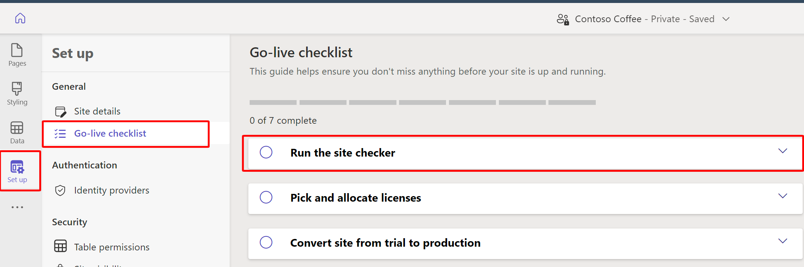

You can use the **Go-live checklist guide** to help ensure that you don't miss anything before your site is up and running. 

1.  From within the Power Pages design studio, select the **Set up** workspace in the left pane and then select **Go-live checklist**.

	> [!div class="mx-imgBorder"]
	> 

1.  **Run the site checker**. Site checker is a self-service diagnostic tool that site administrators use to identify common configuration issues in their site. Site checker helps to identify issues with a site by looking at various configuration parameters and provides suggestions on how to fix them.
