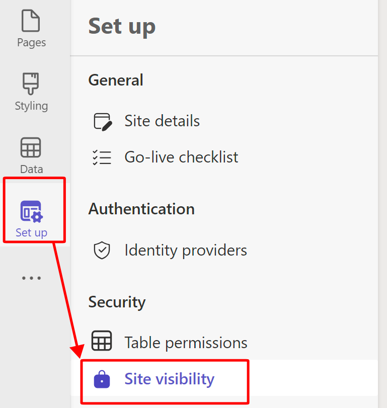
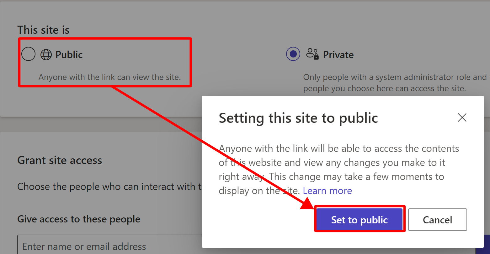

The Power Pages site visibility feature allows you to manage who has access to your website. You can restrict access to specific people in your organization by making the site private. If you choose to make the site public, anyone with the link has access. This feature is for restricting your site to your team only. Don't use this feature to restrict access control for the audience of your site in the production live state; instead, use the following **Identity and Security** options: 

1.  From within the **Set up** workspace, under **Security**, select **Site visibility**.

    > [!div class="mx-imgBorder"]
    > 

1.  Modify the site to be public. 

    > [!div class="mx-imgBorder"]
    > 

Now, you can show your Power Pages site to anyone.
 

Though your site is now public, it doesn't mean that the public can view or modify all machine orders because you were intentional about that factor previously in your design.

You can also change your website URL and other settings. Try the setup for Content Delivery Network (CDN) and Web Application Firewall (WAF). Both would require you to convert your site from Trial to Production. You can find this information in the **Site Details** section of the **Setup** workspace and others that link you to the Power Pages admin center.
