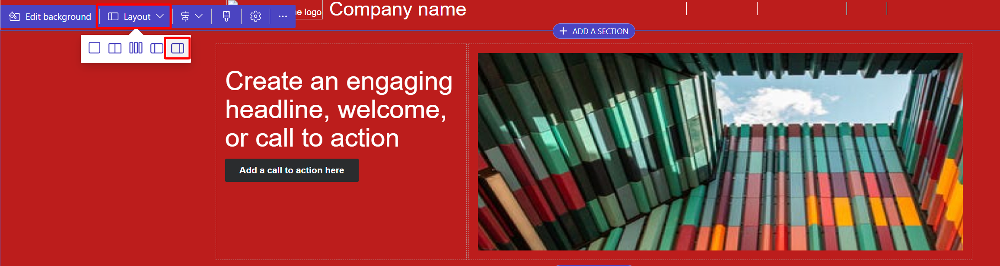
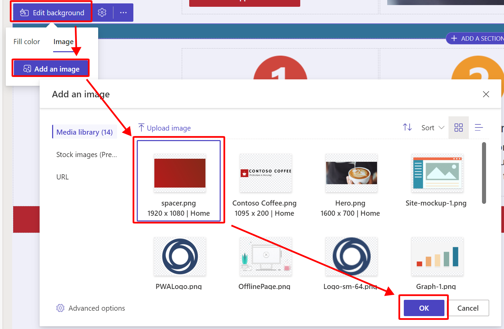

In this exercise, you'll customize webpages by following these steps.

1. If you don't already have it open, open the [Power Pages maker portal](https://make.powerpages.microsoft.com/?azure-portal=true).

1. In the upper-right corner, validate that you aren't in the default environment and that you're in your Dataverse environment.

   > [!div class="mx-imgBorder"]
   > 

1. On the **Home** page, under **Active sites**, identify the Power Pages site that you previously created and then select **Edit**.

	> [!div class="mx-imgBorder"]
	> 

1.  Within the design studio, under the **Pages** section, select the **Home** page.

	> [!div class="mx-imgBorder"]
	> 

1.  Hover your mouse cursor over the section immediately below the header and then select it. Select **Layout** and then select the fifth layout, one-third right. We want the image to take up two thirds of this section, that way, we can insert text on the left. 

	> [!div class="mx-imgBorder"]
	> 

1.  Select the image in the second column and then select **Image > Upload image**. Browse to the **Lab** folder and then upload **hero.png** 
	- (It can be found by navigating to the CC site images folder: '1. Dev Resources and Solution Packages\Graphical Resources\CC site images).

	> [!div class="mx-imgBorder"]
	> 

1. Select **OK**.

	> [!NOTE]
	> If you're using a template other than Template 1, remove any extra sections or elements you do not need after making the following required changes. 

1.  In the first column, choose or add a **Text** component to be transformed into your header. Edit the text of the component to match following text: **Equipping you to brew perfection.** Change the style to **Heading 1** and the font color to **black**.

	> [!div class="mx-imgBorder"]
	> 

1.  Select the plus (**+**) sign beneath your text and then add a **Text** component, or edit the text component underneath your header. 

	> [!div class="mx-imgBorder"]
	> 

1. Add descriptive text, such as **Our mission is to produce exceptional espresso machines that consistently deliver the ideal temperature, strength, and froth to satisfy any coffee lover's taste buds.** Change the font to **Paragraph**, and the font color to **black**.

	> [!div class="mx-imgBorder"]
	> 

Currently, the current color combination might cause eye strain to users try to read the header, and won't be able to see the edges of a button we plan on adding in. To fix this, we need to choose a color combination that will be easy for users to read. 

1. Change the current section's background color to **white** to make it easier for users to read the text. 

	> 

1.  If needed, select the plus (**+**) sign beneath your text and then add a new button, or select the button under the existing paragraph.

	> [!div class="mx-imgBorder"]
	> 

1.  Set the **Button label** to **Create a supplier account**. Select the **Link to a URL** option and then add `https://[your-pages-name].powerappsportals.com/Account/Login/Register?returnUrl=%2F` in the text box. Lastly, set the button Style to **Secondary**.

	> [!div class="mx-imgBorder"]
	> 

1.  Select **OK**. 

1.  Beneath the section containing your two columns, if there isn't one already, select the plus (**+**) sign and then add a spacer. Select **Edit background** on the spacer component.

	> [!div class="mx-imgBorder"]
	> 

1.  Select the **Image** tab and then select **Add image**. Upload the **spacer.png** image, which you can find in the **Lab** folder.

	> [!div class="mx-imgBorder"]
	> 

1. Select the gear icon to the right of **Edit background** and then modify **Spacer height** to **25 px**.

	> [!div class="mx-imgBorder"]
	> 

1. You can customize the other sections if you want, or you can remove them. 

	> [!div class="mx-imgBorder"]
	> 