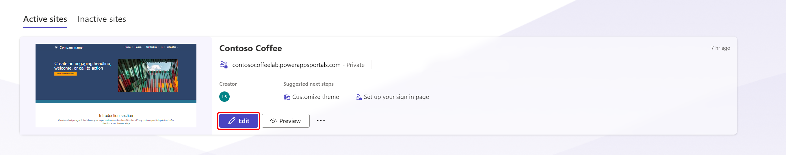
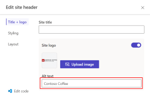

In this exercise, you'll edit the site header and footer in Power Pages.

1. If you don't already have it open, open the [Power Pages maker portal](https://make.powerpages.microsoft.com/?azure-portal=true).

1. In the upper-right corner, validate that you aren't in the default environment and that you're in your Dataverse environment.

   > [!div class="mx-imgBorder"]
   > 

1. On the **Home** page, under **Active sites**, identify the Power Pages site that you previously created and then select **Edit**.

   > [!div class="mx-imgBorder"]
   > 

1.  In Power Pages design studio, select **Pages** on the left pane to access the **Pages** workspace.

    > [!div class="mx-imgBorder"]
    > 

1.  Hover your mouse cursor over the top section of the page and then select **Edit site header**.

	> [!div class="mx-imgBorder"]
	> 

1.  Clear the **Site title** field so that it's blank.

1.  Select **Upload image** in the **Site Logo** section, and then select **Upload image**. Browse to the **Lab** folder and upload **header.png**. Select **OK**.

	Download the [student files](https://github.com/MicrosoftDocs/mslearn-developer-tools-power-platform/raw/master/in-a-day/power-pages/PowerPagesIADSupplierPortalStudent.zip). The file is located in the **Lab** folder directory (\Power Pages IAD Supplier Portal-Student.zip\1. Dev Resources and Solution Packages\Graphical Resources\CC site images\header.png).

	> [!div class="mx-imgBorder"]
	> 

	> [!div class="mx-imgBorder"]
	> 

	> [!NOTE]
	> If you're using your own logo, try to find one that's web friendly, around 40-60 pixels tall and PNG format, instead of large images that are meant for print. An alternative place to borrow a logo file is your own website.

1.  Modify the **Alt text** field to **Contoso Coffee**.

	> [!div class="mx-imgBorder"]
	>  

1.  Select the **Styling** tab. Modify the **Header background** to the color **white** and then close the tab.

	> [!div class="mx-imgBorder"]
	> 

1.  Hover your cursor over the lower section of the page and then select the footer.

1.  Select **Edit background** and choose **red** as the background color.

	> [!div class="mx-imgBorder"]
	> 

1.  Replace the text with **Disclaimer: Contoso Coffee is a fictitious company and this website is used for demonstration purposes only.** Change the text color to **white**.

	> [!div class="mx-imgBorder"]
	> 