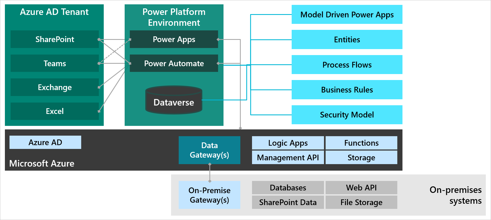

An environment is a space to store, manage, and share an organization's business data, apps, and flows. Administrators can create environments and control access to environments.

An environment has the following components:

- **Name** - Name of the environment.
- **Location** - Which Azure region that the environment, its data, apps, and flows are stored in.
- **Admins** - Who can manage the environment.
- **Security Group** - Controls which users can access the environment.
- **Apps** - Apps that are created in the environment.
- **Flows** - Flows that are created in the environment.
- **Bots** - Chatbots that are created in the environment.
- **Connectors** - Custom connectors that are added to the environment.
- **Gateways** - On-premises gateways that are connected to the environment.
- **Dataverse (optional)** - An instance of a Dataverse database.

Environments are containers that administrators can use to manage apps, flows, connections, and other assets along with permissions to allow organization users to use the resources.

## Tenants

Microsoft 365 uses a Microsoft Entra ID tenant to control authentication and authorization. You don't need an Azure subscription to access Microsoft Entra ID; the Microsoft 365 subscription permits access to the [Microsoft Entra ID portal](https://aad.portal.azure.com). Adding a user to Microsoft 365 will add the user to Microsoft Entra ID. Additionally, Microsoft Entra ID tenants are located in an Azure region, which is typically the region of the user who created the tenant.

Environments are created within a Microsoft Entra ID tenant. Access to the environment is authenticated by Microsoft Entra ID.

## Multiple environments

An environment is a container to separate apps that might have different roles, security requirements, or target audiences. How you choose to use environments depends on your organization and the apps that you're trying to build, for example:

- You can choose to only build your apps in a single environment.
- You might create separate environments that group the test and production versions of your apps.
- You might create separate environments that correspond to specific teams or departments in your company, each containing the relevant data and apps for each audience.
- You might also create separate environments for different global branches of your company.

The following diagram illustrates how an organization might create multiple environments.

Environments are a scope for lifecycle management and a scope for permissions.

## Items not contained in an environment

Environments contain Microsoft Power Platform components such as apps, flows, and bots. However, not everything that you might build for your solution is contained in environments. Microsoft Dynamics 365 apps (Sales, Marketing, Customer Service, Field Service, and Project Operations) are contained in an environment. No limitations are applied to the number of apps or flows that can be deployed within an environment.

An environment does not contain:

- Power BI workspaces, datasets, reports, or dashboards.
- An Azure service that is deployed.
- Non-customer engagement Dynamics 365 apps (for example, Finance or Business Central).

A solution architect needs to consider how access to these other components is controlled.

The following diagram illustrates how an environment is related to other components inside and outside the environment.

## Security layers

Microsoft Power Platform uses multiple layers of security:

- **Microsoft Entra ID** - User identities are authenticated by Microsoft Entra ID. With Microsoft Entra ID, you can restrict people from using Microsoft Entra ID features, such as conditional access policies, and enforce security through multi-factor authentication. Microsoft Entra ID supports single sign-on (SSO) so that users don't need to sign in separately to Microsoft Power Platform. Guest access is supported for Microsoft Power Platform.
- **Licensing** - Users require an appropriate license to access Microsoft Power Platform.
- **Environments** - Microsoft Entra ID security groups control access to each environment.
- **Data Loss Prevention Policies** - Restrict the use of connectors for environments and therefore the risk of data leakage. You can create cross-tenant inbound and outbound restrictions where you have a multi-tenant scenario.
- **Security Roles** - Access to tables and rows in Dataverse is controlled by security roles.
- **Encryption** - All data is encrypted at rest by using SQL Server Transparent Data Encryption (TDE). All data is encrypted in transit by using SSL.

The following diagram shows how security layers are applied for Microsoft Power Platform environments.

When creating an environment, the solution architect needs to decide the location of the environment.
