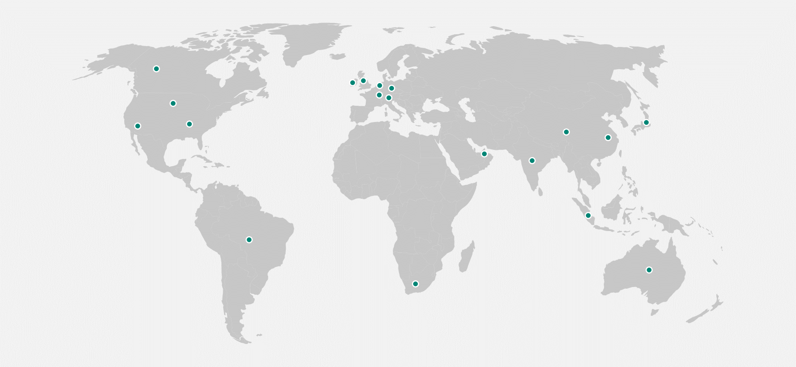
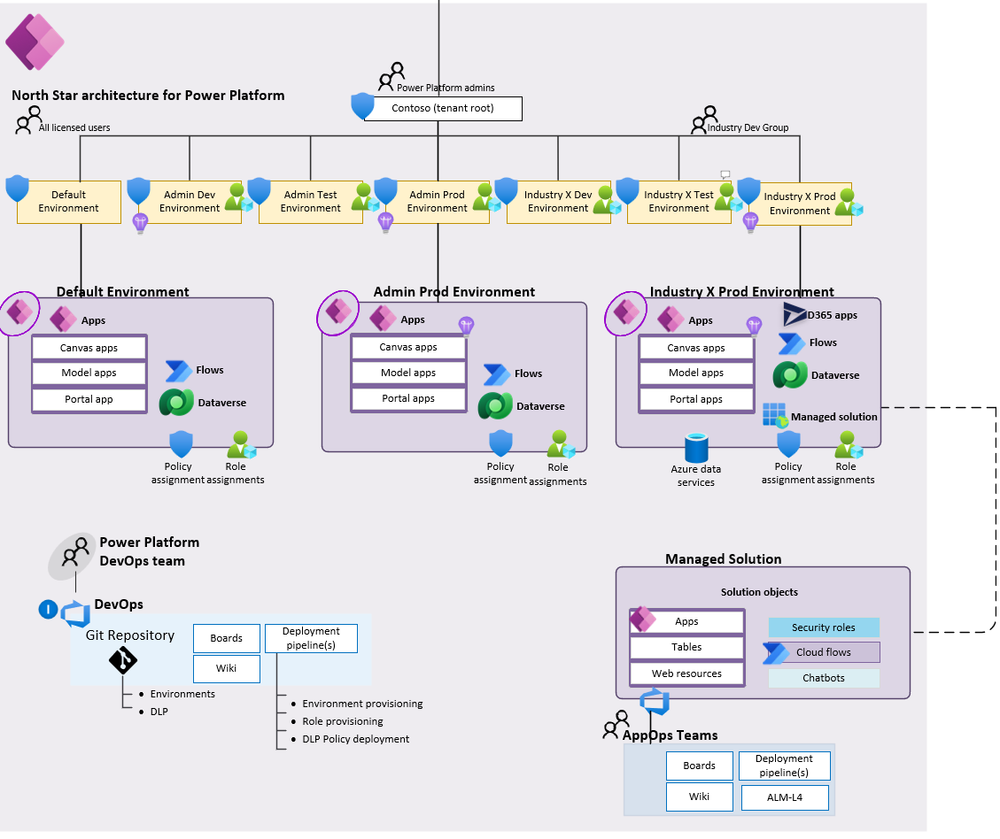
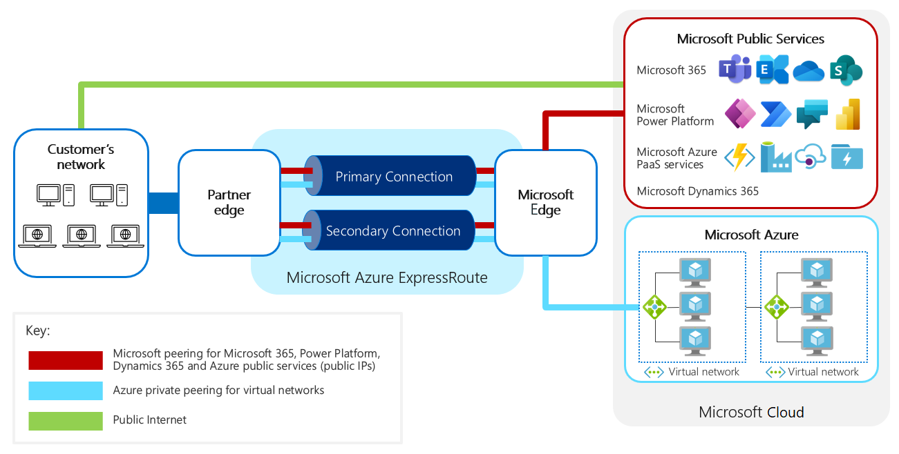
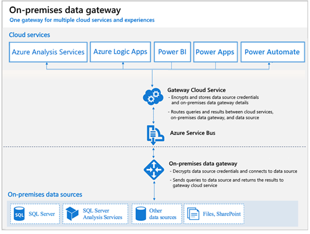

Microsoft has a worldwide network of datacenters (which support Microsoft Power Platform) that are set up in 17 different locations. This level of localization helps organizations more easily meet data residency, sovereignty, and compliance requirements.

When creating an environment, you can specify its geographical location. The data for the environment will be held in the chosen geographical location.

> [!NOTE]
> An environment can be relocated after it has been created, but it is easier to select the correct region from the beginning.

## Regions

Microsoft offers the option of choosing global, local, and sovereign clouds:

- **Global cloud** - A public internet cloud deployment option that lets customers access globally connected cloud services that are deployed from regional Microsoft datacenters. The global clouds are United States, Europe, and Asia Pacific.
- **Local cloud** - A cloud option that addresses local data residency requirements by letting all public cloud users within a country or region keep their data in the country or region. The local clouds are: Canada, Brazil, United Kingdom, France, Germany, India, Japan, Australia, United Arab Emirates, Switzerland, and Republic of South Africa.
- **Sovereign cloud** - A cloud option that adheres to the strictest standards of operation. Data remains inside the country or region of residence always. Sovereign clouds are: US Government and China.

> [!NOTE]
> New locations are planned, so the preceding list might not be complete. See [availability](/power-platform/availability) for the latest information.

The following diagram shows the supported Microsoft Power Platform locations.

## Data residency

Ask yourself the following questions to determine which of the several aspects influence the choice of location for environments and data:

- Are the users geographically dispersed?
- What latency is acceptable?
- Does the organization have separate autonomous business units where data must not be shared?
- Are the required features available in the region?
- Are security requirements in place that should be considered?
- Are specific data and compliance requirements in place?

If no other factors exist, you should select a location close to most users who need to share data.

> [!NOTE]
> The location of the tenant (billing) can be different from the location of an environment and its data.

## Compliance and data protection

Solution architects must consider regulatory and compliance requirements, such as the General Data Protection Regulation (GDPR), when deciding on a location for the environment and data.

Microsoft won't transfer customer data outside the selected Azure geographic location (geo), except when it's necessary for Microsoft to provide customer support, troubleshoot the service, or comply with legal requirements.

Microsoft Power Platform stores information that is global in nature, such as user identities and profile information, in a datacenter that is located in the United States. All Microsoft Power Platform customer data and the geo-redundant mirrors are maintained within the selected geo.

## When to use multiple environments

A previous module explained how Microsoft Power Platform uses environments to separate development from production and to separate different user groups. When you further consider the location of users in a global organization, consider other reasons for creating multiple environments:

- Handle application lifecycle management (ALM) – Dev / Test / Prod.
- Isolate resources that aren't used by the same users or that share data.
- Allow conflicting customizations between different regions or markets, or for compliance with legal and regulatory constraints.
- Keep environments close to users who don’t share data.
- Isolate data that can't be colocated.
- Provide places for makers to experiment.

The next unit will explain how you can work with the data.

## Managed environments

Managed Environments offer a set of enhanced out-of-the-box governance capabilities that simplifies, automates, and streamlines IT administration of Microsoft Power Platform at scale.

Once an environment is enabled as a managed environment, you can:

- Limit sharing: reduce risk by limiting how widely canvas apps can be shared.

- View usage insights: include insights for the environment in the weekly email digest.

- Data policies: limit the connectors available.

- Set up Power Platform pipelines: easily deploy solutions between environments.

See [Managed Environments overview](/power-platform/admin/managed-environment-overview/?azure-portal=true) for further details.

## Landing Zones

Power Platform Landing Zones is a reference architecture and design methodology that consists of design principles to serve as a compass for organizations to determine their overall architecture for Microsoft Power Platform.

It enables effective construction and operationalization of landing zones (environments) on Power Platform, at scale. This approach aligns with the platform and product roadmap and the Center of Excellence adoption framework.

The following diagram shows the high-level architecture for Power Platform Landing Zones.

> [!div class="mx-imgBorder"]
> 

Power Platform Landing Zones architecture contains critical design areas with heavily interrelated and dependent design decisions:

- Licensing and AD tenants

- Identity and access management

- Security, governance, and compliance

- Environments

- Management and monitoring

- Business continuity and Disaster recovery

- Connectivity and interoperability

- Platform Automation and DevOps

The methodology can be used for both new Microsoft Power Platform organizations, and for those who already have implemented Power Platform solutions. The solution architect may not be responsible for implementing environment strategy but if there's no strategy, the solution architect should use the design principles and considerations contained in Power Platform Landing Zones.

See the [Power Platform Landing Zones GitHub repo](https://github.com/microsoft/industry/tree/main/foundations/powerPlatform/?azure-portal=true) for further details.

## Connecting to on-premises networks

For some organizations, a secure connection between the end user on-premise location(s) and Power Platform services is required. You can use a Virtual Private Network (VPN) or Azure ExpressRoute.

Microsoft Azure ExpressRoute provides a way to connect your on-premises network to Microsoft cloud services by using private connectivity.

The following diagram shows the ExpressRoute network configuration.

> [!div class="mx-imgBorder"]
> 

The benefits of using ExpressRoute for your organization are:

- Compliance: You won't route customer information via the public internet.

- Predictability: Having a dedicated connection avoids conflict with other internet traffic.

See [Use Azure ExpressRoute with Microsoft Power Platform](/power-platform/guidance/expressroute/overview/?azure-portal=true) for further details.

Other networking considerations may concern accessing data held in on-premises locations. The On-premises data gateway enables you to connect Power Platform apps and flows to on-premises data sources.

The following diagram shows the On-premises data gateway network configuration.

> [!div class="mx-imgBorder"]
> 
