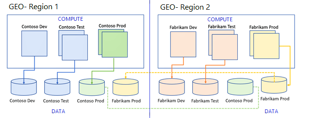
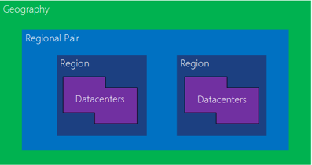

Solution architects need to consider how to include high availability in the solution design. Microsoft handles high availability and disaster recovery for Microsoft Power Platform and its components. The solution architect needs to focus on non-Microsoft Power Platform components, custom code, and integrations.

## Business continuity and disaster recovery

Microsoft provides disaster recovery for production environments of Dynamics 365 software as a service (SaaS) applications and Power Platform environments for business continuity if there's an Azure region-wide outage.

Microsoft creates a replica of Azure SQL storage and file storage in the secondary region for each production environment at deployment. These replicas are referred to as geo-secondary replicas.

The solution architect should identify and design the business continuity strategy.

> [!NOTE]
> Power Platform Landing Zones contain set of design considerations for Business continuity and disaster recovery.

> [!div class="mx-imgBorder"]
> 

## Principles of high availability

When creating a solution, the solution architect should follow these principles:

- No single points of failure should exist.
- Use the capabilities of Microsoft Azure whenever possible.
- Use monitoring and health checks to predict and detect problems.

Microsoft deploys a Microsoft Power Platform environment within an Azure region. Within a region, services and data are replicated redundantly across the datacenter(s) to increase availability. Each Azure region has a paired region where Microsoft Power Platform resources are replicated automatically. Microsoft monitors Microsoft Power Platform on your behalf as part of the service.

## Handle failover

Microsoft Power Platform components handle internal integrations; solution architects should focus on external integrations and custom code.

If an issue occurs with the primary datacenter, Microsoft initiates the failover automatically, if necessary, from the primary location to the regional pair. Microsoft also handles required service recovery.

Users shouldn't notice interruptions in service. At worst, they have a transient error when saving data. For example, model-driven apps handle such errors.

However, custom code could have issues. For example, the endpoint for the environment might change. Integrations should use the global discovery service for endpoint discovery to get the latest environment endpoint. Custom code should have transient error handling with automatic retries.
