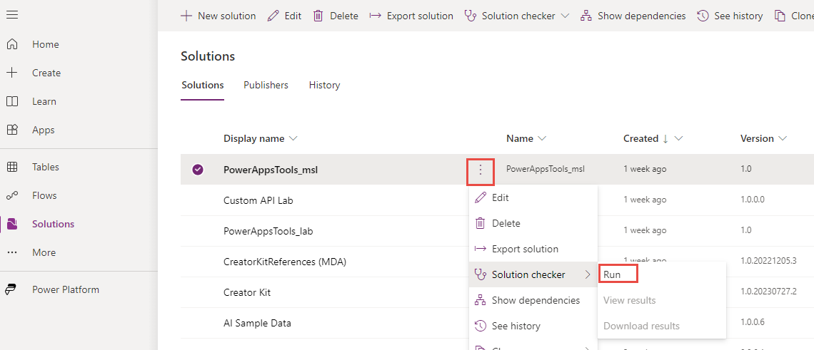

While developing client scripts might look like a seemingly easy task to a seasoned JavaScript developer, it's important to keep best practices in mind when considering their use. Often, developers also overlook that users can use other means to access the data. For example, they can use data import or export, maker studio, canvas apps, third-party desktop apps, shell scripting, etc. You should use client scripting to solve specific client-side UI issues and enhance user experience in a model-driven app. It isn't a  security measure nor a solution to all problems. You must often combine a client-side approach with a server-side approach, like a Dataverse plug-in, to ensure all access points implement the business requirement.

## Use solution checker

Solution checker can perform static analysis checks on your solutions against a set of best practice rules and quickly identify these problematic patterns. This check includes the JavaScript used for client scripting. The checker can identify performance, stability, and reliability issues as they become introduced, which can negatively affect the user experience. The checker can also spot the use of deprecated methods. When run regularly, you can proactively identify and remediate the problems before their release to the users. You can run the solution checker on demand from the maker portal or as part of an automated build process. This automation allows it to be run regularly and become a part of your ongoing application lifecycle management process.

> [!div class="mx-imgBorder"]
> [](../media/solution-checker.png#lightbox)

For more information about using solution checker, see [Use solution checker to validate your apps in Power Apps](/power-apps/maker/data-platform/use-powerapps-checker/?azure-portal=true) in product documentation.

## Business rules vs. client script

Business rules are an available feature in model-driven applications that enable users to conduct frequently required actions on a form based on certain requirements and conditions. Specifically, business rules can do the following tasks:

- Set field values

- Clear field values

- Set field requirement levels

- Show or hide form column controls

- Enable or disable form column controls

- Validate data and show error messages

- Create business recommendations based on business intelligence.

One of the distinct features of business rules is that table-scoped rules can automatically apply the logic on the backend where applicable. This scoping ensures app consistency regardless of whether an action runs via the user interface, data import, or an API method call. Client script alone wouldn't be a full equivalent in these scenarios.

While the available business rules framework is robust, some scenarios might exist where business rules can't fully implement a given requirement. In these cases, client scripting can narrow the differences between business rules and a more demanding requirement. Here are some common limitations that users experience with business rules where client script might be a better solution.

### Reference related data

If you need to reference data in a related table, such as the address of the primary contact of an account, you need to use client script and the Web API.

### Logic needs to run on the form save event

Business rules only run on form load and a field change unless you set the scope to table. You must use a client script if you need business logic to run on the Save form event.

### Complex conditions

If your condition has multiple `and` statements or requires `or` statements, writing these conditions in client script might be more efficient than through business rules.

### Clear values of form data

Clearing data from a form column isn't easily accomplished in a business rule. While there are workarounds that you can use, like assigning a "dummy" column that always contains NULL values, you can more elegantly accomplish this using client script.

### Calculated columns vs. client script

Calculated columns run the logic on the retrieve, so any client-side changes don't reflect in the value of the calculated column until a form refreshes. If you want data to update instantly on the form, client script would be the preferred method. Often, client-script complements a backend implementation that uses calculated or rollup columns, plug-ins, etc. This combined approach can provide a consistent user experience in the app while ensuring data consistency and integrity at the backend.

## Coding standards and best practices

The following sections cover the best practices and standards for coding.

### Define unique script function names

The functions you write are most likely on a form with many other libraries. If another library contains a function with the same name as the one you provide, whichever function loads last is the one the form uses. To avoid a potential conflict, make sure that you use unique function names. You can use the following strategies if you or your organization doesn't have one already established:

- **Unique function prefix** - Define each of your functions by using the standard syntax with a consistent name that includes a unique naming convention, as shown in the following example.

  ```javascript
    function MyUniqueName_performMyAction()
    {
    // Code to perform your action.
    }
  ```

- **Libraries with namespaces** - Associate each of your functions with a script object to create a namespace to use when you call your functions, as shown in the following example.

  ```javascript
    //If the MyUniqueName namespace object isn’t defined, create it.
    if (typeof (MyUniqueName) == "undefined")
       { MyUniqueName = {}; }
       // Create Namespace container for functions in this library;
       MyUniqueName.MyFunctions = {
     performMyAction: function(){
     // Code to perform your action.
     //Call another function in your library
     this.anotherAction();
       },
       anotherAction: function(){
     // Code in another function
      }
    };
  ```

When you use your function, specify the full name, as shown in the following example.

```javascript
    MyUniqueName.MyFunctions.performMyAction();
```

> [!TIP]
> If you call a function within another function in the same namespace, you can use the **this** keyword as a shortcut to the object that contains both functions. However, if you use your function as an event handler, the **this** keyword will refer to the object on which the event is occurring.

### Avoid unsupported methods

While a few third-party online resources might suggest or have examples of how you can use unsupported methods to perform certain actions, this isn't supported or recommended. These methods can't be guaranteed to work in future versions of your app and might contribute to the instability of your implementation. You should also avoid methods you discover by inspecting the API objects in the debugger if the discovered methods aren't in the official documentation for the client API reference documentation.

### Review your code for deprecated methods

The Client API is being continuously developed and improved. It's important to review your code base for the use of deprecated methods and follow documentation recommendations for their replacements. If you use the solution checker, it flags these methods as problems.

### Avoid using jQuery in forms and ribbon commands

jQuery and other direct HTML DOM manipulation libraries aren't supported within form scripts or command bar commands. You should restrict your scripts to only using methods in the Client API object model. For more information, see [Understand the Client API object model](/power-apps/developer/model-driven-apps/clientapi/understand-clientapi-object-model/?azure-portal=true).

### Write non-blocking code

You should use asynchronous patterns to ensure a non-blocking user experience when performing queries or process-intensive activities.

Try avoiding methods that block UI, like confirmation dialogs, blocking progress indicators, etc. The preferred interaction method with the user is through non-intrusive notification mechanisms like a highly visible alert area in the app or form.

### Write code for multiple browsers

Ensure that any scripts you implement you test to work against all browsers and device form factors your users use with your model-driven apps. For more information, see [Supported web browsers and mobile devices](/power-platform/admin/supported-web-browsers-and-mobile-devices/?azure-portal=true).
