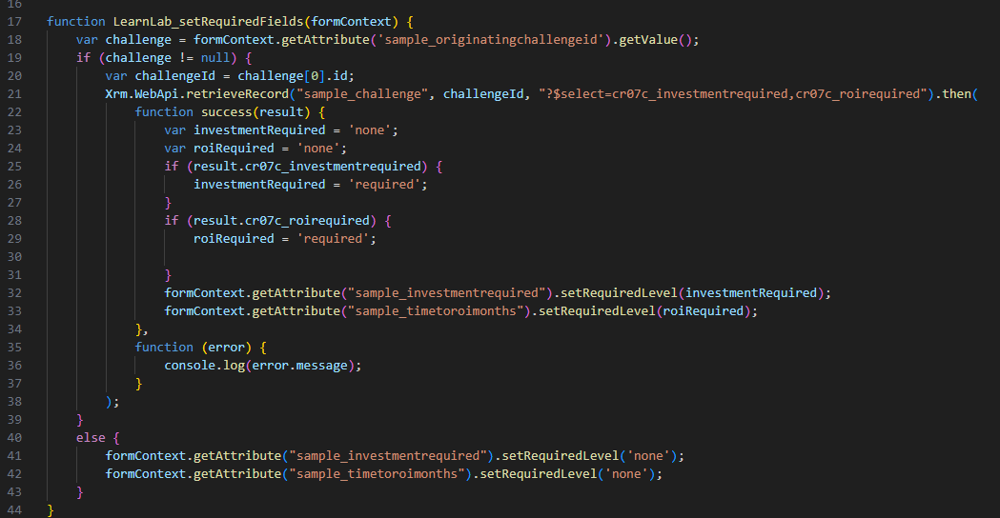
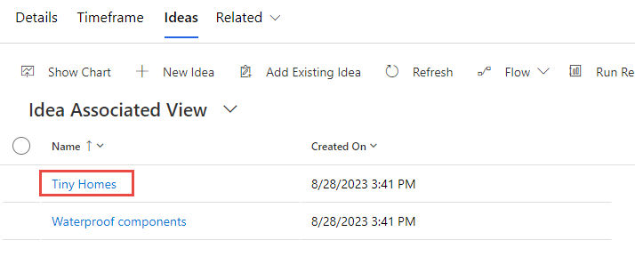

In this exercise, you use a client script to implement the business requirement of making columns on the form required based on the values in a related table. You set the requirement level of columns on the Idea form in the Innovation Challenge sample app based on the value of columns on the Challenge table. To accomplish this, you use the Xrm.WebAPI methods to retrieve the related data.

> [!IMPORTANT]
> Use a test environment with Microsoft Dataverse provisioned and the sample apps enabled. If you don't have one you can sign up for the [community plan](https://powerapps.microsoft.com/communityplan/?azure-portal=true).

## Task - Prepare solution

In this task, you create a solution, add existing tables to the solution, add new columns, and prepare the main form of one of the tables you added to the solution.

1. Navigate to [Power Apps maker portal](https://make.powerapps.com/?azure-portal=true) and make sure you're in the correct environment that has the sample apps enabled.

   > [!div class="mx-imgBorder"]
   > [](../media/environment-name.png#lightbox)

1. Select **Solutions** and then select **+ New solution**.

1. Enter **Innovation Challenge Web API** for **Display name**, select **CDS default publisher** for **Publisher**, and select **Create**.

   > [!div class="mx-imgBorder"]
   > [](../media/new-solution.png#lightbox)

1. The **Innovation Challenge Web API** solution you created should open.

1. Select **+ Add existing** and then select **Table**.

1. Enter idea in the Search textbox, select **Idea**, and then select **Next**.

   > [!NOTE]
   > If you're unable to locate **Idea** table you may not have the sample apps in your environment. Select another environment or create a new one with the sample apps installed.

1. Select the **Select objects** button.

   > [!div class="mx-imgBorder"]
   > [](../media/select-components.png#lightbox)

1. Select the **Forms** tab, select the **Information** form of **Form type** Main, and then select **Add**.

   > [!div class="mx-imgBorder"]
   > [](../media/add-component.png#lightbox)

1. Select **Add** again.

1. Select **+ Add existing** and select **Table** again.

   > [!div class="mx-imgBorder"]
   > [](../media/add-existing-table.png#lightbox)

1. Enter search for challenge, select **Challenge**, and then select **Next**.

1. Select the **Select objects** button.

   > [!div class="mx-imgBorder"]
   > [](../media/select-components-button.png#lightbox)

1. Select the **Forms** tab, select the **Information** form of **Form** type **Main**, and then select **Add**.

   > [!div class="mx-imgBorder"]
   > [](../media/main.png#lightbox)

1. Select **Add** again.

1. Open the **Challenge** table you just added to the solution.

1. Select **+ New** and then select **column**. You're adding two columns to indicate what data is required for Idea rows created for this Challenge.

   > [!div class="mx-imgBorder"]
   > [](../media/add-column.png#lightbox)

1. Enter **Investment Required** for **Display name**, select **Choice | Yes/No** for **Data type**, expand the **Advanced options**. Make a note of the **prefix** of the **Schema name**; your prefix is different. You need this when you're creating the script and what to refer to the fields you're adding.

   > [!div class="mx-imgBorder"]
   > [](../media/name.png#lightbox)

1. Select **Save**.

1. Select **+ New** and then select **Column** again.

1. Enter **ROI Required** for **Display name**, select **Choice | Yes/No** for **Data type**, and select **Save**.

1. Expand the **Challenge** table on the left side and then select **Forms**.

1. Open the **Information** form you added to the solution.

1. Select the **Table columns** tab.

   > [!div class="mx-imgBorder"]
   > [](../media/table-columns-tab.png#lightbox)

1. Add the **Investment Required** column to the form.

1. Add the **ROI Required** to the form.

1. The form should now look like this image. Select **Save and publish**. Wait for the publishing to be completed.

   > [!div class="mx-imgBorder"]
   > [](../media/save.png#lightbox)

1. Go back to the solution by selecting on the back button.

   > [!div class="mx-imgBorder"]
   > [](../media/back.png#lightbox)

## Task - Create client script

In this task, you create a script that sets the required level for columns on the Idea table based on the Challenge tables column values.

1. Start a new instance of Visual Studio Code or use your favorite code editor. You can download and install [Visual Studio Code](https://code.visualstudio.com/?azure-portal=true).

1. Select **Open Folder**.

   > [!div class="mx-imgBorder"]
   > [](../media/open-folder.png#lightbox)

1. Create a folder in your Documents folder and name it **ClientScriptLab**.

1. Select the **ClientScriptLab** folder you created and select the **Select Folder** button.

   > [!div class="mx-imgBorder"]
   > [](../media/select-folder.png#lightbox)

1. Hover over the **CLIENTSCRIPTLAB** folder and select **New File**.

   > [!div class="mx-imgBorder"]
   > [](../media/new-file.png#lightbox)

1. Name the file **IdeaForm.js**.

1. Add the below functions to **IdeaForm.js**. Your functions should have either unique names or use a namespace to ensure uniqueness.

   ```javascript
   function LearnLab_handleIdeaOnLoad(executionContext) {
   }
   function LearnLab_handleChallengeOnChange(executionContext) {
   }
   ```

1. Add this script to the **OnLoad** function. This script registers an **OnChange** event handler, you need to handle on change in case the related challenge changes.

   ```javascript
   var formContext = executionContext.getFormContext();
   formContext.getAttribute('sample_originatingchallengeid').addOnChange(LearnLab_handleChallengeOnChange);
   ```

   > [!div class="mx-imgBorder"]
   > [](../media/onload-function.png#lightbox)

1. Add this script to the **OnChange** function. This code simply gets the formContext.

   ```javascript
   var formContext = executionContext.getFormContext();
   ```

1. Add this function to the **IdeaForm** file. This function is called from both OnLoad and OnChange functions and the formContext is passed as an argument. This is where you implement the business logic to set the requirement levels.

   ```javascript
   function LearnLab_setRequiredFields(formContext) {
   }
   ```

1. You first get the challenge lookup values. Add this script to the **setRequiredFields** function. We got `sample_originatingchallengeid` from the properties of the column in solution explorer.

   ```javascript
   var challenge = formContext.getAttribute('sample_originatingchallengeid').getValue();
   ```

1. You then check if the **challenge** value is null. Add this script to the **setRequiredFields** function.

   ```javascript
   if (challenge != null) {
       }
       else{
       }
   ```

1. You make the columns not required if the challenge is null. Add this script inside the **else**. This ensures if a challenge isn't selected the columns aren't required.

   ```javascript
   formContext.getAttribute("sample_investmentrequired").setRequiredLevel('none');
   formContext.getAttribute("sample_timetoroimonths").setRequiredLevel('none');
   ```

1. Your **IdeaForm** should now look like this image.

   > [!div class="mx-imgBorder"]
   > [](../media/idea-form.png#lightbox)

1. You get the ID of the related **challenge** if the challenge isn't null. Add this script inside the **if** statement.

   ```javascript
   var challengeId = challenge[0].id;
   ```

1. Now you retrieve the challenge row using **WebAPI** and select only the two columns you're interested in **InvestmentRequired** and **ROIRequired**. Add the script inside if statement.

    > [!NOTE]
   > Replace **crc8c** with your prefix from Task 1.

   ```javascript
   Xrm.WebApi.retrieveRecord("sample_challenge", challengeId, "?$select=crc8c_investmentrequired,crc8c_roirequired").then(
               function success(result) {
               },
               function (error) {
               }
           );
   ```

1. If the **retrieveRecord** succeeds, you first create two variables that hold the requirement values for both columns and set their initial value to not required. After that you check whether the columns are required and set the requirement variable accordingly. Finally you set the column requirement to the value of the variable you created. Add this script inside the success function. Replace the prefix **cr07c_** for cr07c_investmentrequired and cr07c_roirequired with the prefix of the columns you created.

   > [!NOTE]
   > Replace **crc8c** with your prefix from task 1.

   ```javascript
   var investmentRequired = 'none';
   var roiRequired = 'none';
   if (result.cr07c_investmentrequired) {
       investmentRequired = 'required';
   }
   if (result.cr07c_roirequired) {
       roiRequired = 'required';
   }
   formContext.getAttribute("sample_investmentrequired").setRequiredLevel(investmentRequired);
   formContext.getAttribute("sample_timetoroimonths").setRequiredLevel(roiRequired);
   ```

1. You log the error message if **retrieveRecord** causes an error. Add this script inside the error function. You could also use methods from Xrm.Navigation to show a dialog to the user with appropriate options if necessary.

   ```javascript
   console.log(error.message);
   ```

1. The **LearnLab**_**setRequiredFileds** function should now look like this image.

   > [!div class="mx-imgBorder"]
   > [](../media/completed-function.png#lightbox)

1. You call the **LearnLab**_**setRequiredFileds** from both **OnLoad** and **OnChange** functions. Add this script to both **OnLoad** and **OnChange** functions.

   ```javascript
   LearnLab_setRequiredFields(formContext)
   ```

1. Your **IdeaForm** should now look like this image.

   > [!div class="mx-imgBorder"]
   > [](../media/completed-idea.png#lightbox)

1. Select **File** and **Save all**.

## Task - Upload the script

In this task, you load the script you created into your environment.

1. Navigate to [Power Apps maker portal](https://make.powerapps.com/?azure-portal=true) and make sure you're in the correct environment.

1. Select **Solutions** and to open the **Innovation Challenge Web API** solution.

1. Select **+ New** and select **More | Web resource**.

   > [!div class="mx-imgBorder"]
   > [](../media/web-resource.png#lightbox)

1. Enter **IdeaForm.js** for **Name**, enter **IdeaForm.js** for **Display name**, select **Java script (JS)** for **Type**, and then select **Choose File.**

   > [!div class="mx-imgBorder"]
   > [](../media/choose-file.png#lightbox)

1. Select the **IdeaForm.js** file you created earlier and then select **Open**.

1. Select **Save**.

1. Your solution should now have the **Challenge** table, **Idea** table, and the **IdeaForm.js** web resource.

1. Don't navigate away from this page.

## Task - Edit form

In this task, you add JavaScript library to the Idea main form and add an event handler for On Load event.

1. Make sure you're still in the **Innovation Challenge Web API** solution.

1. Expand the **Idea** table and select **Forms**.

1. Open the **Main** **Information** form.

1. Select the **Form libraries** tab.

1. Select **+ Add library**.

   > [!div class="mx-imgBorder"]
   > [](../media/add-library.png#lightbox)

1. Enter idea in the search textbox and press Enter. Select **IdeaForm.js**, and then select **Add**.

   > [!div class="mx-imgBorder"]
   > [](../media/add-javascript-library.png#lightbox)

1. Select the **Events** tab from the right.

1. Expand the **On Load** section and select **+ Event Handler**.

   > [!div class="mx-imgBorder"]
   > [](../media/event-handler.png#lightbox)

1. Enter **LearnLab_handleIdeaOnLoad** for **Function**, check the **Pass execution context as first parameter** checkbox, and select **Done**.

   > [!div class="mx-imgBorder"]
   > [](../media/configure-event.png#lightbox)

1. Select **Save and publish** and wait for the publishing to complete.

1. Select the **Back** button.

1. Select **All**.

1. Select **Publish all customizations** and wait for the publishing to complete.

## Task - Test

In this task, you test your script.

1. Navigate to [Power Apps maker portal](https://make.powerapps.com/?azure-portal=true) and make sure you're in the correct environment.

1. Select **Apps** and launch the **Innovation Challenge** application.

1. Select **Challenges** and open one of the **Challenge** rows.

1. The **Investment Required** and **ROI Required** should be empty. Select **Related** and select **Ideas**.

   > [!div class="mx-imgBorder"]
   > [](../media/related-ideas.png#lightbox)

1. Open one of the **Ideas**.

   > [!div class="mx-imgBorder"]
   > [](../media/tiny-homes.png#lightbox)

1. Clear the **Investment Required** and **Time to ROI (months)** column values.

1. The columns aren't required because the requirement columns on the Challenge table are empty. Select the back button.

   > [!div class="mx-imgBorder"]
   > [](../media/back-button.png#lightbox)

1. Select the Details tab and select Yes for both **Investment Required** and **ROI Required**.

   > [!div class="mx-imgBorder"]
   > [](../media/requirements.png#lightbox)

1. Select the **Ideas** tab and open the same idea you selected last time.

1. The two columns should now be required.

   > [!div class="mx-imgBorder"]
   > [](../media/investment-time.png#lightbox)
