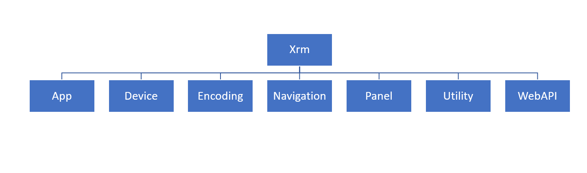

The Client API provides the **Xrm** object, which is globally available in your code, to do various activities without having to use the execution context. At a high level, the following diagram illustrates each of the available properties and methods. For an in-depth overview of this object, see [Client API Xrm object](/power-apps/developer/model-driven-apps/clientapi/clientapi-xrm/?azure-portal=true).

> [!div class="mx-imgBorder"]
> 

## App object

Using addGlobalNotification from the App object, you can display an error, information, warning, or success notification for an app and specify actions to execute based on the notification. This notification is similar to form notifications, but you can use it outside the context of a form. For example, a command bar script could notify a user of an action completed. Use clearGlobalNotification method to clear a notification in the app.

## Device object

The Xrm.Device object exposes native device capabilities that are related to mobile device interactions, except for the pickFile method, which is also accessible through web clients. Canvas apps also provide an extensible framework for mobile development and should be considered in these scenarios. The following table is a summary of the methods that are available within the Xrm.Device object.

| Method | Description |
|--------|-------------|
| [captureAudio](/power-apps/developer/model-driven-apps/clientapi/reference/xrm-device/captureaudio/?azure-portal=true) | Invokes the device microphone to record audio. |
| [captureImage](/power-apps/developer/model-driven-apps/clientapi/reference/xrm-device/captureimage/?azure-portal=true) | Invokes the device camera to capture an image. |
| [captureVideo](/power-apps/developer/model-driven-apps/clientapi/reference/xrm-device/capturevideo/?azure-portal=true) | Invokes the device camera to record a video. |
| [getBarcodeValue](/power-apps/developer/model-driven-apps/clientapi/reference/xrm-device/getbarcodevalue/?azure-portal=true) | Invokes the device camera to scan the barcode information,   such as a product number. |
| [getCurrentPosition](/power-apps/developer/model-driven-apps/clientapi/reference/xrm-device/getcurrentposition/?azure-portal=true) | Returns the current location by using the device   geolocation capability. |
| [pickFile](/power-apps/developer/model-driven-apps/clientapi/reference/xrm-device/pickfile/?azure-portal=true) | Opens a dialog box to select files from your computer (web   client) or mobile device (mobile clients). |

Depending on the device configuration, some functionality isn't available. User consent may also be required for the app to access specific device capabilities. For example, the user may have globally disabled device location capabilities or refused the app camera access. When developing an app, beware that  these methods may fail because of the device's capabilities, configuration, lack of permissions, or consent.

## Encoding object

You can use the Xrm.Encoding object to encode and decode XML and HTML strings. This encoding and decoding can be valuable when you're:

- Interacting with HTML web resources,

- Encoding and decoding query string parameters,

- Interacting with FetchXML that contains special characters like '&' or '<' in a search string.

## Navigation object

The Navigation object provides navigation-related methods you can use within a model-driven application. Because of their blocking nature, activities such as showing alert, confirm, and error dialogs aren't considered an optimal user experience but are still available. In these scenarios, we recommend considering form notifications or other non-blocking mechanisms to warn users of an issue. Here's a summary of methods that are available within the Xrm.Navigation object.

 | Method | Description |
|---------|-------------|
| [openAlertDialog](/power-apps/developer/model-driven-apps/clientapi/reference/xrm-navigation/openalertdialog/?azure-portal=true) | Displays an alert dialog that contains a message and a   button. |
| [openConfirmDialog](/power-apps/developer/model-driven-apps/clientapi/reference/xrm-navigation/openconfirmdialog/?azure-portal=true) | Displays a confirmation dialog box that contains a message   and two buttons. |
| [openErrorDialog](/power-apps/developer/model-driven-apps/clientapi/reference/xrm-navigation/openerrordialog/?azure-portal=true) | Displays an error dialog. |
| [openFile](/power-apps/developer/model-driven-apps/clientapi/reference/xrm-navigation/openfile/?azure-portal=true) | Opens a file. |
| [openForm](/power-apps/developer/model-driven-apps/clientapi/reference/xrm-navigation/openform/?azure-portal=true) | Opens a table form or a quick create form. |
| [openUrl](/power-apps/developer/model-driven-apps/clientapi/reference/xrm-navigation/openurl/?azure-portal=true) | Opens a URL, including file URLs. |
| [openWebResource](/power-apps/developer/model-driven-apps/clientapi/reference/xrm-navigation/openwebresource/?azure-portal=true) | Opens an HTML web resource. |

## Panel object

The Xrm.Panel object provides a method to display a webpage on the side pane of a model-driven app form. This feature is currently in preview and isn't covered in detail here. For more information, see [Xrm.Panel](/power-apps/developer/model-driven-apps/clientapi/reference/xrm-panel/?azure-portal=true).

## Utility object

The Xrm.Utility object is a container for various useful methods. The following table is a summary of the methods that are available within the Xrm.Utility object. For more information, see [Xrm.Utility (Client API reference)](/power-apps/developer/model-driven-apps/clientapi/reference/xrm-utility/?azure-portal=true)

| Method | Description |
|--------|-------------|
| [closeProgressIndicator](/power-apps/developer/model-driven-apps/clientapi/reference/xrm-utility/closeprogressindicator/?azure-portal=true) | Indicator closes a progress dialog box that was opened using showProgressIndicator. |
| [getAllowedStatusTransitions](/power-apps/developer/model-driven-apps/clientapi/reference/xrm-utility/getallowedstatustransitions/?azure-portal=true) | Returns the valid state transitions for the specified table and state code. |
| [getEntityMetadata](/power-apps/developer/model-driven-apps/clientapi/reference/xrm-utility/getentitymetadata/?azure-portal=true) | Returns the entity metadata for the specified entity. |
| [getGlobalContext](/power-apps/developer/model-driven-apps/clientapi/reference/xrm-utility/getglobalcontext/?azure-portal=true) | Gets the global context that can provide you with runtime   information including organization settings, user settings, app, and client information. |
| [getLearningPathAttributeName](/power-apps/developer/model-driven-apps/clientapi/reference/xrm-utility/getlearningpathattributename/?azure-portal=true) | Returns the name of the DOM attribute that is expected by the learning path (guided help) content designer for identifying UI controls   in the model-driven apps forms. |
| [getResourceString](/power-apps/developer/model-driven-apps/clientapi/reference/xrm-utility/getresourcestring/?azure-portal=true) | Returns the localized string for a given key that is   associated with the specified web resource. |
| [invokeProcessAction](/power-apps/developer/model-driven-apps/clientapi/reference/xrm-utility/invokeprocessaction/?azure-portal=true) | Invokes an action based on the specified parameters. This method could also be used to invoke Custom APIs created by your developers. |
| [lookupObjects](/power-apps/developer/model-driven-apps/clientapi/reference/xrm-utility/lookupobjects/?azure-portal=true) | Opens a lookup control to select one or more items. |
| [refreshParentGrid](/power-apps/developer/model-driven-apps/clientapi/reference/xrm-utility/refreshparentgrid/?azure-portal=true) | Refreshes the parent grid that contains the specified   record. |
| [showProgressIndicator](/power-apps/developer/model-driven-apps/clientapi/reference/xrm-utility/showprogressindicator/?azure-portal=true) | Displays a progress dialog with the specified message. |

There are also many methods not listed here that you might come across in older code that has now [been deprecated](/power-apps/developer/model-driven-apps/clientapi/reference/xrm-utility?azure-portal=true#deprecated-methods) because they've moved to the Xrm.Navigation namespace. If you find these methods, you should update the code to use the new Xrm.Navigation methods.

## Xrm.WebApi object

The Xrm.WebApi object provides properties and methods to use the Web API for traditional CRUD operations within a client script. When you use the Xrm.WebAPI, in your script logic, the operations you perform is automatically in the context of the current app user. You can use the Web API  when the app is online and offline (if you configure the environment for offline). The namespace includes a specific online and offline set of methods; however, using these methods requires keeping track of the client state. If you use the Xrm.WebAPI, Xrm.WebAPI.createRecord, the API determines if it should use the online or offline namespace methods for you.

The following table is a summary of the methods that are available within the Xrm.WebApi object. For more information, see [Xrm.WebApi (Client API reference)](/power-apps/developer/model-driven-apps/clientapi/reference/xrm-webapi/?azure-portal=true).

| Method | Description |
|--------|-------------|
| [createRecord](/power-apps/developer/model-driven-apps/clientapi/reference/xrm-webapi/createrecord/?azure-portal=true) | Creates a table row. |
| [deleteRecord](/power-apps/developer/model-driven-apps/clientapi/reference/xrm-webapi/deleterecord/?azure-portal=true) | Deletes a table row using the ID of the row. |
| [retrieveRecord](/power-apps/developer/model-driven-apps/clientapi/reference/xrm-webapi/retrieverecord/?azure-portal=true) | Retrieves a row using the ID of the row. |
| [retrieveMultipleRecords](/power-apps/developer/model-driven-apps/clientapi/reference/xrm-webapi/retrievemultiplerecords/?azure-portal=true) | Retrieves a collection of table rows matching the query options or Fetch XML provided. |
| [updateRecord](/power-apps/developer/model-driven-apps/clientapi/reference/xrm-webapi/updaterecord/?azure-portal=true) | Updates a table row. |
| [isAvailableOffline](/power-apps/developer/model-driven-apps/clientapi/reference/xrm-webapi/isavailableoffline/?azure-portal=true) | Returns a Boolean value that indicates whether a table is   present in a user’s profile and available in offline mode. |
| [execute](/power-apps/developer/model-driven-apps/clientapi/reference/xrm-webapi/online/execute/?azure-portal=true) | Run a single action, function, or CRUD operation. |
| [executeMultiple](/power-apps/developer/model-driven-apps/clientapi/reference/xrm-webapi/online/executemultiple/?azure-portal=true) | Run a collection of actions, functions, or CRUD   operations. |

Using properties and methods of **Xrm** object you can automate business processes and improve the overall user experience.
