In this exercise, you'll add the Power Virtual Agents app to Microsoft Teams, create a new chatbot, and navigate between other parts of Teams and your existing chatbot.

## Task: Discover and add the Power Virtual Agents app to Teams

In this first task, you'll search for and add the Power Virtual Agents app to Teams.

1. Select the **Apps** icon on the left toolbar and then search for **Power Virtual Agents**. 

    > [!div class="mx-imgBorder"]
    > 

1. Select the Power Virtual Agents app when you find it in the search results.

    > [!div class="mx-imgBorder"]
    > [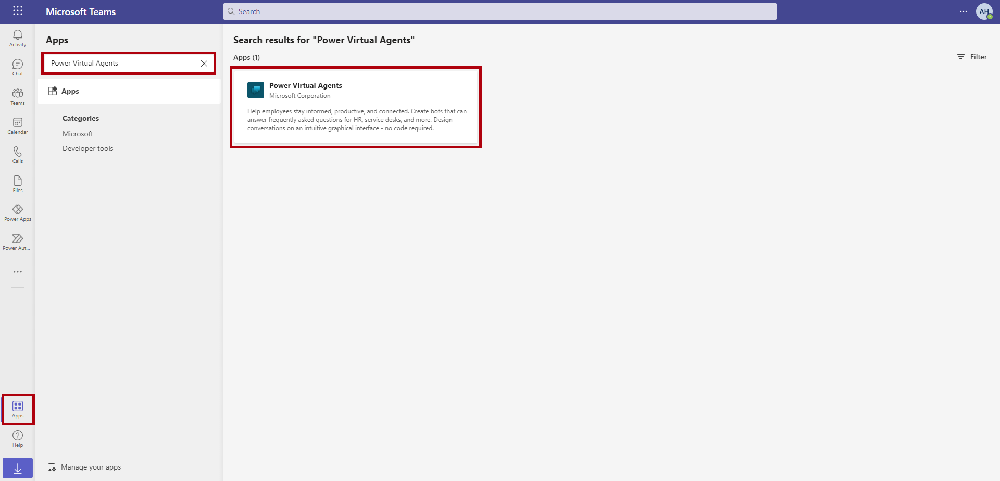](../media/power-virtual-agent.png#lightbox)

1. A pop-up window will appear that includes information about the Power Virtual Agents app for Microsoft Teams. Select the **Add** button.

    > [!div class="mx-imgBorder"]
    > 

1. The Power Virtual Agents app will display in the left navigation bar. Right-click that icon and select **Pin**. This action pins the app to the navigation bar, making it easier for you to return to it when necessary. 

    > [!div class="mx-imgBorder"]
    > [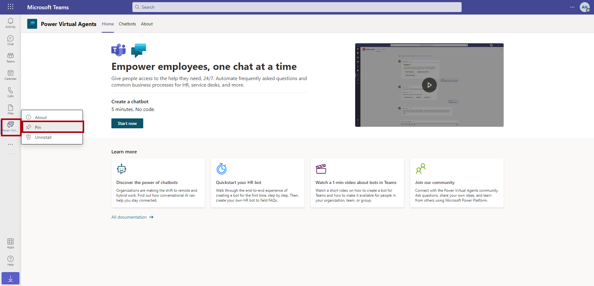](../media/pin-app.png#lightbox)

## Task: Create a new chatbot 

To create a new chatbot, follow these steps:

1. Select the **Start now** button.

    > [!div class="mx-imgBorder"]
    > [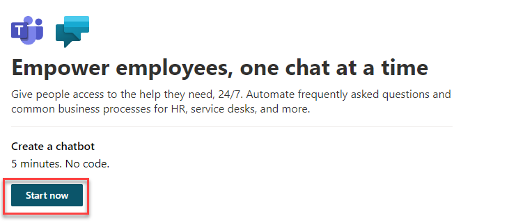](../media/start-now.png#lightbox)

    You'll be asked which team you want your bot to join. When you're adding a bot as an app in Teams, consider it as similar to adding a new virtual member of your team. Select the dropdown menu and then select the team that you've used in the previous labs.

1. After you've selected your team, select **Continue**.
 
    > [!div class="mx-imgBorder"]
    > [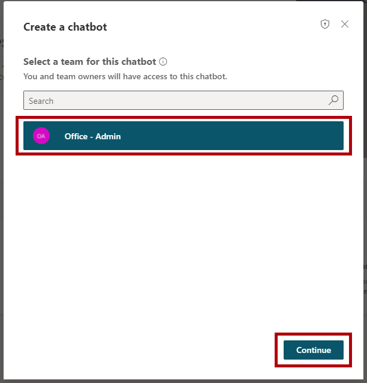](../media/continue-admin.png#lightbox)

1. You'll be prompted to create a new bot. Give your bot a name (this example uses the name Office Helper). For this lab, you can create your own bot name (or add your name to the end of the bot name, such as **Office Helper – Jane**). Then, when you start the collaboration exercise in Lab 6, the bots will have different names. 

1. Select **Create**. Wait a minute or so until the bot has been provisioned. (Note the capability to create a bot in other languages.)

    > [!div class="mx-imgBorder"]
    > 

1. The familiar Power Virtual Agents builder will show inside Microsoft Teams. Your main navigation menu is on the left.

    > [!div class="mx-imgBorder"]
    > [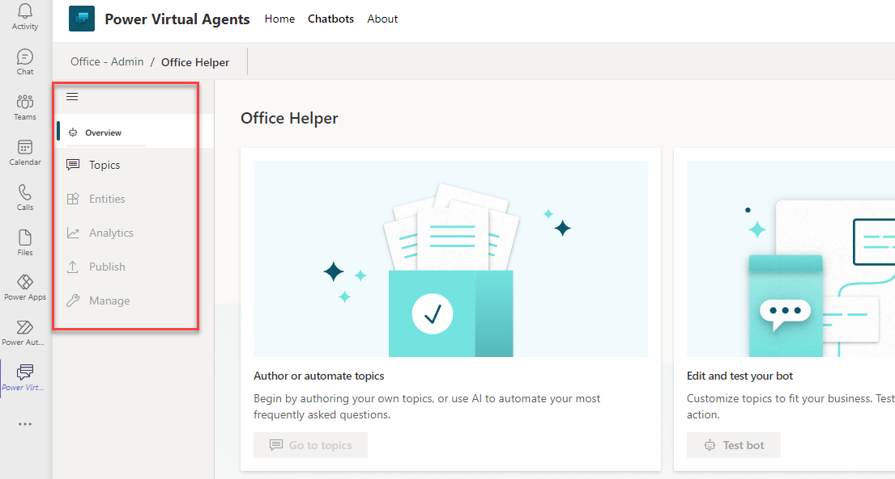](../media/virtual-agent-home.png#lightbox)

1. Select the hamburger icon to expand (or collapse) the navigation menu.
 
    > [!div class="mx-imgBorder"]
    > [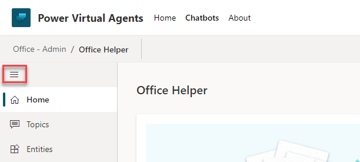](../media/collapse.png#lightbox)

1. The test pane is located to the right of the Power Virtual Agents navigation menu. Use this test pane for testing your bot as you build it. You can hide or show this test pane by selecting the chatbot icon near the lower-left corner of the screen.

    > [!div class="mx-imgBorder"]
    > [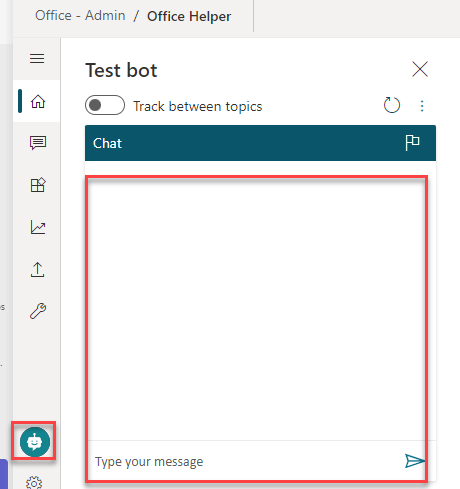](../media/test-bot-chat.png#lightbox)

The rest of the screen is the main canvas where you'll build your bot. As you work on topics, the authoring canvas will be displayed on this screen. When you first create your bot (or when you navigate to the home screen), you’ll find guided help steps on this canvas to assist you with navigation and getting started.
 
   > [!div class="mx-imgBorder"]
   > [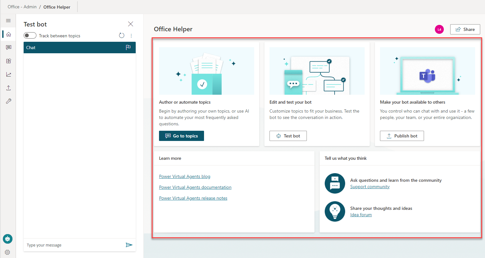](../media/test-bot.png#lightbox)

## Task: Navigate between other parts of Teams and your existing chatbot

You can navigate away from building your chatbot to continue collaborating in Teams and then return later to continue working on it anytime. Note this step because you'll need to navigate back and forth later in the lab.

1. Select the main Teams icon in the left navigation bar to return to your Teams environment.

    > [!div class="mx-imgBorder"]
    > [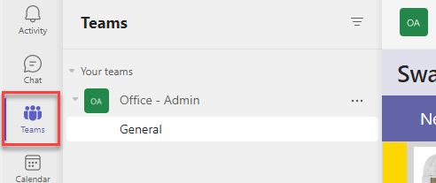](../media/teams-left-navigation.png#lightbox)

1. To return to building your chatbot, you'll need to return to the Power Virtual Agents app in Teams. If you previously pinned the icon to the navigation menu, you'll find and select it from the menu. If not, you can select the icon at the bottom of that menu and then search for and select **Power Virtual Agents**.

    > [!div class="mx-imgBorder"]
    > [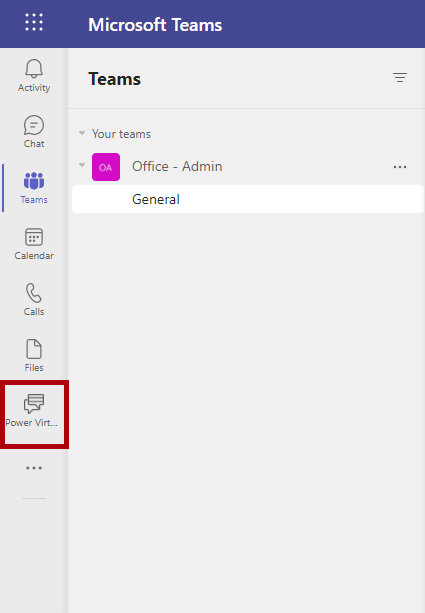](../media/pinned-button.png#lightbox)

    **Or**

    > [!div class="mx-imgBorder"]
    > 

1. Select **Chatbots** in the menu at the top of your screen to view a list of all existing chatbots. Select the name of your chatbot to open it for editing.

    > [!div class="mx-imgBorder"]
    > [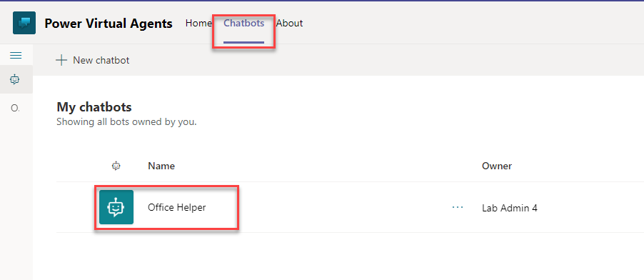](../media/edit-chatbot.png#lightbox)
