In this task, you'll create a topic for the bot to answer common questions from employees about Contoso Coffee swag.

## Task: Turn off the lesson topics

Your first task is to turn off the lesson topics, which aren't needed as part of this chatbot.

1. The list of existing topics are **Lesson 1**, **Lesson 2**, **Lesson 3**, and **Lesson 4**. Switch the **Status** toggle for each topic to the **Off** position.

    > [!div class="mx-imgBorder"]
    > [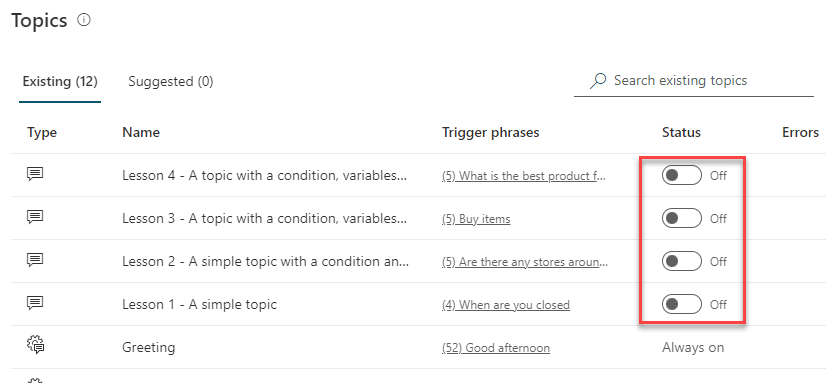](../media/status-toggle.png#lightbox)
 
1. Wait a few seconds for each topic to turn off. A progress message will display, followed by a confirmation message at the top of the topics list.

    > [!div class="mx-imgBorder"]
    > 

## Task: Create a new topic for questions

To create a new topic for questions about Contoso Coffee’s swag, follow these steps:

1. Create a new topic by selecting **+ New topic**.
    
    > [!div class="mx-imgBorder"]
    > 

1. By default, you can add trigger phrases on creation. Add the following trigger phrases by entering them and then selecting the button after each until all appear in the list.

   *Need information on swag*

   *Can I get branded clothes*

   *What swag is available?*

   *What branded Contoso Coffee things do we have?*

   *How do I get a Contoso Coffee beanie?*

    > [!div class="mx-imgBorder"]
    > [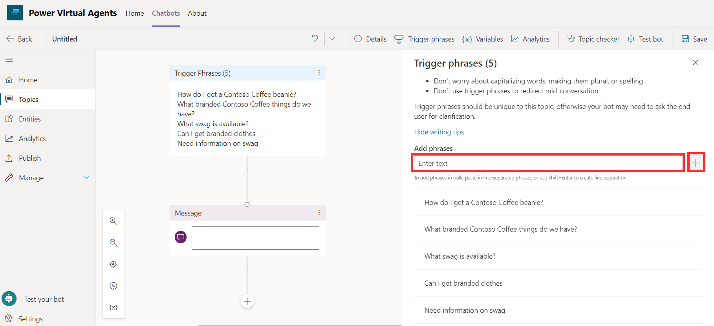](../media/add-phrase.png#lightbox)

1. Select **Details**, and then in the **Name** field, enter **Swag Information**. Close the **Details** pane.

    > [!div class="mx-imgBorder"]
    > 

1. Save your topic for now by selecting **Save**. A pop-up window will appear, asking if you'll save the topic with errors. For now, you can ignore this message by selecting **Save** because this task will be done in the following steps.

    > [!div class="mx-imgBorder"]
    > 

   Your topic is now saved and you can edit it in the authoring canvas, with your trigger phrases at the top. This interface is drag-and-drop, and you'll use it to build your conversation. You'll create a conversation tree with a series of messages, questions, and conditional branches.

    > [!div class="mx-imgBorder"]
    > 

1. Add the following text into the **Message** box: 
    
    *I can help with information about our Contoso Coffee swag.*
    
    Select the **Add node** button underneath the message box and then select **Ask a question**.

    > [!div class="mx-imgBorder"]
    > [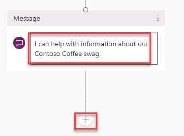](../media/add-message.png#lightbox)
   
    > [!div class="mx-imgBorder"]
    > [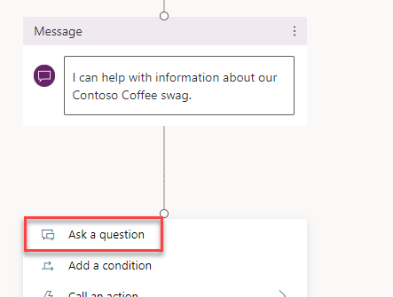](../media/add-question.png#lightbox)

1. Enter the following text in the **Ask a question** box:
    
    *What would you like to know about?*
 
    > [!div class="mx-imgBorder"]
    > [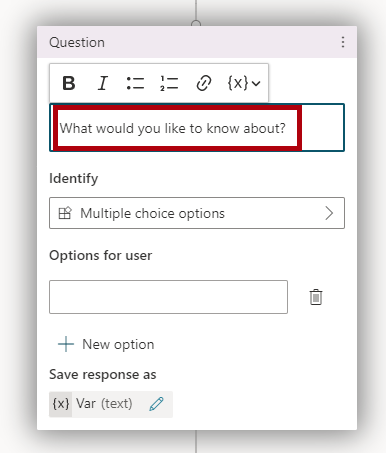](../media/question.png#lightbox)

1. Power Virtual Agents can identify various types of information (known as entities) from unstructured text in the response from the user. When you add a question to your conversation tree, you'll choose what type of information the bot should look for and extract from the response. Set the **Identify** field to **Multiple choice options**.

    > [!div class="mx-imgBorder"]
    > [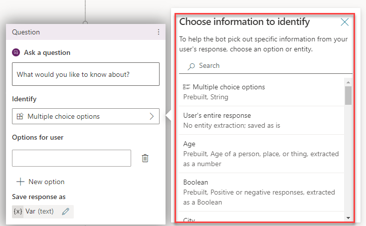](../media/choose-information.png#lightbox)

1. Add the following multiple choice options for the user. The conditional branching is automatically created as you add each new option.
    
    **Apparel**
    
    **Accessories**
 
    > [!div class="mx-imgBorder"]
    > [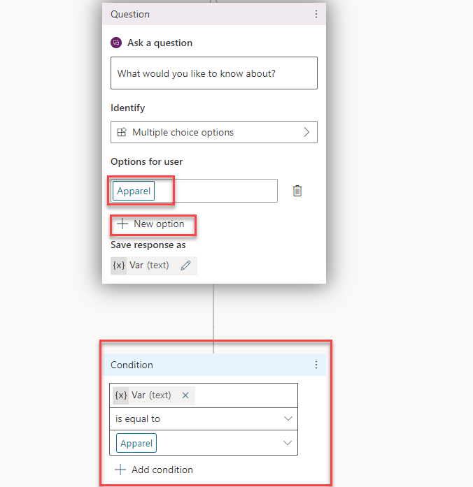](../media/apparel-accessories.png#lightbox)

    > [!div class="mx-imgBorder"]
    > [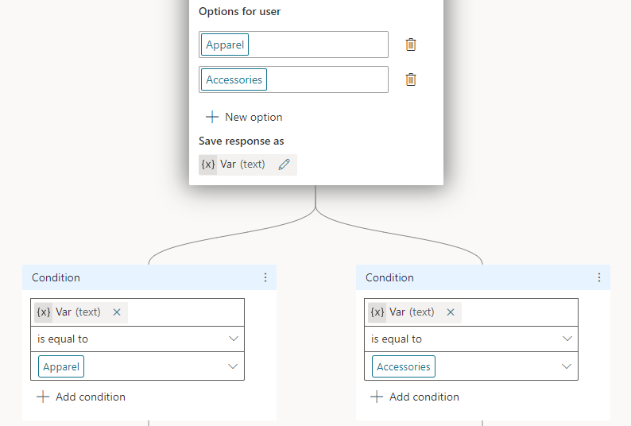](../media/conditions.png#lightbox)

1.	The response that the user selects will be stored as a variable. Edit the variable name by selecting the pencil icon and then entering the name **AssetCategory** in the **Name** field of the **Variable properties** pane.

    > [!div class="mx-imgBorder"]
    > [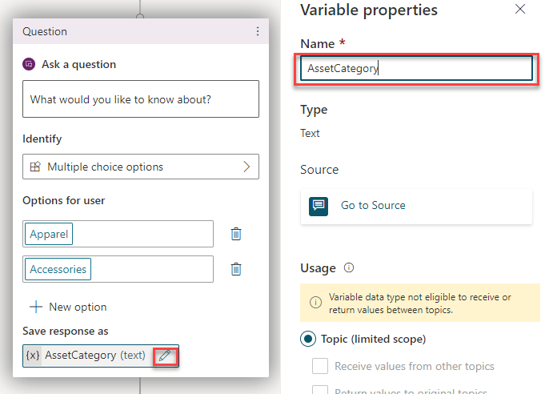](../media/asset-category.png#lightbox)

1.	Close the **Variable properties** pane by selecting the **X**, and then save your chatbot by selecting the **Save** button.
 
    > [!div class="mx-imgBorder"]
    > [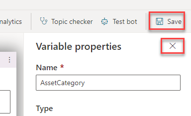](../media/save-variable.png#lightbox)

1.	Add a message under each asset category to provide the user with information about the category that they choose. 

    Under the first conditional node (Apparel) select the **Add condition** button and then select **Show a message**.
 
    > [!div class="mx-imgBorder"]
    > 

1.	Add the following text to the **Message** box: 

    *The Contoso Coffee apparel we have at the moment includes:*
    - *Caps*
    - *Beanies*
    - *T-shirts*
    - *Long sleeve shirts*

        > [!div class="mx-imgBorder"]
        > 

1.	Add a node underneath the message to end the conversation with a survey. This action will trigger the prebuilt **End of Conversation** topic in Power Virtual Agents, which asks the user if their question was answered and then finishes with a satisfaction survey question.  
 
    > [!div class="mx-imgBorder"]
    > [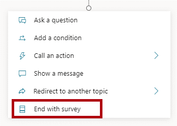](../media/end-survey.png#lightbox)

    > [!div class="mx-imgBorder"]
    > 

1.	Under the **Accessories** node, add the following message.

    *The types of accessories we have available at the moment include Contoso Coffee-branded mugs and drinking glasses.*

1.	Add a node to **End with survey**.
 
    > [!div class="mx-imgBorder"]
    > [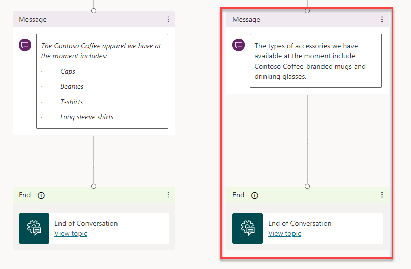](../media/add-node.png#lightbox)

1.	Select **Save** to save your topic.
    
## Task: Test your chatbot

Now it's time to test your chatbot.

1. Turn on the **Track between topics** toggle in the **Test bot** pane. Turning on this option means that, as you test your bot, the tracking of the conversation flow will show across different topics.

    > [!div class="mx-imgBorder"]
    > [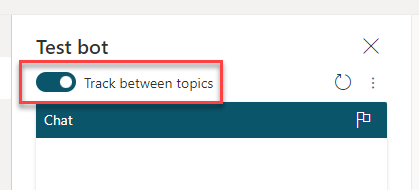](../media/track-topic.png#lightbox)

1. Test your chatbot in the **Test bot** pane by entering a trigger phrase, such as **What swag is available**, and then go through the conversation. The path that the bot has followed will be indicated with green check marks in the authoring canvas, showing it move from the topic that you created to the built-in **End of Conversation** topic.
 
    > [!div class="mx-imgBorder"]
    > 

1.	You can reset your **Test bot** pane by using the reset button at any stage.

    > [!div class="mx-imgBorder"]
    > [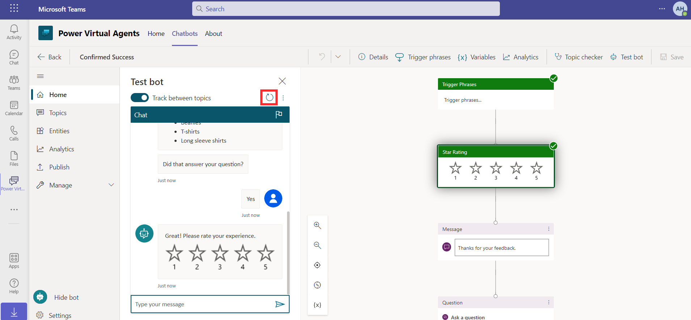](../media/reset-button.png#lightbox)

1.	Select the **Back** button to return to the **Topics** page.
 
    > [!div class="mx-imgBorder"]
    > [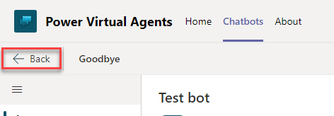](../media/back-button-topic.png#lightbox)
