In this exercise, you'll explore the **Manage issues** app and the **Issue reporting** app.

## Task - Explore the Manage issues app

To explore the **Manage issues** app, follow these steps:

1. Select the **Manage Issues** tab on your screen.

    You might need to select **more** if it's not appearing.

    > [!div class="mx-imgBorder"]
    > [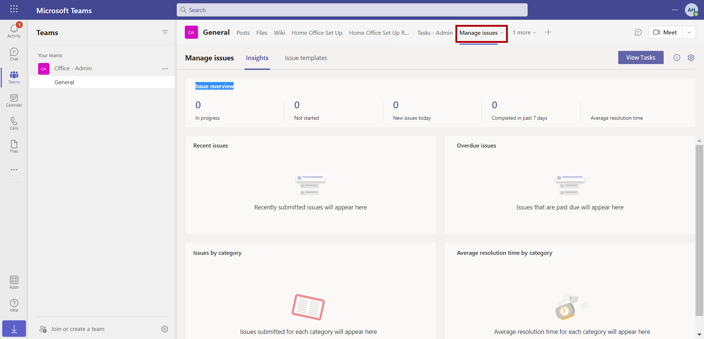](../media/manage-issues.png#lightbox)

1. Within the **Manage issues** app, select the **Issue templates** tab.

    > [!div class="mx-imgBorder"]
    > 

1. Select **Add category**.

    > [!div class="mx-imgBorder"]
    > [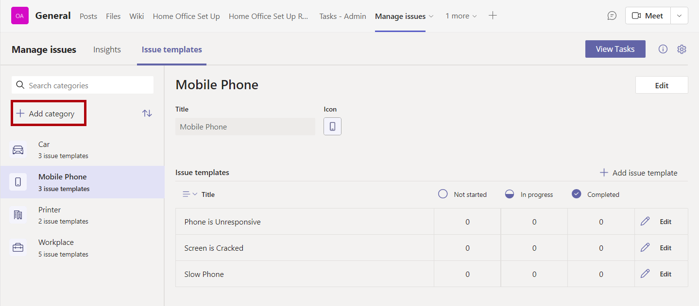](../media/add-category.png#lightbox)

1. Enter **Kitchen** as the category title and then select **Update icon**. Select the food icon. Then, select **Save** to create the new category.

    > [!div class="mx-imgBorder"]
    > 

1. With the Kitchen category selected, select **Add issue template**.

    > [!div class="mx-imgBorder"]
    > [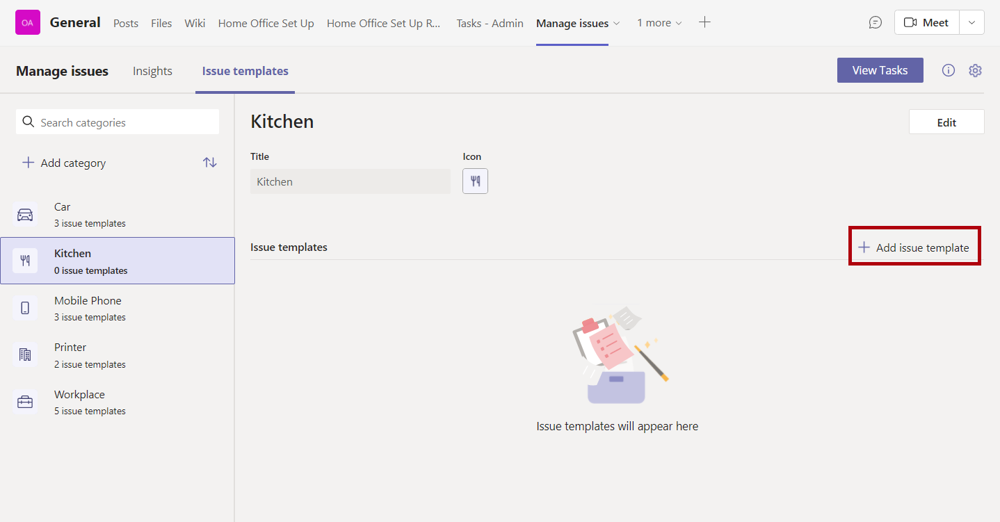](../media/add-issue.png#lightbox)

1. Enter the following information into the template:

    **Title** - Hot Water Not Working

    **Due within** - 2

    **Auto assign issues to** - *your account*

    > [!div class="mx-imgBorder"]
    > 

1. Select **Add question**. In the **Question 1** field, enter **How long has this issue existed?**

    > [!div class="mx-imgBorder"]
    > [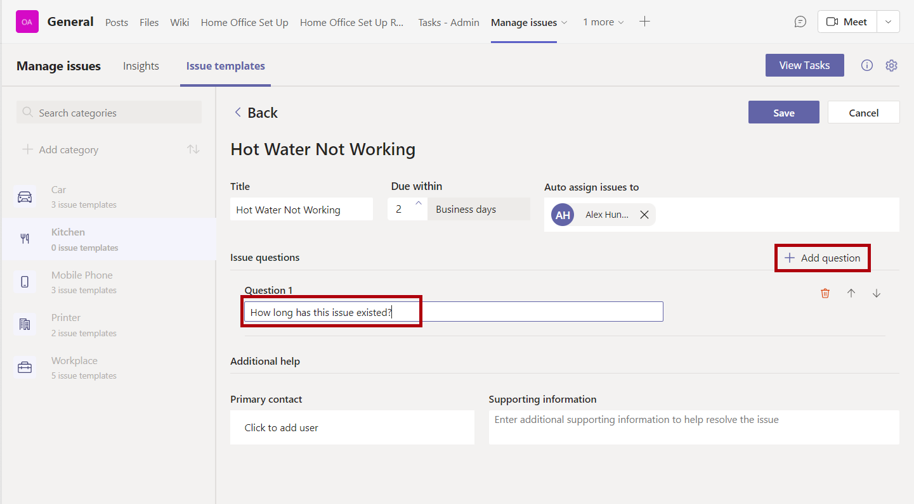](../media/add-question.png#lightbox)

1. Select **Add question** again, and in the **Question 2** field, enter **Has this happened before?**

    > [!div class="mx-imgBorder"]
    > [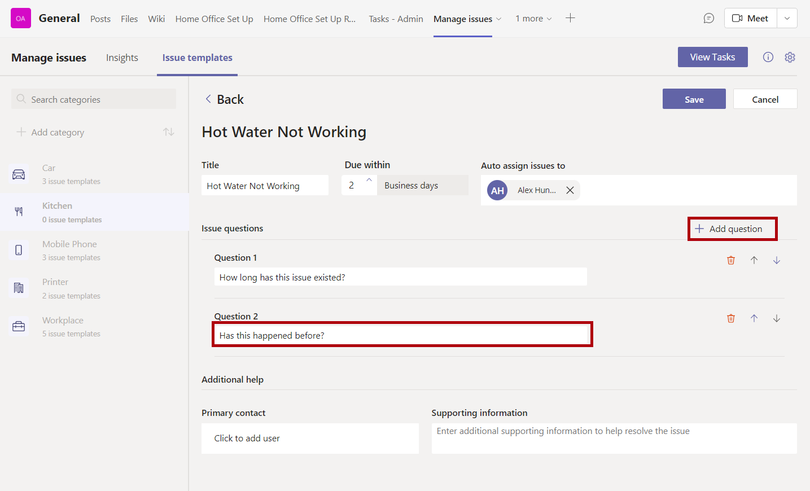](../media/questions.png#lightbox)

1. In the **Supporting information** field, enter **A plumber will be called within the next day to fix the issue**.

    > [!div class="mx-imgBorder"]
    > 

1. Select **Save** to store your template.

    > [!div class="mx-imgBorder"]
    > [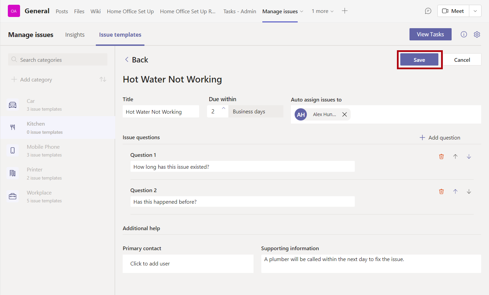](../media/save-template.png#lightbox)

## Task - Explore the Issue reporting app

To explore the **Issue reporting** app, follow these steps:

1. Select the **Issue reporting** tab of your team.

    > [!div class="mx-imgBorder"]
    > 

1. Select **Allow**.

    > [!div class="mx-imgBorder"]
    > [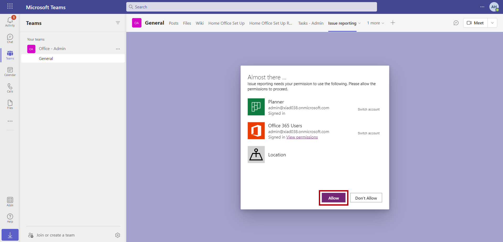](../media/allow-issue.png#lightbox)

1. Select **Report an issue**.

    > [!div class="mx-imgBorder"]
    > [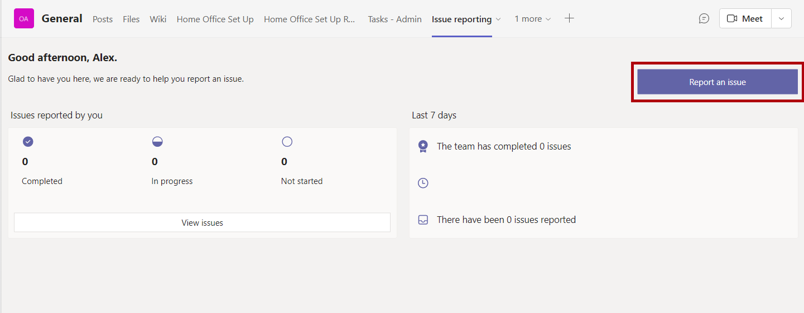](../media/report.png#lightbox)

1. Select the **Select an issue type** option and then select **Kitchen**. Select the **Hot Water Not Working** template.

    > [!div class="mx-imgBorder"]
    > 

1. In the **Location** field, enter **Dallas Store**.

    > [!NOTE]
    > You can turn on the GPS switch to record the coordinates of your location.

1. Enter a description, such as **No hot water is coming out of the tap from the sink in the main kitchen**.

1. For the **How long has this issue existed** question, enter **3 days**.

1. For the **Has this happened before** question, enter **No**.

1. Select **Submit issue**.

    > [!div class="mx-imgBorder"]
    > [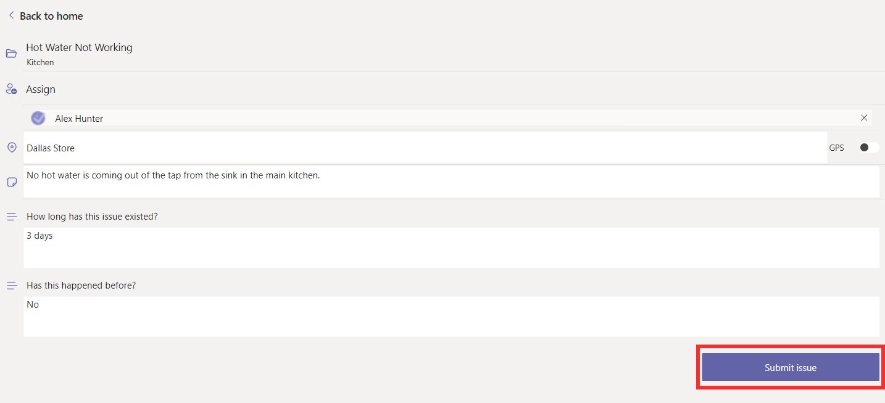](../media/submit-issue.png#lightbox)

1. Select **View in Tasks** to launch Tasks in a new tab. The issue that you reported should display.

    > [!div class="mx-imgBorder"]
    > 

    > [!div class="mx-imgBorder"]
    > [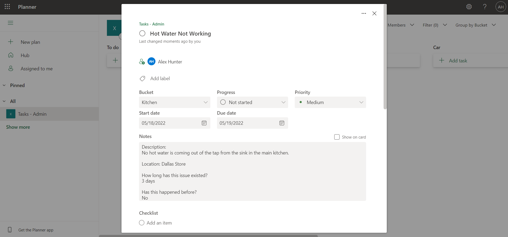](../media/view-tasks.png#lightbox)

1. From Tasks, you can manage the details and status of the task, such as changing the **Progress**, **Priority**, and **Due date** and adding attachments. For now, change the **Progress** to **In progress**.

    > [!div class="mx-imgBorder"]
    > [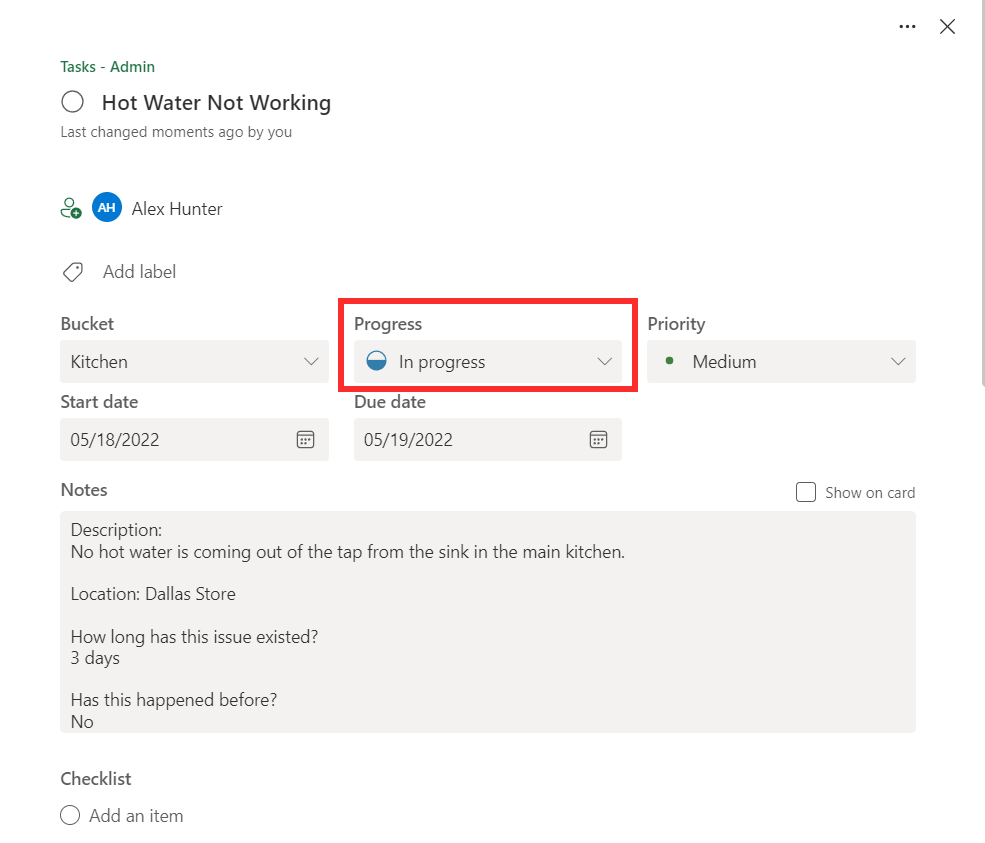](../media/progress.png#lightbox)

1. Return to the tab in your browser with Microsoft Teams open. Select **Return to home**. A summary of the issues that your user has reported will display, where you can view a summary of each.

    > [!div class="mx-imgBorder"]
    > 

    > [!div class="mx-imgBorder"]
    > [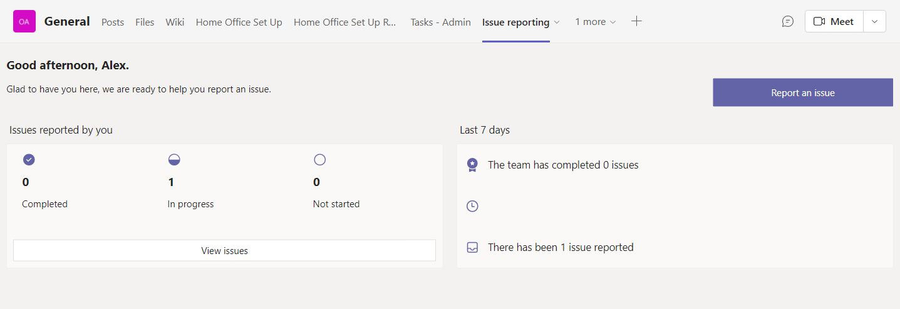](../media/report-issue.png#lightbox)
