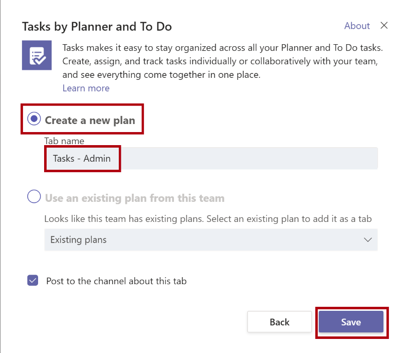
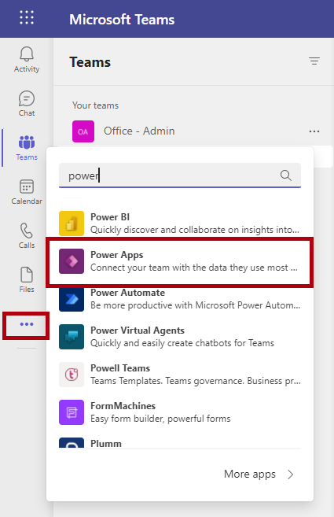
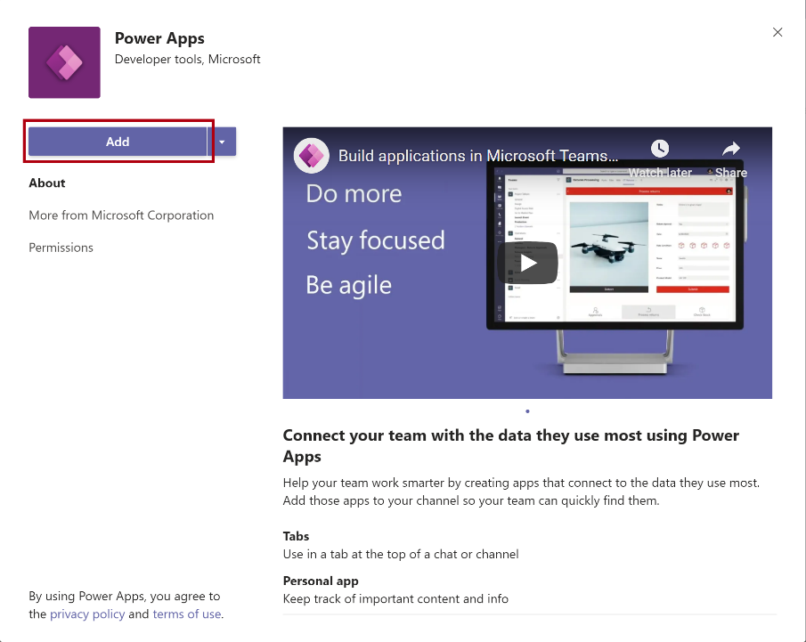
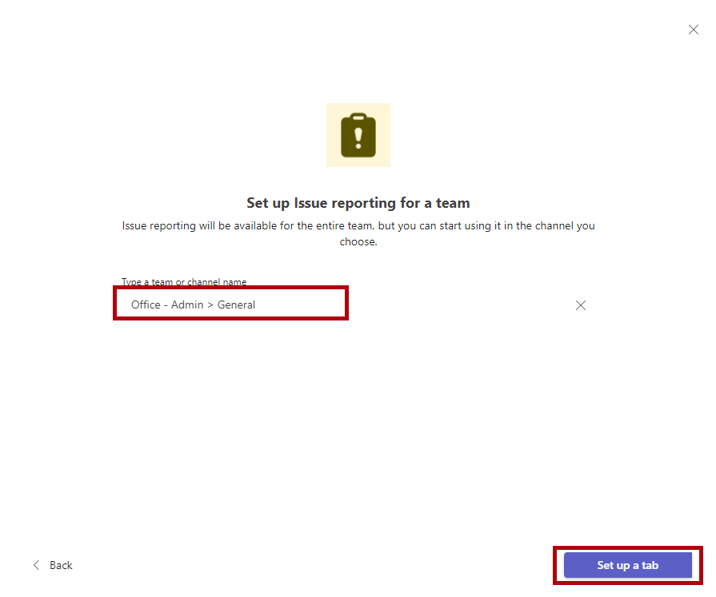
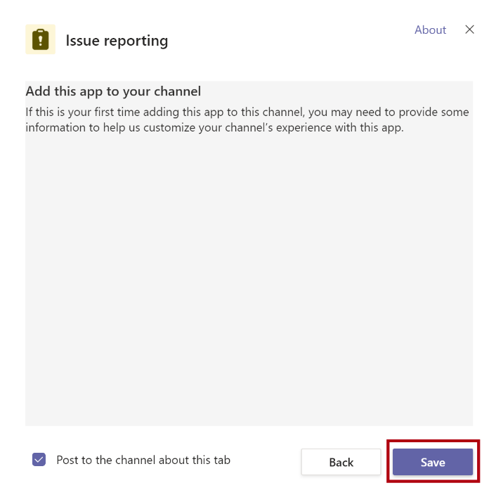
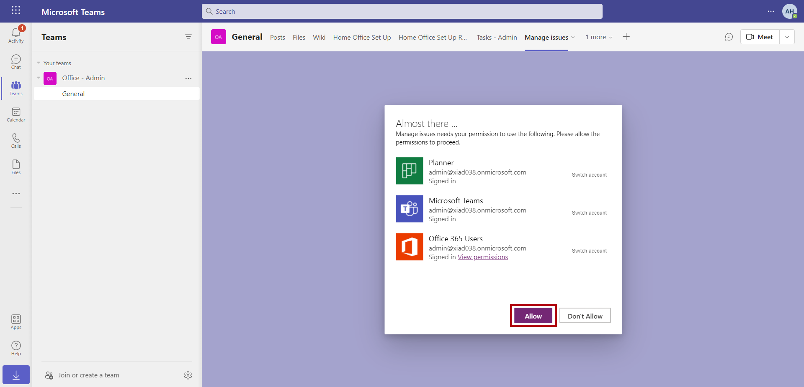
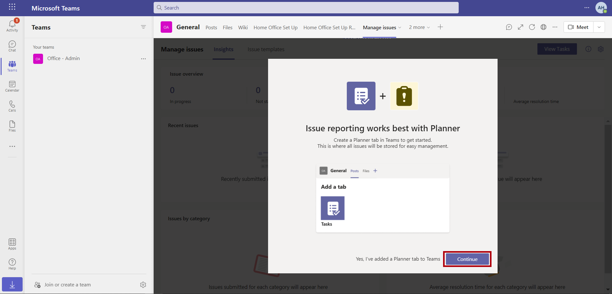
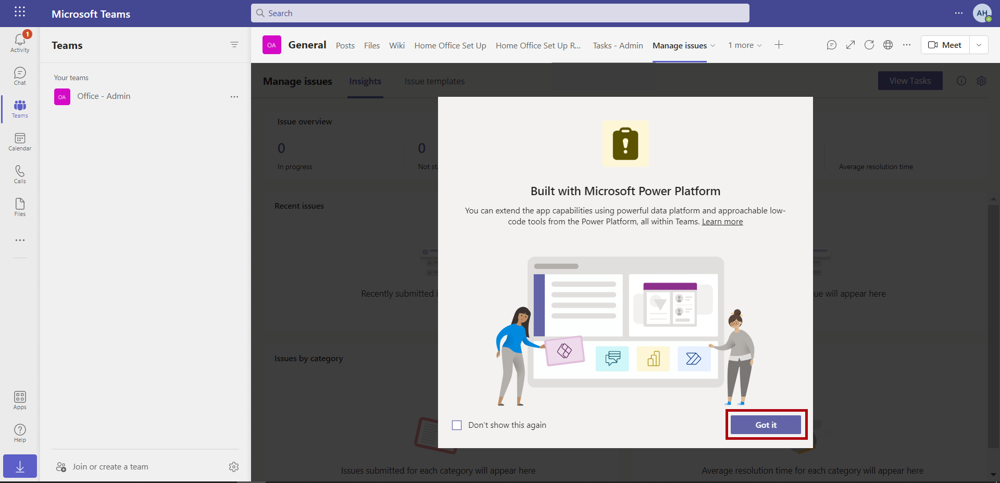

In this exercise, you'll install the **Issue reporting** sample app.

## Task - Add Tasks to your team

1. In your browser, go to [Microsoft Teams](https://teams.microsoft.com/?azure-portal=true) and sign in with the account that you're using for the labs. Go to the team that you created in the previous lab in this learning path to complete the labs.

1. In your team channel, select the plus (**+**) icon to add a new tab.

    > [!div class="mx-imgBorder"]
    > 

1. Search for **Tasks** and then select the app called **Tasks by Planner and To-Do**.

    > [!div class="mx-imgBorder"]
    > 

1. Select **Create a new plan** and give the tab a unique name. You can name the tab **Tasks - *your name***. Select **Save**.

    > [!IMPORTANT]
    > Give your tab a unique name because other users in your tenant will create an instance of the **Tasks** tab.

    > [!div class="mx-imgBorder"]
    > 

## Task - Add the Issue reporting app to your team

To add the **Issue reporting** app to your team, follow these steps:

1. In Teams, select the ellipsis (**...**) and launch Microsoft Power Apps (if it isn't already showing on the navigation bar). You might need to search for it, as shown in the following screenshot, if it doesn't immediately appear in your list of apps. If necessary, you might need to select **Add**.

    > [!div class="mx-imgBorder"]
    > 

    > [!div class="mx-imgBorder"]
    > 

1. On the home page of Power Apps, select **Issue reporting** from the **Add these apps to your team** area.

    > [!div class="mx-imgBorder"]
    > 

1. Select **Add to a team** and then search for your team. Select **Set up a tab**.

    > [!div class="mx-imgBorder"]
    > 

    > [!div class="mx-imgBorder"]
    > 

1. Select **Save**.

    It might take a few minutes for the app to save and finish installing.

    > [!div class="mx-imgBorder"]
    > 

1. After the installation has finished, you'll get a notification in Teams. Select **Allow** after the app has finished installing.

    > [!div class="mx-imgBorder"]
    > 

1. Select **Continue**.

    > [!div class="mx-imgBorder"]
    > 

1. When asked to select the Planner instance, select the **Tasks** tab that you created earlier in the **Add tasks to your team** task. Then, select **Let's go**.

    > [!div class="mx-imgBorder"]
    > 

1. Select **Got it**.

    > [!div class="mx-imgBorder"]
    > 
