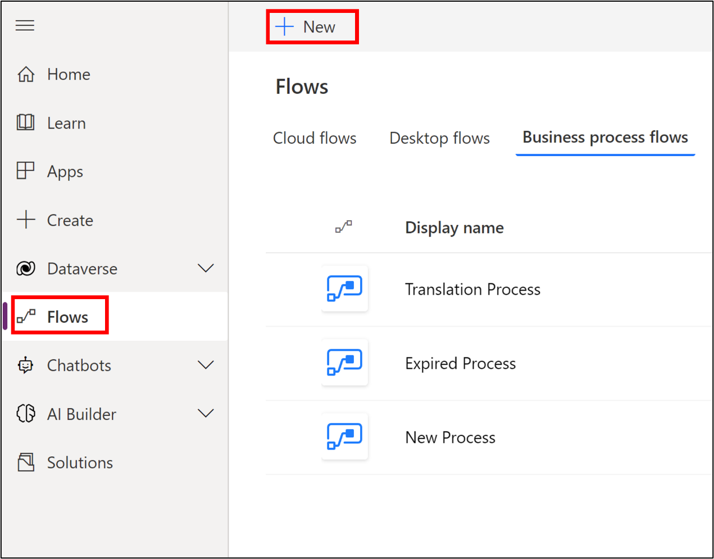
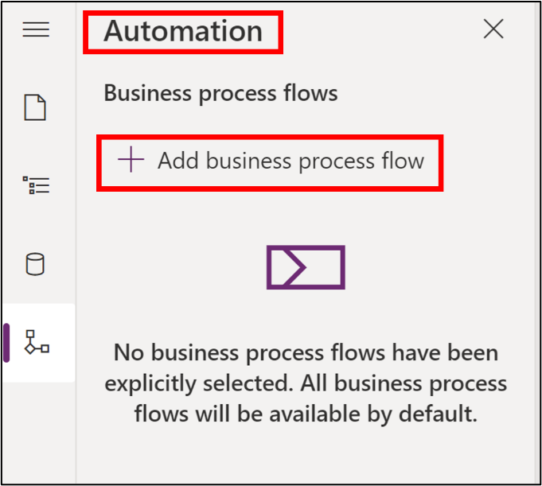
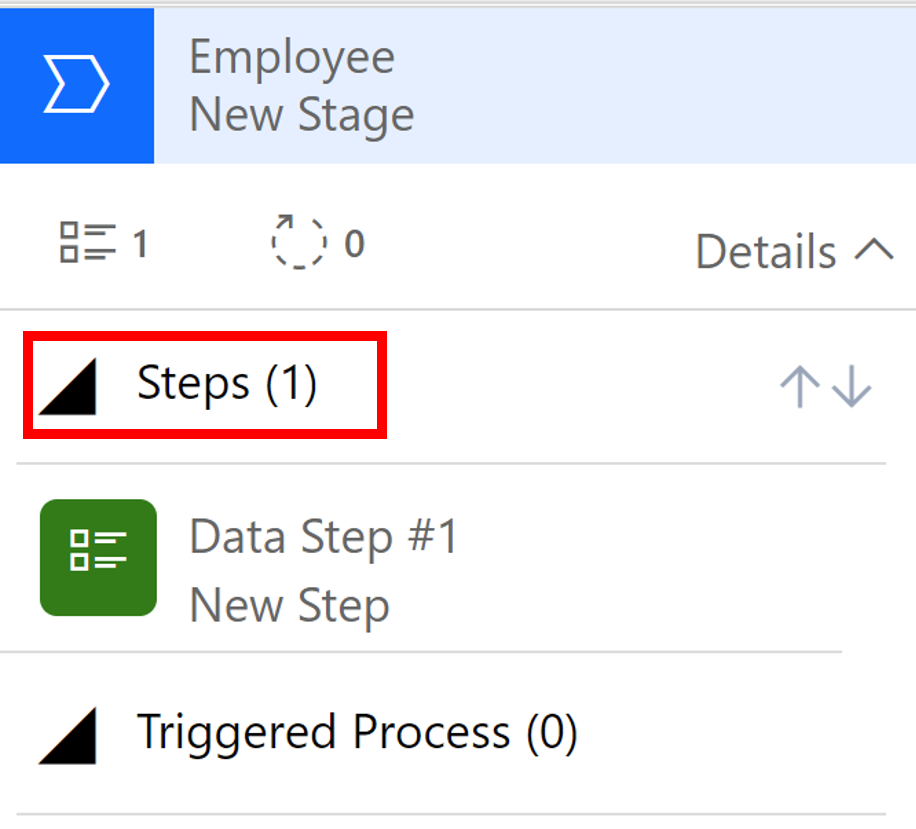
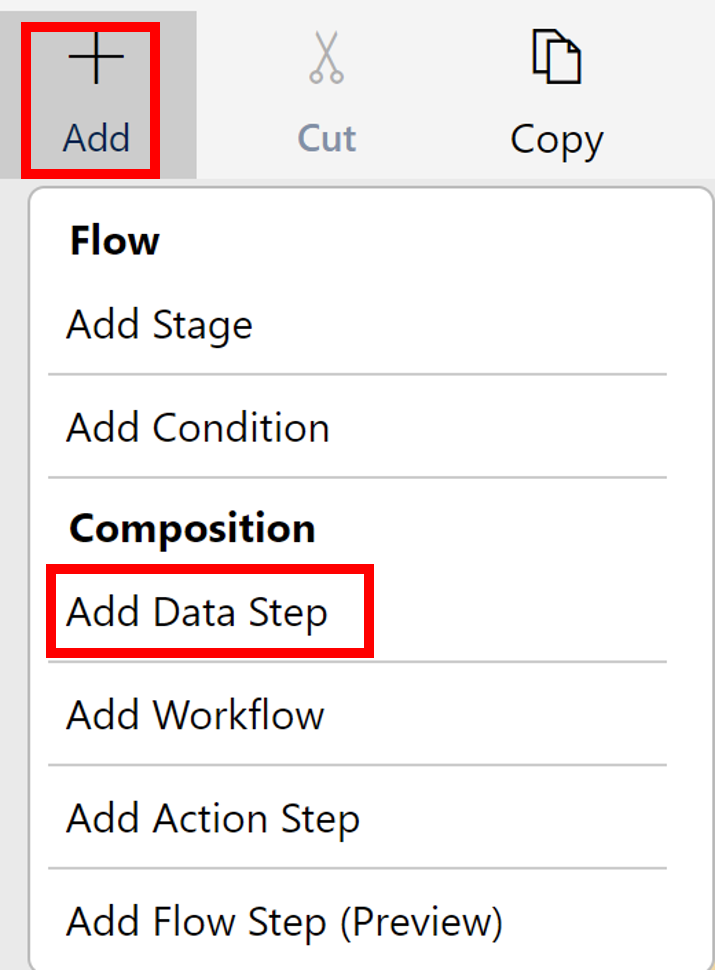
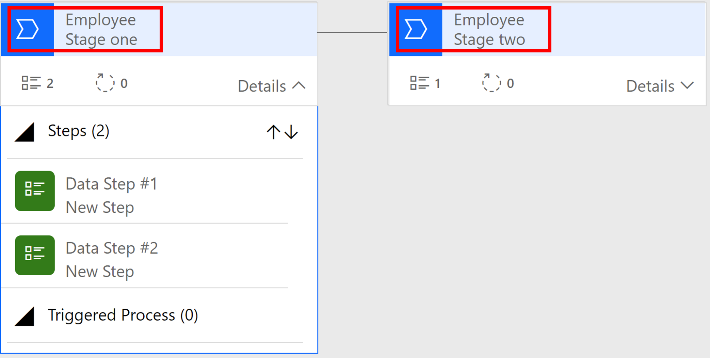
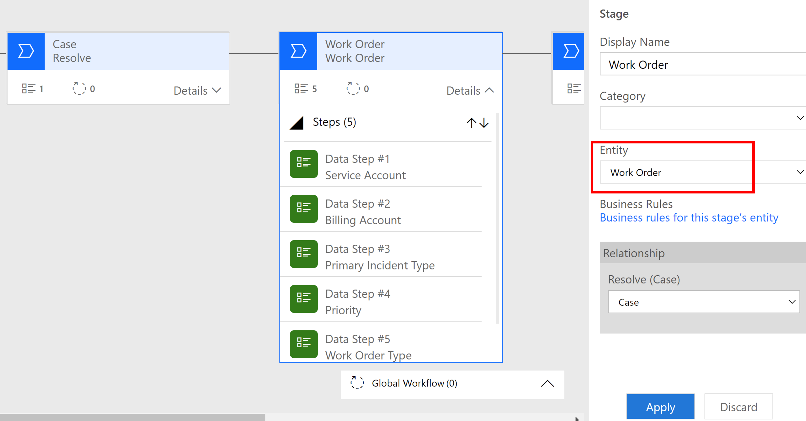

To create a business process flow, refer to the [PowerApps maker portal](https://make.powerapps.com/?azure-portal=true) documentation.

You can create business process flows from three places.

1. Select **Flows** in the left panel and then select the **Business process flows** tab. Then, select **New** in the action pane.

    > [!div class="mx-imgBorder"]
    > 

1. You can create a business process flow from a solution. Under **New** in the action pane, select the **Automation** menu. Under **Automation**, select **Process > Business process flow**.

    > [!div class="mx-imgBorder"]
    > 

1. Open a model-driven app in the edit mode. Select the **Automation** icon in the left panel and then select **Add business process flow**.

    > [!div class="mx-imgBorder"]
    > 

    When you create the business process flow, you'll need to select a table, which will be the primary table of the business process flow. By default, a stage will be created with a step in it.

    > [!div class="mx-imgBorder"]
    > 

1. In the stage property, enter the display name. You can also select the category of the stage. A category lets you group stages by a type of action; it's useful for reports that will group rows by the stage that they're in. The options for the stage category come from the **Stage Category** global choice. You can add more options to this global choice and change the labels of existing options if needed. The category global choices are:

    - Qualify

    - Develop

    - Propose

    - Close

    - Identify

    - Research

    - Resolve

    - Approval

1. Select **Data Step #1**, and in the property panel, select the data field. You can select the required option in the **Data Step** property if the data field is mandatory.

1. To add a new step within the stage, select **Add** in the action pane and then select **Add Data Step** under **Composition**.

    > [!div class="mx-imgBorder"]
    > 

1. If you have multiple data steps within a stage, you can use the **Sequence** property to sequence the data fields.

1. You can add multiple stages by selecting the **Add** button in the action pane, followed by the **Add Stage** button under **Flow**. Business process flows can have up to 30 stages.

    > [!div class="mx-imgBorder"]
    > 

## Business process flow with multiple tables

You need to select a base table to create a business process flow. The default table for all stages is the base table that was created during the creation of a new stage. From the second stage onward, you can change the table.

> [!div class="mx-imgBorder"]
> 

If a relationship between two tables exists, a relationship block will appear in the property pane. You need to enter a relationship when the preceding stage in the process is based on a different table. For the stage that's currently being defined, you'll need to select the **Relationship** block in the property pane to identify a relationship to use when you're moving between the two stages. Relationships define the column mapping between two tables, which will automatically carry over data between rows, minimizing data entry.

## Branching capability

To design a business scenario, you can create a linear business process flow. To manage a complex business process flow, you'll need to use branching. The branching condition consists of multiple logical expressions that use a combination of **AND**/**OR** operators.

> [!div class="mx-imgBorder"]
> 

To initiate a branching, select **Add** in the action pane, and under **Flow**, select **Add condition**. In the condition block, you can define single or multiple conditions that are supported by various operators, such as **equals**, **does not equal**, and **contains data**. You can connect two endpoints (true and false) of the condition block to different stages. Select the **Connector** button in the action pane to reconnect the branched-out stage.

## Security features

Different users in an organization might follow different processes to run the same operation. To perform the same function, different conditions might be applied for different users. You can have up to 10 active business process flows for each entity to provide appropriate processes for different situations. You can associate business process flows with security roles so that only people who have those security roles can view or use them. You can also set the order of the business process flows so that you can control which business process flow will be set by default. To set business process flow order, you'll need to open a business process flow in the designer and then select **Order Process Flow** on the command bar.

> [!div class="mx-imgBorder"]
> 

Each business process flow definition is represented as a custom entity. It comes with its own set of privileges that you can edit within a security role. You can specify the privileges in the **Business Process Flows** tab for a security role.

In the next unit, you'll learn how to embed a canvas app in a model-driven app form by using the canvas app component.
