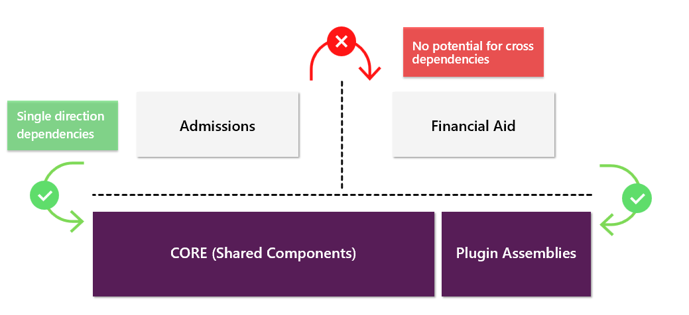
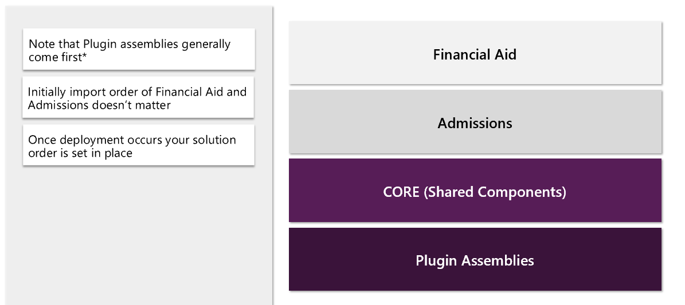
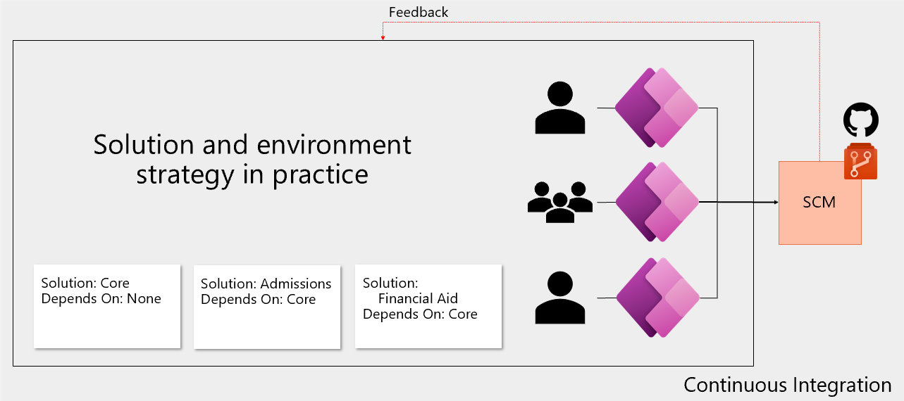
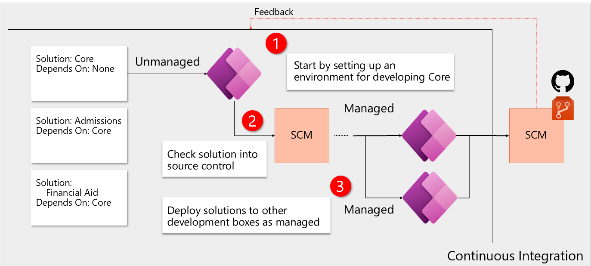

This unit provides an example of developing your solution and environment strategy from start to finish. The first task is to view your solutions. Then, you’ll outline what you want the solution segmentation to look like. This example uses vertical solution segmentation.

> [!div class="mx-imgBorder"]
> 

Additionally, this example applies an environment strategy to align with the solution architecture. Make sure that you always store the publisher solution for quick access when you’re setting up a new development environment.

Consider the following parameters when storing publisher solutions:

-   Storing the publisher solution in source will allow us to share the publisher to new development environments as an unmanaged solution to ensure no mistakes are made when setting up a publisher.

-   Using a single publisher for all work is recommended.

> [!div class="mx-imgBorder"]
> 

## Solution layering

The following image shows how layering is shown post deployment when you’re using managed solutions.

> [!div class="mx-imgBorder"]
> 

For plug-ins, the SDK Message processing will create dependencies, which will enforce some import order of solutions. Therefore, plug-in assemblies are generally imported first.

## Solution and environment strategy in practice

This example has three solutions that are segmented by an app with shared components that reside in a separate solution.

> [!div class="mx-imgBorder"]
> 

This strategy isn’t the definitive answer to solution architecture, but it’s a good starting point for you to develop an understanding of proper solution segmentation. The strategy contains the following solutions:

-   **Core** - This solution contains shared components.

-   **Admissions** - This solution contains all functionality that’s developed specifically for the Admissions department. This solution depends on the components in the **Core** solution.

-   **Financial Aid** - This solution contains all functionality that’s developed specifically for the Financial Aid department. This solution depends on components in the **Core** solution

## Development process setup

With an understanding of what your solutions are, you’ll now be able to determine how to set up your development environments. You’ll start by establishing a workflow for your core solution.

> [!div class="mx-imgBorder"]
> 

1. Assume that the top environment will be dedicated to developing the Core solution, which contains shared components. To get started, you'll create the Core solution in the target development environment. When creating solutions, you’ll create them as unmanaged, and you can only change them to managed during the export process.

	Following the pattern of including your dependencies as managed solutions, you'll need to complete certain tasks before using the Core solution downstream, assuming that you’re starting from the beginning.
	
	Before you can introduce the Core solution into your development environments for Admissions and Financial Aid, you’ll need to have a viable base of code to enable the development of the layered apps.
	
	Having a viable base of code doesn't prevent you from starting development on the layered apps because they might have unique components that have no dependencies. For simplicity purposes, you'll start building the Core solution first.

1. Assume that you've finished your development sprint on the Core solution and have checked your changes into your repository. Then, you’ll deploy the Core solution as managed in the Admissions and Financial Aid development environments.

### Reasons for introducing one unmanaged solution for each environment

By introducing only one unmanaged solution for each environment, you’ll eliminate the potential for injecting unwanted dependencies.

Additionally, this approach allows you to effectively use segmentation and solution layering.

### Get the managed solution

With the dependencies in place, we can now introduce our other solutions.

> [!div class="mx-imgBorder"]
> 

You'll create or import your Admissions and Financial Aid solutions in their respective environments.

An environment might have more than one unmanaged solution installed if it can be guaranteed that the other solutions won't introduce dependencies. This concept might make more sense in certain cases.