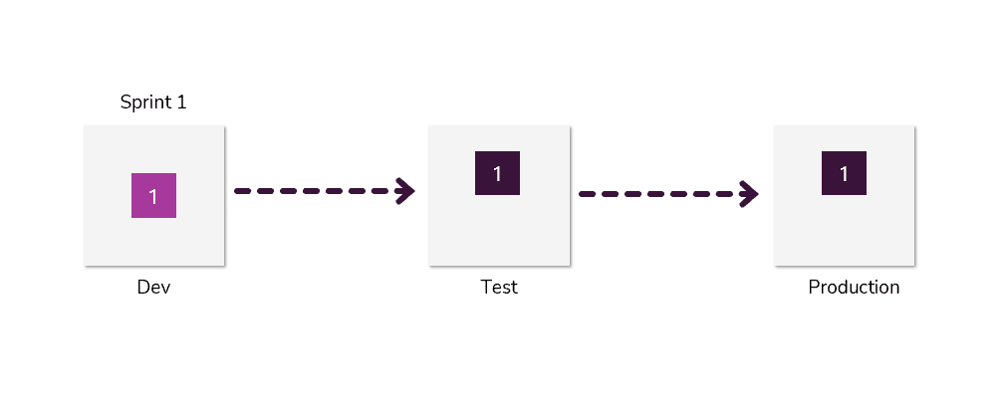
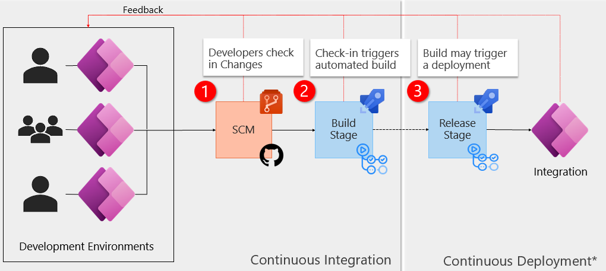

The Power Platform allows teams to apply common continuous integration and continuous deployment (CI/CD) patterns with unmanaged and managed solutions. This module will cover a common anti-pattern developers follow when beginning development for the Power Platform, followed by a more optimal approach. 

The most common pattern seen historically when working with a solution is the development and deployment of unmanaged solutions. As seen in the graphic below, this pattern leads to an unhealthy state in the production environment as more solutions are added over time. 

> [!div class="mx-imgBorder"]
> 

In the early phases of development, the use of unmanaged solutions for deployment is common for decreasing deployment times and reducing perceived complexity. Teams often place their development changes into a new unmanaged solution for deployment to production. Over time, the addition of new unmanaged solutions to speed releases leads to a multitude of unmanaged solutions in production. Eventually leading to a state where a production environment is no longer in a healthy state causing maintainability and supportability to suffer. This pattern also leads teams to miss the opportunity to use source control, solution layering, and efficiencies gained when using managed solutions for deployment, which will be discussed in the following section.  

Pitfalls: 

When new unmanaged solutions are used for each deployment, it is not possible to apply source control for solutions. 

Improvements in deployment times are marginal when compared to a healthy deployment pattern applying managed solutions, solution segmentation, and source control as the definitive source of truth.  

## A better pattern for team development

A better pattern for team development will involve the use of one or more development environments enabling multiple developers to efficiently collaborate on the creation of new content. 

> [!div class="mx-imgBorder"]
> 

In this more optimized development loop:

1. Developers make changes in their respective environments. 

1. Changes in those environments are exported, then checked into source control. 

1. The action of checking a solution into source control may trigger one of several events, such as a build process to move the solution to downstream environments.   

## Modern approach to solution development

Watch the following video for a demonstration of how continuous integration supports a modern way for developing solutions.

> [!VIDEO https://www.microsoft.com/videoplayer/embed/RE4VeDz]

## Support team development

Every software journey starts with a **plan**. Setting up Automated Lifecyle Management (ALM) for the Power Platform is no different.

**Planning** is not the focus of this module; however, it must be understood that to avoid many common issues in team development an effective process for work item planning and management must be in place. 

Consider the following: 

Work items should be minimal, specific, and time bound 

Plan development to ensure little to no overlap of components. For example, avoid working on the same form at the same time. Co-development of the same components will often lead to conflicts and potentially creators overwriting on another’s changes when working in the same environment. 

Note that while it is not a requirement to have a resource dedicated to maintaining a team’s ALM processes, it has been demonstrated to lead to better outcomes as a projects scale. 

> [!div class="mx-imgBorder"]
> 
