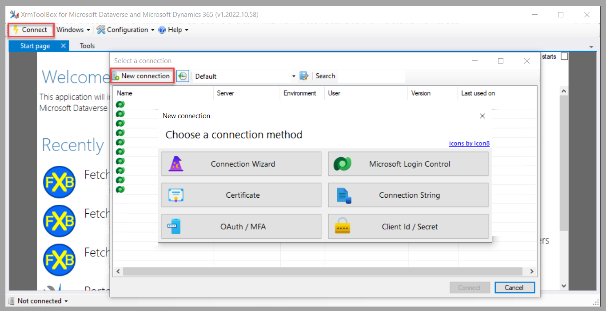
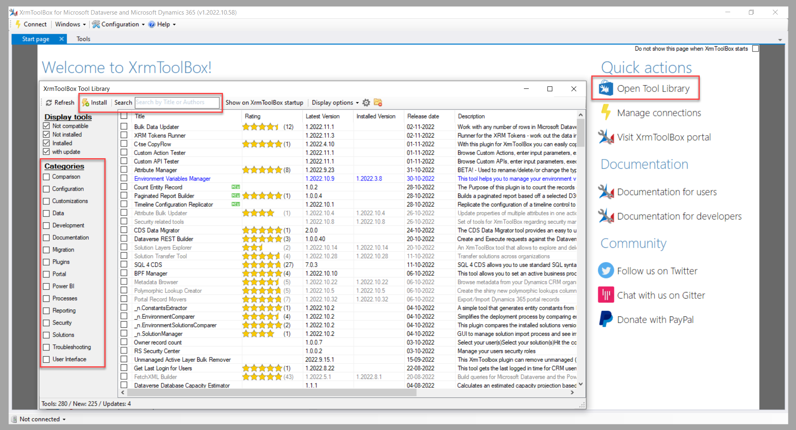
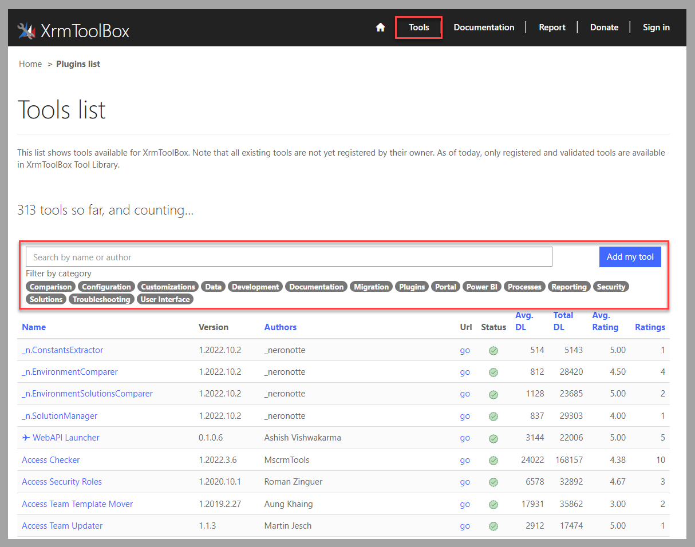
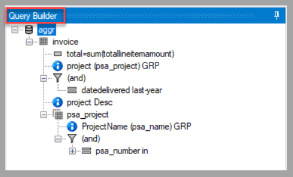
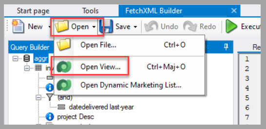
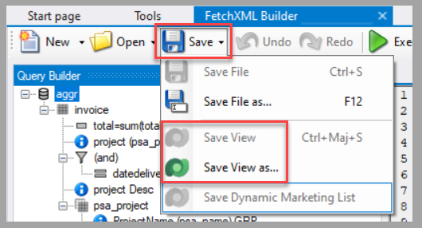
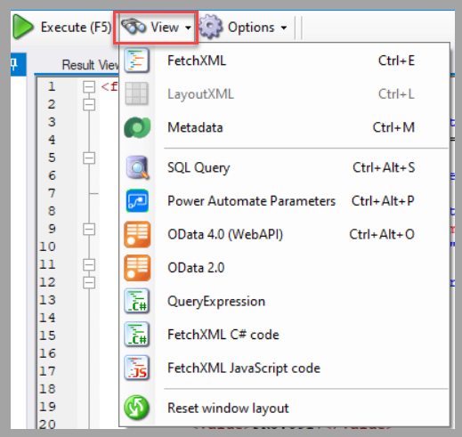
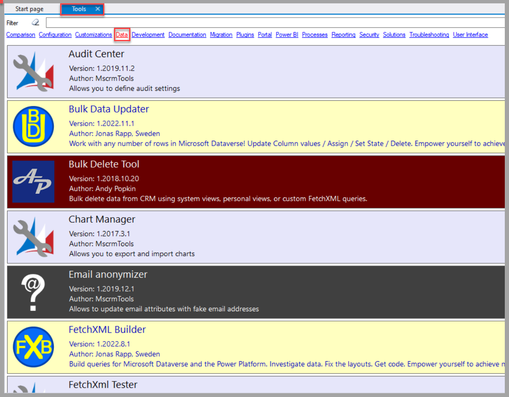

The community of contributors for Microsoft Power Platform solutions provides great extensions to the set of tools that are available on the platform. One frequently used tool is XrmToolBox, which is a community-based, external tool. Developers publish these different extensions, called plug-ins in this context, in a gallery. The extensions are grouped under categories that help analysts, makers, and developers for Dataverse-related tasks, such as:

-   Configuration

-   Documentation

-   Migration

-   Reporting

## Set up XrmToolBox

XrmToolBox is a Windows application that you’ll need to download and install. Current information and details of the requirements, along with installation steps, are available from the editor of the tool:  <https://www.xrmtoolbox.com/>

Different connection methods are available for you to access the Dataverse environment that you want to work with. To provide the appropriate credentials, select **Connect > New connection**.

> [!div class="mx-imgBorder"]
> 

After you’ve created the connection, the different tools can reference it.

## Browse the tool library

Make sure that you install the tools so that they’re available in your local version of the application. Two main areas provide search functionality to discover which tool might help you in your current tasks.

The first area is within the XrmToolBox application. To access it, select **Open Tool Library**. Then, you can search with text or by category, and you can also install the selected tool.

> [!div class="mx-imgBorder"]
> 

The second area is located on the editor's website. Select **Tools**, and then you can search by text or filter by category classification.

> [!div class="mx-imgBorder"]
> 

## Tool example: FetchXML Builder

For specific actions in Microsoft Power Automate, or to help create new views for Microsoft Power Apps, you can use a tool that provides extensive functionality: FetchXML Builder.

Additionally, you can use Query Builder for building complex queries, creating column labels, filtering, sorting, and doing various types of data manipulation. 

> [!div class="mx-imgBorder"]
> 

In Query Builder, you can edit Dataverse views and update them directly.

> [!div class="mx-imgBorder"]
> 

> [!div class="mx-imgBorder"]
> 

To extract the query in formats that you can use in other situations, such as in Power Automate actions, select **View** to select the applicable option.

> [!div class="mx-imgBorder"]
> 

## Use data manipulation tools

You can select from multiple tools that can help with data manipulation in Dataverse. To do so, search for the tools under the **Data** category in the **Tools** section of XrmToolBox.

> [!div class="mx-imgBorder"]
> 

The most frequently used tools include: 

-	**CDS Data Migrator** - This tool provides a user-friendly interface to help you generate schema files to use for exporting/importing data from one Dataverse environment to another.
	
-	**SQL 4 CDS** - This tool is for people who want to use standard SQL syntax to query and manipulate Dataverse data. 

-	**Bulk Data Updater** - This tool provides a solution to update and delete Dataverse records in bulk with a single action. 

Explore the different tools, browse through the documentation and user ratings, and then determine which tools can be applicable for your business scenarios. 

## Next steps

You’ve now learned how to take advantage of community tools, such as XrmToolBox, to have access to extra features for Dataverse and Microsoft Power Platform solutions. Next, you’ll review how to use Dataverse information to generate Power BI reports.
