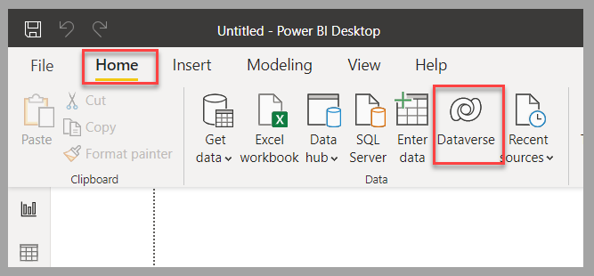
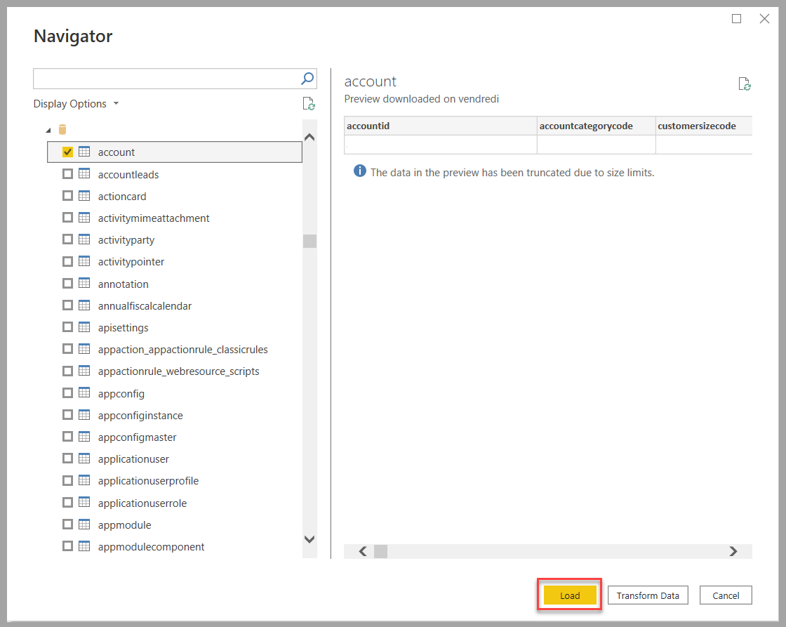
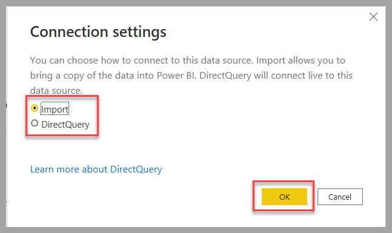

Power BI is a platform that provides extensive analytic capabilities over various data sources, and you can use it to present interactive and appealing reports and dashboards. Additionally, you can integrate those visual representations of data in Power Apps and connect them natively to Dataverse.

Based on the scenario that you might need to deal with, you can choose between two different methods when connecting a Power BI report to Dataverse: 

- **Import** - Data is refreshed based on a predetermined schedule. Performance is optimized for the visualization of the Power BI report. The Dataverse security model might not apply. 

- **Direct Query** – This method provides real-time access to the data. Performance is impacted. Visualization of the Power BI report might take longer to render. Dataverse security is enforced based on the connected user who’s accessing the report.

Alternatively, you can use Azure Synapse Link for Dataverse in situations where you have excessive data that could negatively impact the performance of the **Direct Query** approach and where the delay that’s implied with the **Import** approach isn’t acceptable. The previous unit of this module provides more information about this option.

## Connect to Dataverse

To create a Power BI report that connects to Dataverse by using Power BI Desktop, follow these steps:

1.  Select **Get data** within the **Home** section and then select **Dataverse** as the data source.

	> [!div class="mx-imgBorder"]
	> 

1.  After you've confirmed the connection to the Dataverse environment, select the table(s) in the source Dataverse environment that you want to use in Power BI. Select **Load** to proceed to the next step.

	> [!div class="mx-imgBorder"]
	> 

1.  Based on the applicable scenario, select the type of connection to Dataverse: **Import** or **DirectQuery**. Select **OK** to proceed to the next step.

	> [!div class="mx-imgBorder"]
	> 

When the connection has been established, you can create interactive and rich reports and a dashboard in Power BI based on Dataverse records.

> [!div class="mx-imgBorder"]
> 

For more information about the functionalities of Power BI, you can browse the multiple [Microsoft Learn modules](/training/browse/?expanded=power-platform&products=power-bi).

## Next steps

Now, you’ve learned how to connect to Dataverse in Power BI, which allows you to manipulate data and produce dashboards and reports for straightforward analytics. Next, you’ll validate the learned concepts for this module.

