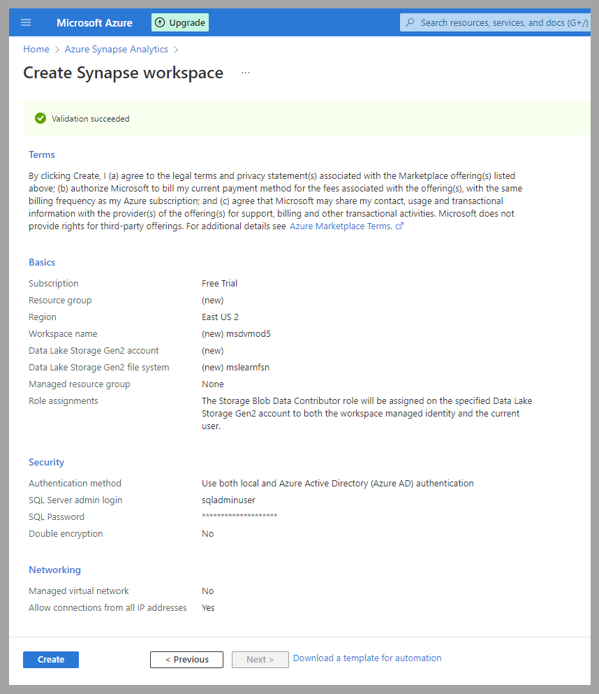
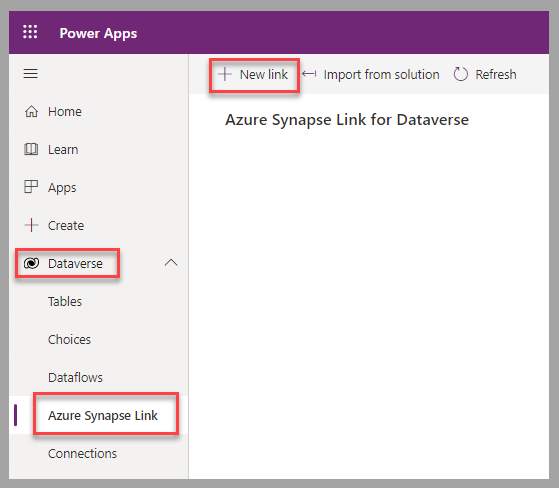
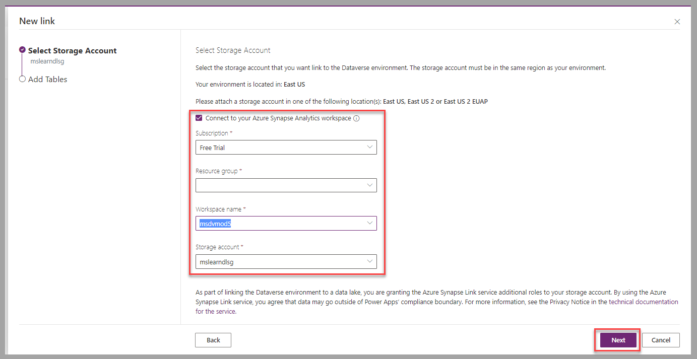
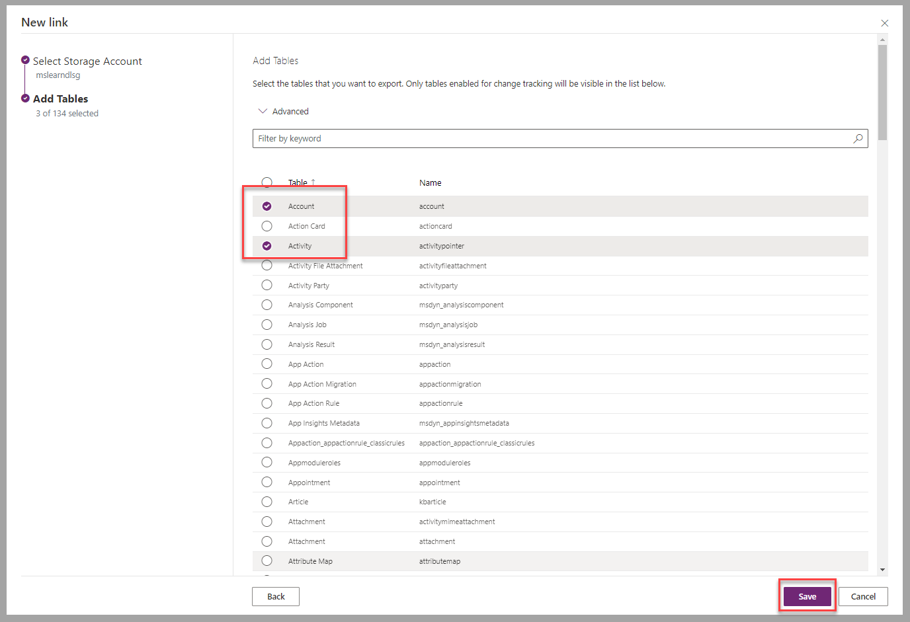
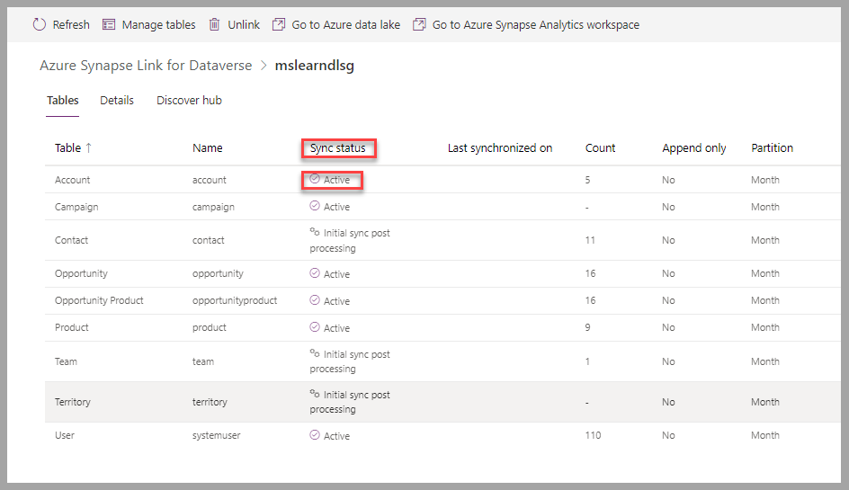
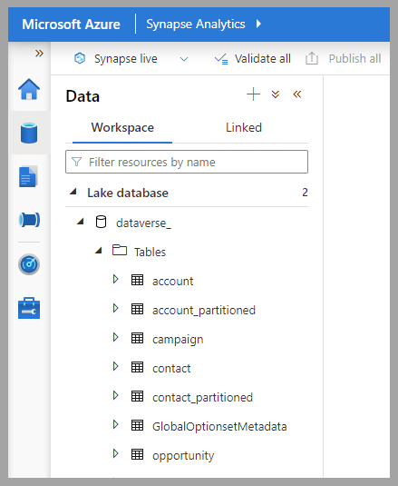
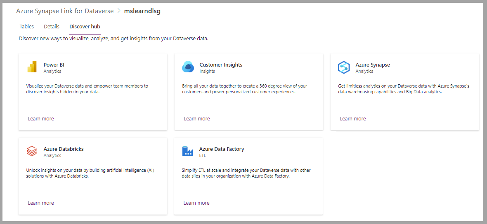

Recent years have shown how digital transformation can provide great opportunities for organizations to understand trends and how it can help with forecasting. The amount of information that’s captured, and the numerous data sources where this information is located, will add complexity to the analytic-related tasks.

Microsoft Azure Synapse Analytics is a service that’s designed for enterprise big data analytics. Combined with Microsoft Azure Synapse Link for Dataverse, Azure Synapse Analytics enables an organization to get near real–time insights over Dataverse.

This combination will allow you to have access to:

-   A fully transactional SQL language through Azure Synapse SQL, which enables data warehousing and virtualization.

-   A big data engine with Apache Spark, which you can use for data preparation, engineering, transformation, and to support machine learning.

-   A scalable data support on Microsoft Azure Data Lake, which allows you to explore and analyze multiple file types.

-   Data integration that’s similar to Azure Data Factory, which provides support for different data sources.

When activated, Azure Synapse Link provides:

-   Continuous replication of tables.

-   A simple process to transform and visualize data in Azure Synapse Analytics.

-   Big data analytics.

## Prerequisites

Through the Microsoft Azure portal, you'll need to create a Synapse workspace prior to linking a Dataverse database to it.

> [!div class="mx-imgBorder"]
> 

Applicable [learning paths](/training/browse/?expanded=azure&products=azure-synapse-analytics&resource_type=learning%20path) are available if you want to delve further into Azure Synapse Analytics.

## Create an Azure Synapse Link for Dataverse

To create a new Azure Synapse Link for Dataverse in the Microsoft Power Apps portal, follow these steps:

1.  Select **+ New link** in the **Azure Synapse Link** section of **Dataverse**.

	> [!div class="mx-imgBorder"]
	> 

1.  Select the storage account configuration to connect to the Azure Synapse Analytics workspace, and then select **Next** to proceed to the next steps.

	> [!div class="mx-imgBorder"]
	> 

1.  Select the tables to connect with Azure Synapse Analytics, and then select **Next** to create the link.

	> [!div class="mx-imgBorder"]
	> 

1.  As the link is created and Dataverse tables are synchronized, the **Sync status** for each table will change to **Active**, which means that the process is complete.

	> [!div class="mx-imgBorder"]
	> 

The tables are automatically created in Azure Synapse Analytics.

> [!div class="mx-imgBorder"]
> 

Different Microsoft analytics solutions are readily available for you to use after the Azure Synapse Link for Dataverse has been enabled: 

- **Power BI** - Visualize Dataverse data in highly interactive dashboards and reports. 

- **Dynamics 365 Customer Insights - Data** - Create a 360-degree view of your customer data. 

- **Azure Synapse** - Benefit from the data warehousing and big data analytics features of Azure Synapse. 

- **Azure Data Factory** - Process complex data transformation and integrate with other data silos. 

- **Azure Databricks** - Take advantage of extensive AI solutions.

> [!div class="mx-imgBorder"]
> 

## Next steps

You’ve now learned how to connect Dataverse with Azure Synapse Analytics, which provides solutions for big data analytics. Next, you’ll learn how community tools can help with Dataverse data manipulation. 
