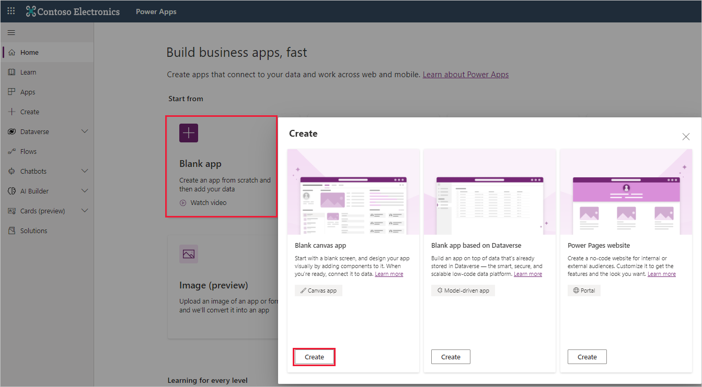
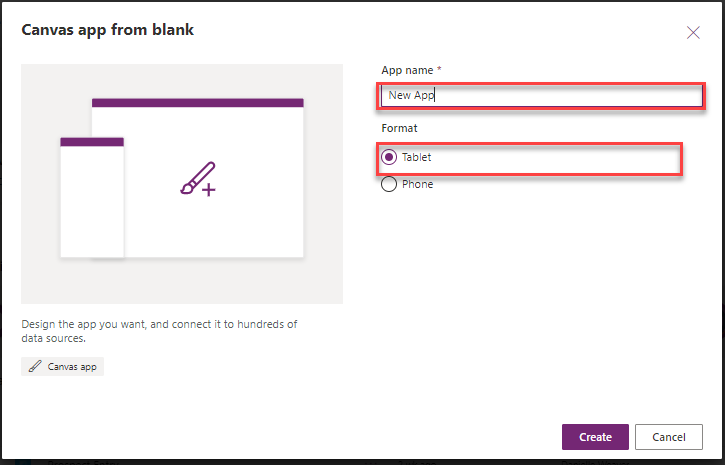
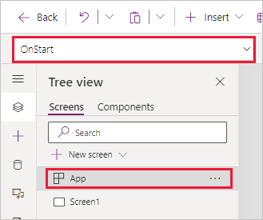
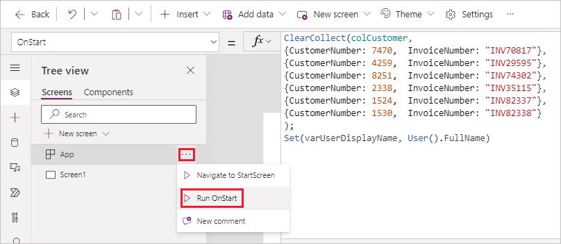
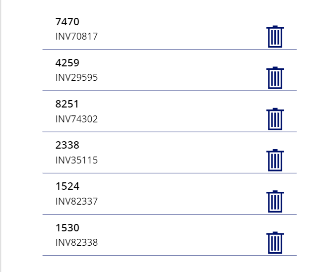
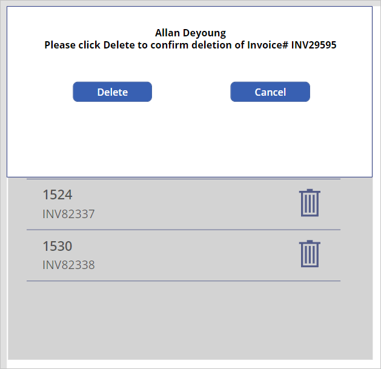
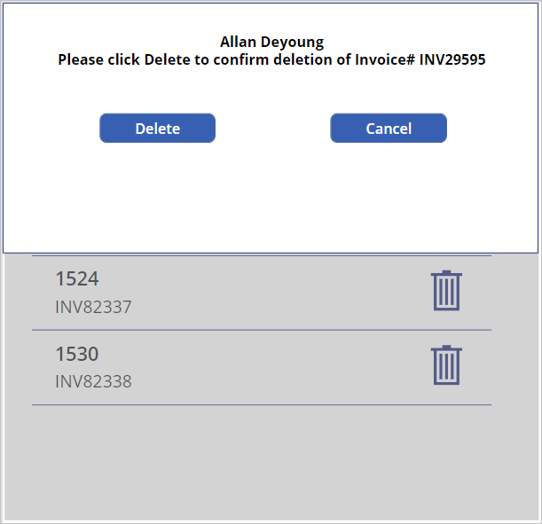

This hands-on lab shows you how to create and use Global, Contextual, and Collection functions.

1. Sign into [Power Apps](https://make.powerapps.com/?azure-portal=true).

1. On the Home screen, under **Start from** select **Blank app** and in the **Create** popup window under **Blank canvas app** select **Create**.

    

1. Name your app **New App**, format **Tablet** and select **Create**.

   

1. After a few moments, your new app will appear. On the **App** object, select the **OnStart** property.

    

1. Set the **OnStart** property to this formula that we're using to create a collection of customer numbers and the associated invoice numbers (just copy and paste it into the fx formula bar):

    ```powerappsfl
    ClearCollect(colCustomer,
    {CustomerNumber: 7470, InvoiceNumber: "INV70817"},
    {CustomerNumber: 4259, InvoiceNumber: "INV29595"},
    {CustomerNumber: 8251, InvoiceNumber: "INV74302"},
    {CustomerNumber: 2338, InvoiceNumber: "INV35115"},
    {CustomerNumber: 1524, InvoiceNumber: "INV82337"},
    {CustomerNumber: 1530, InvoiceNumber: "INV82338"}
    );
    Set(varUserDisplayName, User().FullName)
    ```

1. Select the **ellipsis (…)** and select **Run OnStart**. This will run the **OnStart** formula you just entered and will populate your collection **colCustomer**.

    

1. To view the collection, select the **Insert** tab (or **+ Insert** from the command bar) and add a **Vertical gallery**, set its **Items** property to **colCustomer**.

    Make the changes below to your new **Gallery1**:

    - Layout: Title and subtitle
    - Height: 650
    - Title label **Text** property to ThisItem.CustomerNumber
    - Delete the NextArrow icon

1. In the Gallery, Select the **Title** label and **Insert** tab to add an **Icon** select the **Trash can** icon. Move the Trash icon to the right side of the gallery.

    Your Gallery will now include the Trash can icon.

    

1. Select the **Trash icon** and the below formula to its **OnSelect** property:

    `Remove(colCustomer,ThisItem)`

1. Press and hold **Alt Key**, and select the first **Trash can** icon.

    This will delete the selected row from the collection. While this process works, you probably want to give a warning message that the row will be deleted.

   By employing a **Contextual variable**, let's create a popup warning to inform the user about the pending deletion and give them an option to cancel.

1. First change the **OnSelect** of the **Trash can** icon to the below:
    `UpdateContext({varPopup:true})`

1. To create the popup, select the screen (outside of the gallery control) and use **Insert** to add a **Rectangle** (enter "rectangle" in the search box in the **Insert** menu).

1. Make the **Rectangle** properties as follows:

    - **Name**: rectangle_backgrd
    - **Size**: 744 (width);  720 (height)
    - **Fill**: RGBA(166, 166, 166, .50)

1. Add another **Rectangle** and update its properties to these:

    - **Name**: rectangle_foregrd
    - **Size**: 744 (width); 348 (height)
    - **Fill**: RGBA(255, 255, 255, 1)
    - **BorderThickness**: 1

1. Select **Insert** >**Text label**.

1. Make the following changes to the **Text** label properties:

    - **Name**: lbl_popup
    - **Font size**: 15
    - **Font weight**: Bold
    - **Text alignment**: Center

1. Set the lbl_popup **Text** to the below formula:

    ```powerappsfl
    varUserDisplayName & "
    Please click Delete to confirm deletion of Invoice#" & " " & Gallery1.Selected.InvoiceNumber
    ```

1. Select **Insert** > **Button** and name your new button: button_Delete; set its **Text** property to: Delete

1. Set the Delete **Button** **OnSelect** property to the below:

    ```powerappsfl
    Remove(colCustomer,LookUp(colCustomer,CustomerNumber=Gallery1.Selected.CustomerNumber));
    UpdateContext({varPopup:false})
    ```

1. Select **Insert** > **Button** and name the new button: button_Cancel; set its **Text** property to: Cancel

1. Set the Cancel Button **OnSelect** property to:

    `UpdateContext({varPopup:false})`

1. Arrange the new controls you created over top of **Gallery1** like this:

     

1. Now let's select all of these controls together so we can group them. While holding down the Ctrl-key Select the following controls:

    - rectangle_backgrd
    - rectangle_foregrd
    - lbl_popup
    - button_Delete
    - button_Cancel

1. With all of them selected, right-click and select **Group**. Set the **Visible** property of **Group1** to:

   `varPopup`

   That should make them all disappear from the screen, but if not, press and hold the **Alt** key and select your **Cancel** button.

    You've created a popup box that will delete the selected Customer from the gallery.

   Let's test the Delete function.

1. Press and hold **Alt Key** and select the **Trash can** icon for  invoice# INV29595.

1. Select the **Delete** button, INV29595 is removed from the gallery and your popup disappears.

     

1. Now press and hold **Alt** key again and select the **Trash can** icon for  invoice# INV74302.

1. This time, select your **Cancel** button. The popup window closes, and INV74302 remains in the gallery.

We've created a dynamic collection, a global variable, and a pop-up that uses a contextual variable.
