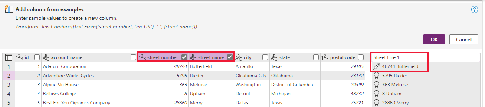

In this exercise, you'll learn how to import rows from a text file into an existing Dataverse table by using Power Query.

## Scenario

You work at a bicycle store and are responsible for your company's Dataverse environment.

The sales manager provides you with a list of potential accounts that could become franchise owners to expand the store's market presence. You must import this list into Dataverse and identify the accounts as potential franchise owners.

## Prepare the account table

To identify potential franchise owners, you need to add a column to the core account table.

In a Dataverse environment where you can proceed with modifications to the tables, such as a dedicated training or development environment, follow these steps:

1. Sign in to the [Power Apps maker portal](https://make.powerapps.com/?azure-portal=true).

1. Select **Tables** from the left side panel.

1. From the list of tables, choose **Account**. Your **Tables > Account** screen will appear.

1. In the columns and data pane of your screen, select the **+ (New column)** button on the far right of your columns.

	> [!div class="mx-imgBorder"]
	> 

1. In the new column form, enter a **Display name**, such as Potential Franchisee. Under **Data type**, select **Choice** and then select **Yes/No** selection within the **Choice** options.

	> [!div class="mx-imgBorder"]
	> 

1. Ensure that the **Default choice** is set to **No**. Then select **Save** to save the new column. Your new column should appear on the right side of your columns and data table. Proceed to the next step.

## Prepare data

A comma-separated values (CSV) file that contains accounts as potential franchise owners is available to [download](https://github.com/MicrosoftDocs/mslearn-developer-tools-power-platform/blob/master/power-apps/visualize-import-export-Dataverse/Potential%20Franchise%20Owners.zip).

For this exercise, the file must be uploaded to a OneDrive for Business folder you have access to.

## Exercise

Now that the account table is modified and the potential franchise owners file is available, you can create the dataflow.

In a Dataverse environment where you can proceed without impacting others in your company, such as a dedicated training or development environment, follow these steps:

1. From the dataflow page in Power Apps Studio, select **+ New dataflow**.

	> [!div class="mx-imgBorder"]
	> 

1. In the New dataflow window, enter `Potential Franchise Owner` for the name, and then select **Create**.

1. In the Power Query, **Choose Data Source** window, select the **Text/CSV** tile. You can find it on the top row under **New sources**.

1. From the **Connect to data source** window, select **Browse OneDrive**.

1. In the **Browse OneDrive** popup, select the **Potential Franchise Owners.csv** file that you saved to OneDrive earlier. Select **Next** to complete this step.

1. Back on the **Connect to data source** window, you'll see the URL link to your file populating the **File path or URL** field. Select the **Next** button in the lower right of the screen to continue.

	After a few moments, the **Preview file data** window appears where you'll now see the data from the csv file arrayed as a table.

1. In the Preview file data window, select the **Transform data** button in the lower right.

1. Let's start transformation by combining the street number and street name into a single column. Select the **Add column** tab, and then select **Column from examples** > **From selection**.

	> [!div class="mx-imgBorder"]
	> 

1. Check the box in the **street number** and **street name** column headings. In the new column section on the right, just below the header, double click it and then input the street number and name values from the first line of data (`48744 Butterfield`) and then select **Enter** on your keyboard. Notice how the values populate down the column when you do this. Rename the new column as **Street Line 1** (and select **Enter**) so it will be easy to recognize later in the import process. Finally, select **OK** to proceed to the next step.

	> [!div class="mx-imgBorder"]
	> 

1. Let's add another column to our data to indicate that the imported accounts are all potential franchise owners. Still at the **Add column** tab in Power Query, select **Custom column** (it's just to the right of the **Column from examples** button).

1. In the Custom column form, under **New column name** input `Potential Franchisee`, set the **Data type** to **True/False**, and in the **Custom column formula** box enter `true`. Select **OK** to proceed to the next step.

	> [!div class="mx-imgBorder"]
	> 

1. You should now see your new **Potential Franchisee** column to the right of your **Street Line 1** column, with values as *TRUE* for each line. We're now complete with data transformation. Select the **Next** button in the lower right corner of the screen to proceed to the next step.

1. The **Map tables** screen appears next. To update the account table with the new rows, select **Load to existing table**, under **Load settings**, and then select **Account** as the destination table.

1. Next move to the **Column mapping** section. Map the source columns from your Potential Franchise Owners table to the Destination columns of your account table according to the table below. Find each Destination column and then select the source column from the dropdown. You'll have to scroll through the columns to find each one. Refer to the image just below the following table.

	>[!NOTE]
	>Your Potential Franchisee column in your Dataverse list will have a different prefix than **cref2_**. The prefix denotes it as a custom column you've created.

	| Source column | Destination column |
	|----------------------|----------------------|
	|city |Address1_City|
	|Street Line 1 |Address1_Line1|
	|postal code |Address1_PostalCode|
	|state |Address1_StateOrProvince|
	|Potential Franchisee|cref2_PotentialFranchisee|
	|account_name |Name |

	> [!div class="mx-imgBorder"]
	> 

1. Column mapping is complete. Select **Next** to continue.

1. The last step is to configure the refresh settings. For the current scenario, which is a one-time event, we'll leave it to **Refresh manually**. Select **Publish** to complete the creation of the dataflow.

1. Wait for the dataflow status to appear as **Published** and a green checkmark to appear under the **Last Refresh** column in your dataflows list.

	> [!div class="mx-imgBorder"]
	> 

1. Next, let's take a look at your table to see how the update went. From the left side panel, select **Tables**. In the list of tables, select **Account**.

1. Under **Account columns and data** note the imported records, including the **Potential Franchisee** values set to **Yes**. You can add columns to the view to see all of your imported data.

## Exercise steps (video)

This following video takes you through similar steps for this exercise, take a moment to watch it to review how you can build a dataflow to import data via Power Query.

> [!VIDEO https://www.microsoft.com/videoplayer/embed/RE59os1]

## Next steps

You now have learned how to create a dataflow by using Power Query to import new rows from a static text file into an existing Dataverse table. You also learned how to add new columns by using transformation and static values. Next, you'll learn how to import dynamic data into a Dataverse table by using Power Query.