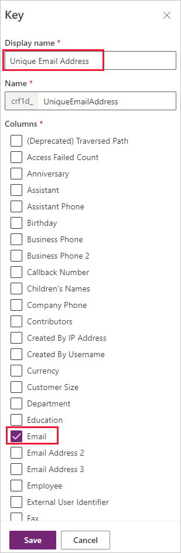
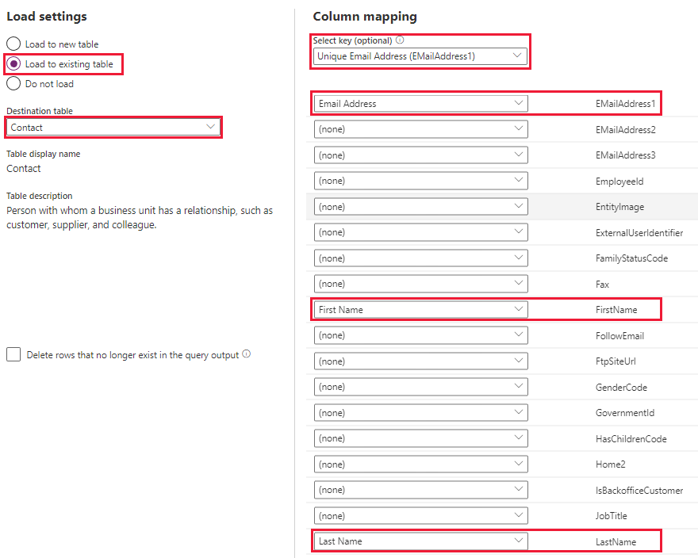
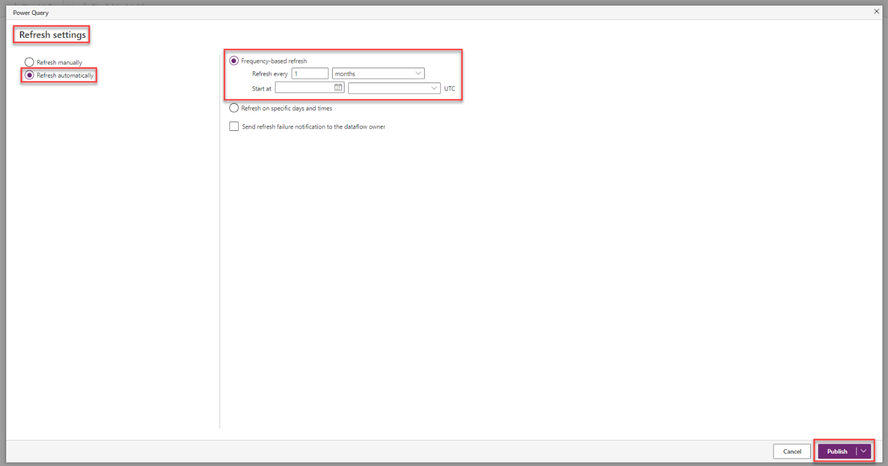
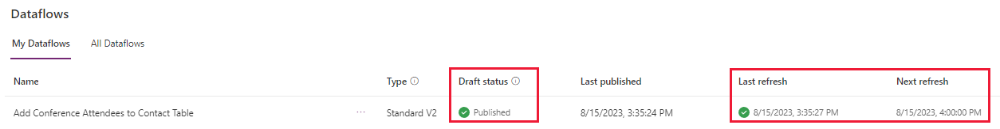
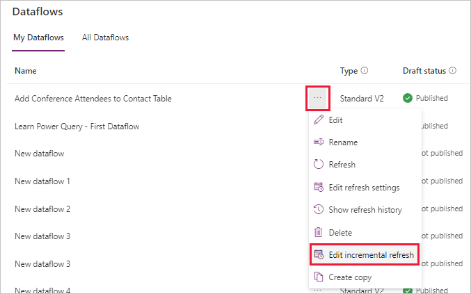
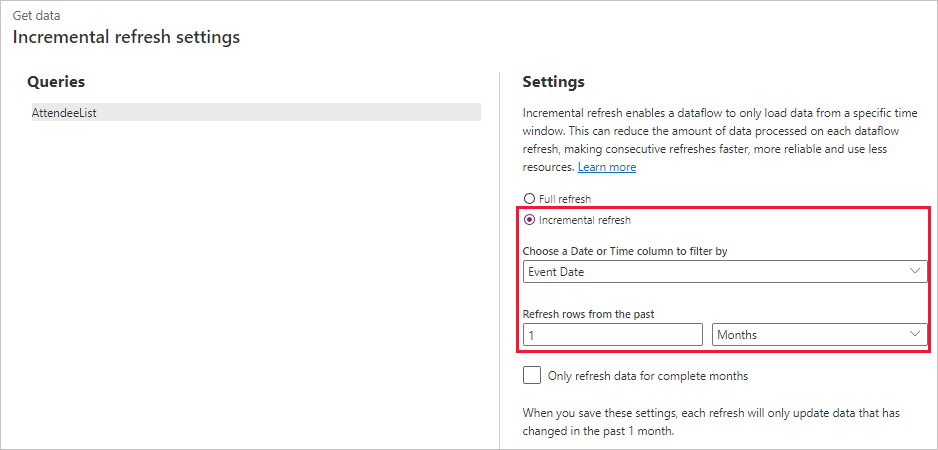

In this exercise, you'll apply your learned knowledge to create a dataflow by using Power Query to import an Excel spreadsheet containing a list of conference attendees. New conferences are organized on a monthly basis, on the same day of the month. You have the task to create a dataflow and configure it to refresh after every conference.

## Prepare the contact table

You want to ensure that attendees are identified based on their email addresses and that contacts aren't added if they already exist in the contact table. So, let's create an index for the email column.

> [!IMPORTANT]
> For the successful creation of the unique key, you must ensure that there are no duplicate records with the same email address in the contact table of your environment.

In a Dataverse environment where you can proceed with modifications to the tables, such as a dedicated training or development environment, follow these steps:

1. Sign in to the [Power Apps maker portal](https://make.powerapps.com/?azure-portal=true).

1. From the navigation panel on, the left select **Tables**.

1. Find and select your **Contact** table.

1. In the Tables viewer for the Contact table, find the **Schema** pane (top center of the viewer) and select **Keys**.

1. Your screen will display a list of keys, select **+ New key** from the command bar to create a new one.

1. For the Display name field, enter `Unique Email Address`. Select the **Email** column, and then select **Save** to proceed to the next step.

	> [!div class="mx-imgBorder"]
	> 

1. The process that creates the key can take a few moments to complete. The Status column will show **Pending**. Before continuing to the next step, confirm successful completion by selecting the **Refresh** action in the command bar, until the status changes to **Active**.

## Prepare data

Go ahead and [download](https://github.com/MicrosoftDocs/mslearn-developer-tools-power-platform/blob/master/power-apps/visualize-import-export-Dataverse/Conference%20Attendees.xlsx) an Excel spreadsheet that contains a list of event attendees.

Ensure that you upload the file to a OneDrive for Business folder that you have access to.

## Exercise

In a Dataverse environment where you can proceed without impacting others in your company, such as a dedicated training or development environment, follow these steps:

1. From the dataflow page in Power Apps Studio, select **+ New dataflow**.

1. In the New dataflow popup, enter the name `Add Conference Attendees to Contact Table`, then select **Create**.

1. From the **Choose Data Source** screen, select **Excel workbook** tile.

1. From the **Connect to data source** screen, select **Browse OneDrive**. Then from the popup find/select the *Conference Attendees.xlsx* file that contains the list of contacts to import. Select **Next** to complete this step.

1. In the **Choose data** form, select the Excel table or workbook that contains the list of attendees to import (**AttendeeList** in the sample file), and then select **Transform data**.

1. For this scenario, we won't need to do any transformation. Select **Next** to proceed to the next step.

1. To update the contact table with the new rows, select **Load to existing table**, and then select **Contact** as the destination table.

1. Configure the **Column mapping** next by selecting **Unique Email Addresses (EmailAddress1)** as the **Select key**. Then select **Email Address**, **First Name**, and **Last Name** for the applicable account table columns (refer to the image below). Select **Publish** to complete this step.

	> [!div class="mx-imgBorder"]
	> 

1. The next step is to configure the **Refresh settings**. For the current scenario, which requires a monthly refresh, select **Refresh automatically**, then set **Frequency-based refresh** to **Refresh every 1 months** with a start date and time of today. Select **Publish** to complete the creation of the dataflow.

	> [!div class="mx-imgBorder"]
	> 

1. Your screen will return to the **Dataflows** list. Wait for green checks to display under **Draft status** (to show **Published**) and under **Last Refresh**. When complete, your dataflow will have a date/time value under **Next refresh** as well.

	> [!div class="mx-imgBorder"]
	> 

1. Now we'll configure the refresh to process for only the last month's event. For the newly created dataflow, select the ellipsis **...(More Commands)**, and then select **Edit incremental refresh**.

	> [!div class="mx-imgBorder"]
	> 

1. On the **Incremental refresh settings** screen, select **Incremental refresh**, and then select the **Event Date** column from the spreadsheet as the column to filter on. Configure **Refresh rows from the past** to be **1 Months**. Select **Save** to complete this step.

	> [!div class="mx-imgBorder"]
	> 

1. Let's take a look at our **Contact** table. Select **Tables** > **Contact**, and you should be able to see the new names/emails added to your table.

## Exercise steps (video)

In the following video, you can review the steps for this exercise.

> [!VIDEO https://www.microsoft.com/videoplayer/embed/RE59BmZ]  

## Next steps

You now have learned how to create a dataflow based on Power Query that imports dynamic data to a Dataverse table. Next, let's validate what you have learned in this module.