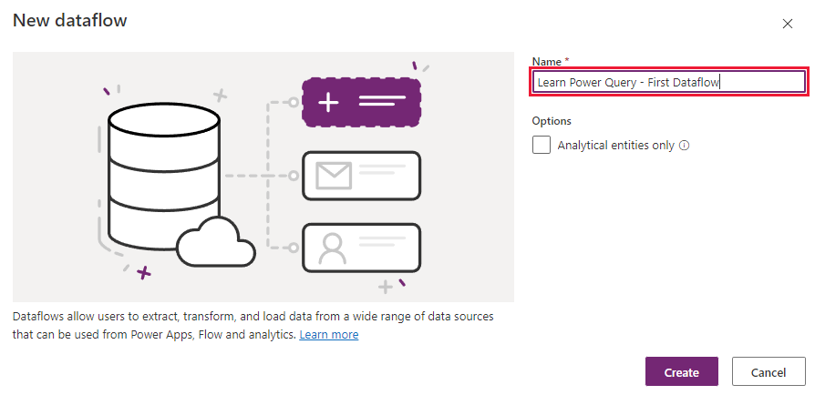
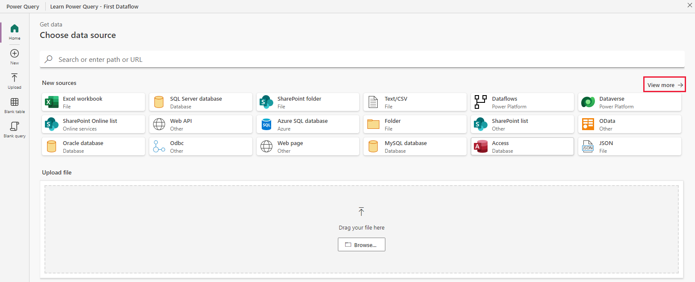
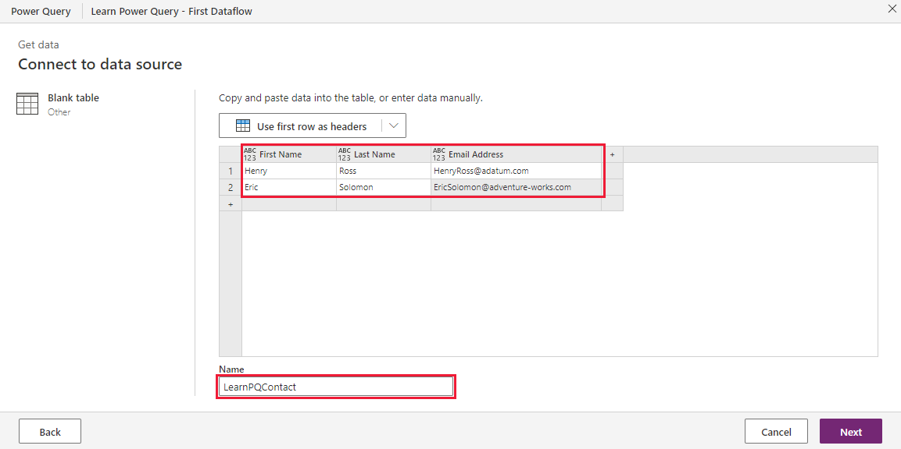
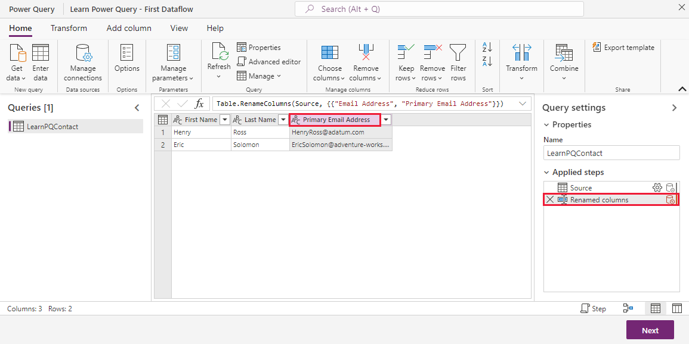
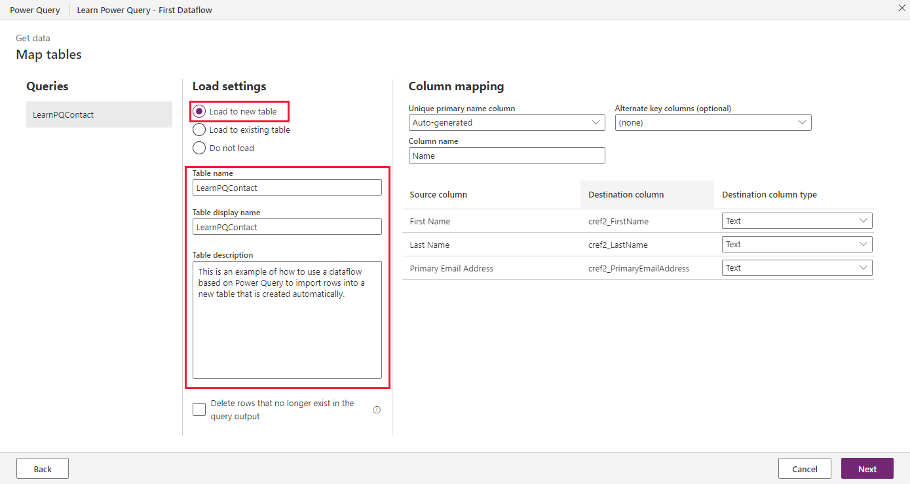

In the previous unit, you learned how to access your dataflows. In this unit, you'll learn the process to import static data, such as manually entered data, into a Dataverse table by using Power Query.

In this scenario, you have a short list of contacts (first name, last name, and email address) that you need to import into a temporary Dataverse table for review. This list of contacts could be in a text file or added manually.

You'll create a dataflow in Power Apps Studio for this process.

## Create a dataflow by using Power Query

To create a dataflow that imports data in Dataverse by using Power Query, follow these steps:

1. From the command bar of the dataflow page in Power Apps Studio, select **+ New dataflow**.

1. In the New dataflow window, enter a name for the new dataflow, and then select **Create**.

	> [!div class="mx-imgBorder"]
	> 

1. From the **Choose Data Source** window of the Power Query, select the data source for your business scenario. There are many different sources to choose from, and you can easily upload from your computer to start the process. For our example, we're going to create a **Blank table**. To find that option select **View more** from the top right of the list of sources, and then select **Blank table**. The **Blank table** option resides near the bottom row of your source list.

	> [!div class="mx-imgBorder"]
	> 

1. With this next step, you connect to a data source. You may need to enter credentials and details about the data source, depending on the source. In our **Blank table** example, we can define information about the data structure and rows. We can add column names, such as **First Name**, **Last Name**, and **Email Address**.

1. We can enter some data into the table, under the rows we created. We can also name our table. In this case, we're naming it "LearnPQContact". Select **Next** to complete this step and move to the data transformation step.

	> [!div class="mx-imgBorder"]
	> 

1. The data transformation step allows you many options to transform the data, such as adding columns based on calculations, groupings, or transformation of other columns of the data source. You can also remove, rename, sort, and many other options. Double click and rename the **Email Address** column in your data to **Primary Email Address**. Notice how in your **Query settings** pane on the right, under **Applied steps** it lists the step that you just did called **Renamed columns**.

	> [!div class="mx-imgBorder"]
	> 

	If you decide to undo a step, you can select the **X** to the left of the applied step.
	
1. Select **Next** to complete data transformation and move to table mapping.

1. The **Map tables** screen provides you with a way to define whether to create a new table or to update an existing table. By default, Power Apps selects the **Load to a new table** option. Then you define the destination column for each source column during the data import. For our current scenario, if you entered a table name in the data transformation step, your **Table name** and **Table display name** will already have the table name you gave. You can change the values here. Go ahead and input a **Table description.** The column mapping doesn't require modifications, since we're creating a new table based on our data transformation screen. Select **Next** to complete this step.

	> [!div class="mx-imgBorder"]
	> 

1. The last step of dataflow creation is to configure the refresh settings. You can refresh your dataflows on demand (**Refresh manually**) or on a predetermined schedule (**Refresh automatically**). You can also choose an option to send a refresh failure notification to the dataflow owner. The notification option is useful if you create a scheduled refresh. Leave this one to **Refresh manually** and select **Publish** to complete the creation of the dataflow.

	After a few moments, Dataverse begins provisioning the new table (or updating an existing table) and the new dataflow will be added to the list of **My Dataflows** with a **Published** status and send a notification that confirms the process is complete.

1. To access the newly created table, select **Tables** from the left-side navigation panel and search for your new table by entering the name of the table in the top right search field. (Alternatively, you can scroll through the complete list of tables.)

## Next step

You now have learned how to create a dataflow that imports manually entered data into a new Dataverse table by using Power Query. Next, you'll learn how to add new accounts from a text file into an existing Dataverse table.
