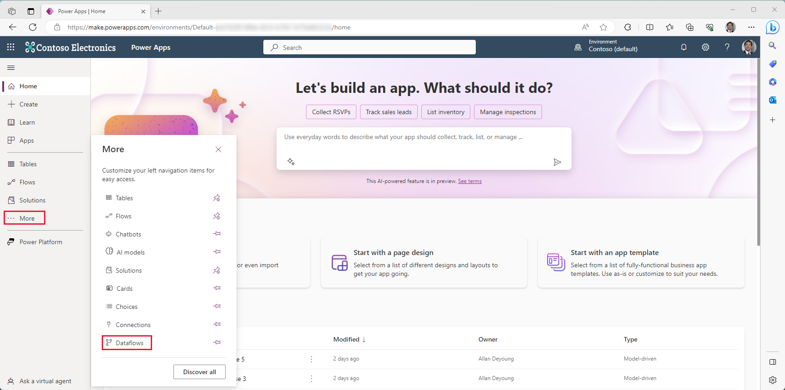
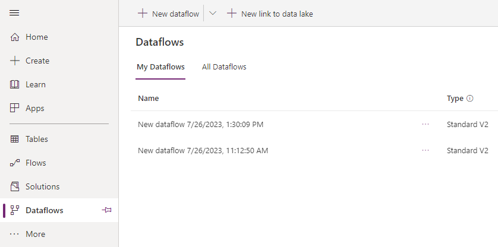
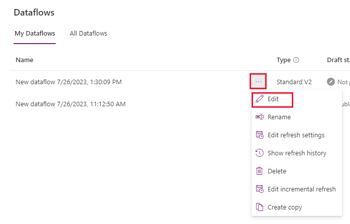
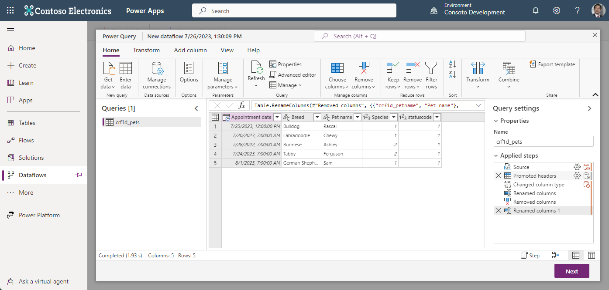

Welcome to "Use Power Query to load data in Dataverse." This self-paced module will help you learn how you can take advantage of Power Query to connect to different data sources and transform data so it can then be imported into a Dataverse table.

## Power Query

Power Query provides a complete solution to transform and prepare data by using a graphical user interface (GUI). You can use the GUI to connect to different data sources and to load data into Dataverse.

Two versions of Power Query are available, one for desktop and one online. In the context of Microsoft Power Platform, the applicable version is Power Query Online and is experienced via the dataflow option.

For most scenarios, the first two steps required when considering using Power Query to import data are:

- **Get data:** Based on the data source, this may require having proper connection credentials.

- **Transform data:** This performs various transformations, such as grouping and merging.

To access Power Query Online from Microsoft Power Platform, follow these steps:

1. Sign in to the [Power Apps portal](https://make.powerapps.com/?azure-portal=true).

1. In the left-hand navigation menu, select **More** and then select **Dataflows** from the popup menu.

	> [!div class="mx-imgBorder"]
	> 

1. The Dataflows screen appears, showing the list of dataflows you created (**My Dataflows**). You can access dataflows created by other users in the same Dataverse environment and then shared with you from the **All Dataflows** tab. You enter the owner's name to create a filtered view.

	> [!div class="mx-imgBorder"]
	> 

1. To access Power Query for an existing dataflow, you can select **Edit** from the ellipsis (**More commands**) related to that dataflow.

	> [!div class="mx-imgBorder"]
	> 

The **Edit** command brings up the Power Query editor popup window displaying the dataflow.

> [!div class="mx-imgBorder"]
> 

You have multiple possibilities available to load and transform data by using Power Query. You should certainly explore the different options available via experimentation in a nonproduction environment.

## Next steps

You now have learned the fundamentals of Power Query. Next, you'll learn how to use Power Query to import data from a static file to a Dataverse table.
