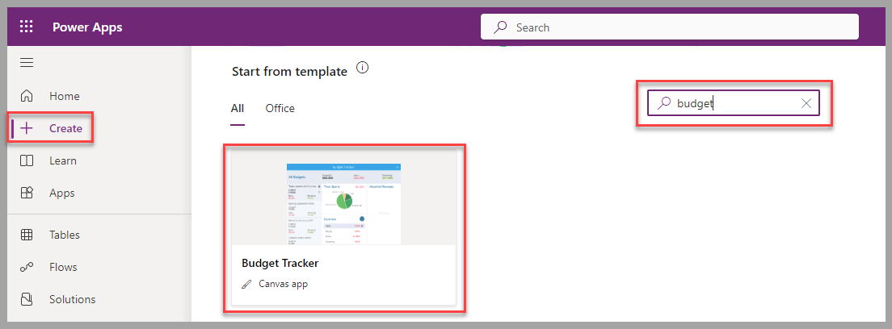
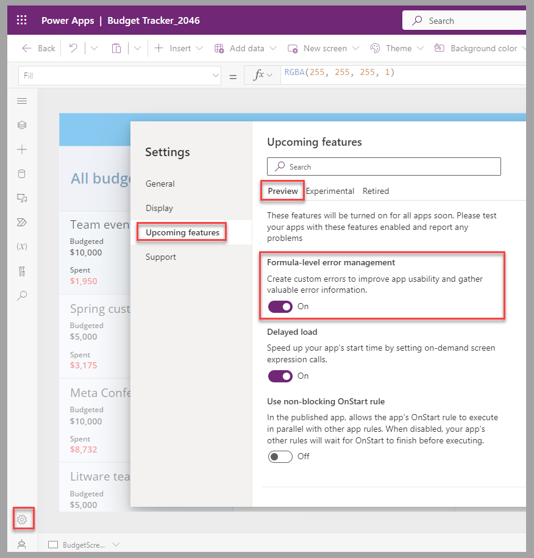
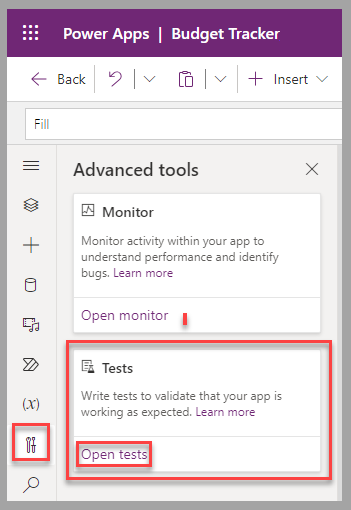
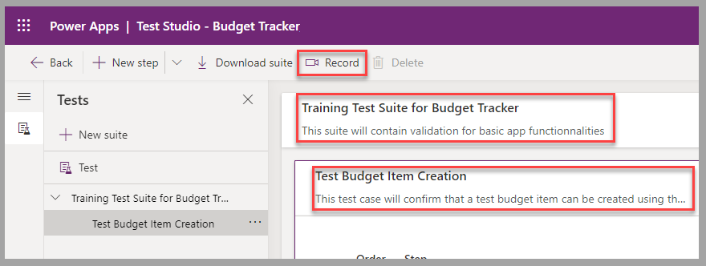
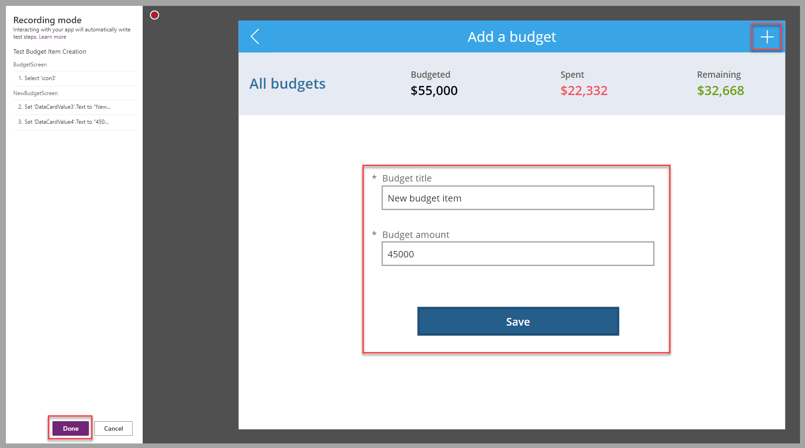
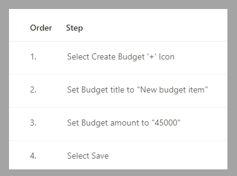
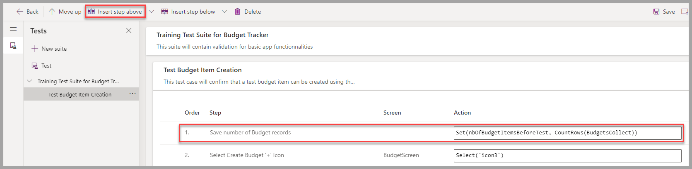
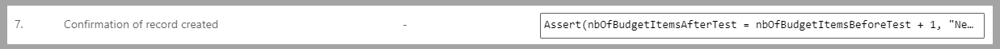
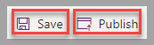

In this exercise, you'll use Test Studio to create and record functionality for a Budget Tracker canvas app. Then, you'll include the formulas that are required to support the test scenario.

## Scenario

You're responsible for the evolution and deployment of the Budget Tracker canvas app at an organization. You need to validate that the creation of new budget items in this app will work in all upcoming versions of the app.

To perform the validation, you record the budget item creation in Test Studio while playing the app. To confirm the creation of the new item, you also need to capture the number of existing budget items in the data source (a collection) before and after using the **Create** function in the app.

## Preparation

To prepare for this exercise, create a canvas app based on the Budget Tracker template, which is available in Power Apps Studio. Save the app before using it with Test Studio.

> [!div class="mx-imgBorder"]
> 

To enable the full set of Test Studio capabilities, you should turn on the **Formula-level error management** option in the advanced settings of the app.

> [!div class="mx-imgBorder"]
> 

## Exercise

To create and record a test suite for the Budget Tracker canvas app, follow these steps:

1.  In Power Apps canvas studio, open the Budget Tracker canvas app that you created. In the left navigation pane, in the **Advanced tools** section, select **Open tests** on the **Tests** tile.

	> [!div class="mx-imgBorder"]
	> 

1.  Provide a name and description for the automatically created test suite and test case. Select **Record** to capture the test case in the app.

	> [!div class="mx-imgBorder"]
	> 

1.  In the Budget Tracker app, select the plus (**+**) symbol to create a new budget item. Provide a title and amount, and then select **Save**. Select **Done** to complete this step.

	> [!div class="mx-imgBorder"]
	> 

1.  In Test Studio, rename the steps to provide information that's more descriptive than the name of the controls.

	> [!div class="mx-imgBorder"]
	> 

1.  To capture the number of budget items before you create a new one, select the first step and then select **Insert step above** from the menu. Provide a step description, such as **Save number of Budget records**, and then insert the following formula as the **Action**: 

	`Set(nbOfBudgetItemsBeforeTest, CountRows(BudgetsCollect))`

	> [!div class="mx-imgBorder"]
	> 

1.  To capture the number of budget items after you create a new one, select the last empty step, provide a step description, such as **Get the number of Budget records**, and then insert the following formula as the action: 

	`Set(nbOfBudgetItemsAfterTest, CountRows(BudgetsCollect))`

	> [!div class="mx-imgBorder"]
	> 

1.  To validate that the new budget item is created, select the last empty step, provide a step description, such as **Confirmation of record created**, and then insert the following formula as the action: 

	`Assert(nbOfBudgetItemsAfterTest = nbOfBudgetItemsBeforeTest + 1, "New Budget item created successfully")`

	> [!div class="mx-imgBorder"]
	> 

1.  Select **Save**, and then select **Publish** to complete this exercise.

	> [!div class="mx-imgBorder"]
	> 

The following video demonstrates the steps for this exercise.

> [!VIDEO https://www.microsoft.com/videoplayer/embed/RW1f2Tq]

You've now learned how to create and record a test by using Test Studio. Next, learn how to perform a test and troubleshoot issues.
