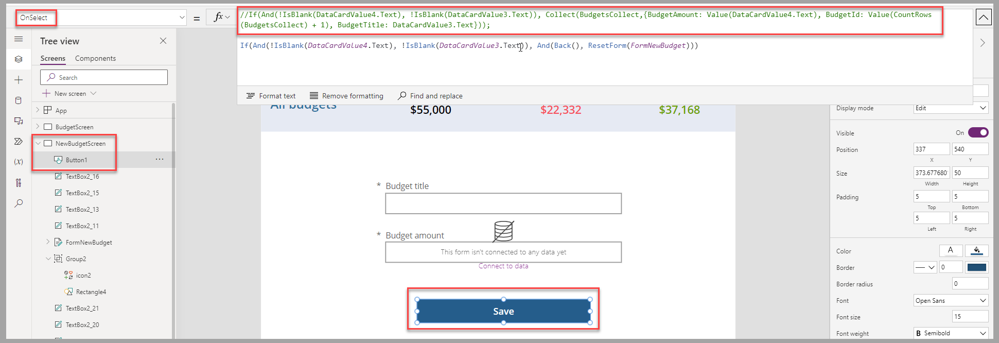
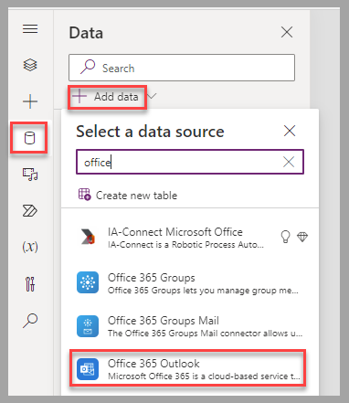
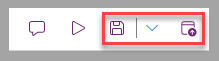
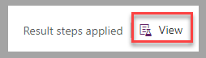
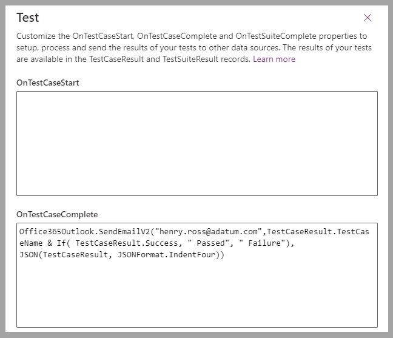
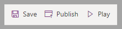
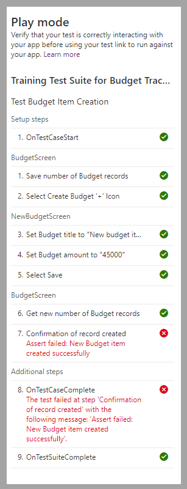

In this exercise, you'll apply your learned knowledge to play and review the test suite that you saved in Unit 3: [Exercise - Create and record a test by using Test Studio](/training/modules/use-test-studio/exercise-create-record-test/?azure-portal=true).

## Scenario

After you create the test suite for the Budget Tracker app, a colleague edits the app and then asks you to confirm the behavior of the app before they deploy it to other users. The test results must be emailed to this colleague.

To proceed with this validation, you'll play the tests and review the results in Test Studio.

## Preparation 

To simulate the modifications that your colleague has made to the app, comment out the first action for the **OnSelect** property of the **Save** button (**Button1**) in the **NewBudgetScreen**. This action will create a failure for the test because the new record isn't added to the collection.

> [!div class="mx-imgBorder"]
> 

To provide the capability of sending email notifications, add **Office 365 Outlook** as a data source for the canvas app.

> [!div class="mx-imgBorder"]
> 

Complete the preparation by saving and publishing the app.

> [!div class="mx-imgBorder"]
> 

## Exercise

To create and record a test suite for the Budget Tracker canvas app, follow these steps:

1.  In Test Studio for the Budget Tracker canvas app that you created, select **View** to set up test properties.

	> [!div class="mx-imgBorder"]
	> 

1.  To send the email notification, in the **OnTestCaseComplete** area of the **Test** pane, insert the following formula, replacing `henry.ross@adatum.com` with the address that you want to use, such as your own email address: 

	`Office365Outlook.SendEmailV2("henry.ross@adatum.com",TestCaseResult.TestCaseName & If( TestCaseResult.Success, " Passed", " Failure"), JSON(TestCaseResult, JSONFormat.IndentFour))`

	> [!div class="mx-imgBorder"]
	> 

1.  Test the app by selecting, in sequence, **Save > Publish > Play**.

	> [!div class="mx-imgBorder"]
	> 

    The modification that's applied in the preparation step causes the test to fail. The results should be visible in the **Play mode** pane after the test is completed.

	> [!div class="mx-imgBorder"]
	> 

You should receive an email with all details at the email address that you provided in step two of this exercise. You can remove the comment that you added in the preparation steps of this exercise from the **OnSelect** property of the **Save** button. Run the test against the newly published version of this app. The system should send an email confirmation that the test results are successful.

The following video demonstrates the steps for this exercise.

> [!VIDEO https://www.microsoft.com/videoplayer/embed/RW1f2Tt]

You've now learned how to perform and review tests for a canvas app. Next, you can validate the learned concepts for this module.
