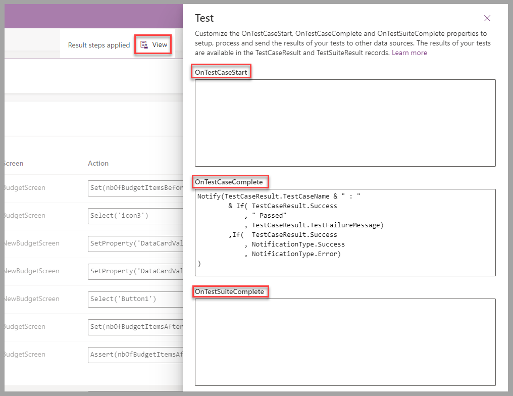
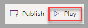
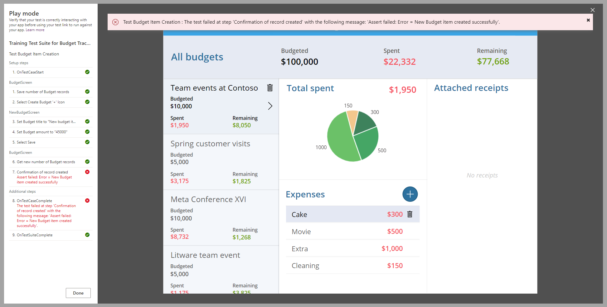

Typically, one goal for a test strategy is to confirm that app functionality works as planned. This approach provides an opportunity to troubleshoot issues when the tests don't proceed with success.

Occasionally, you would select test inputs from a data source to allow test cases to evolve without you needing to modify their configuration. Other times, you're required to navigate to a specific screen to ensure that tests are run under the appropriate conditions. For these situations, you can use **OnTestCaseStart** to provide the full canvas app formula features.

The same concepts apply to the **OnTestCaseComplete** and **OnTestSuiteComplete**, where you can save results to an external data source, send an email on success or failure, or provide a notification to the user who's playing the tests.

You can access these three properties from the **View** menu of Test Studio.

> [!div class="mx-imgBorder"]
> 

The **Play** option of Test Studio opens the app and then processes the steps of the different test cases for each test suite that's selected.

> [!div class="mx-imgBorder"]
> 

Based on the results of the different steps of the current test run, results are displayed with a success or failure symbol and a message that provides details of the failure when applicable.

> [!div class="mx-imgBorder"]
> 

You can share the results of the tests with the team that's responsible for bug resolution.

You've now learned how to perform a test and capture the success or failure status of the tests to help troubleshoot the app behavior. Next, learn how to play and review the tests for the Budget Tracker canvas app.
