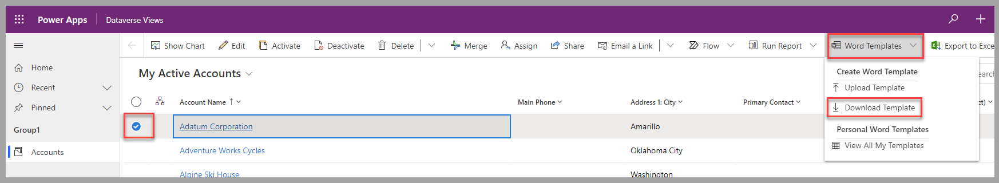
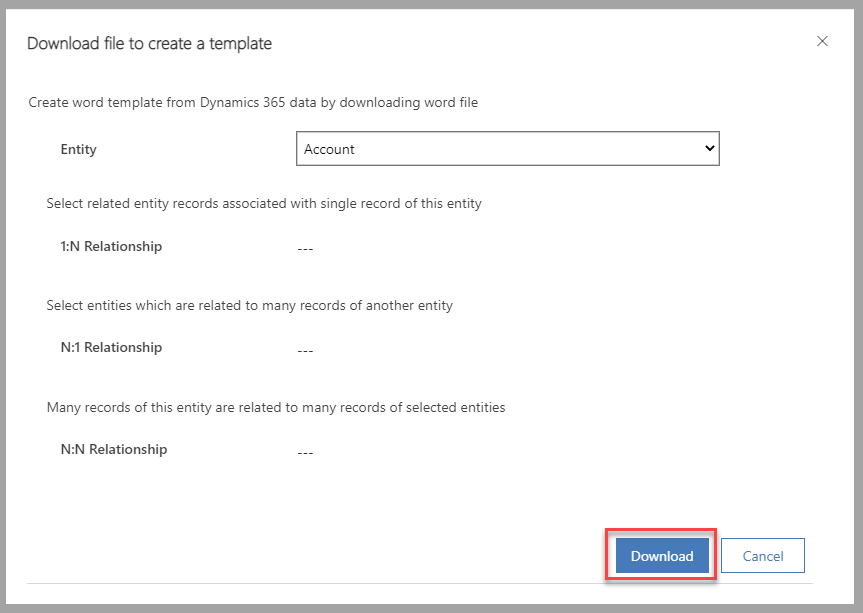
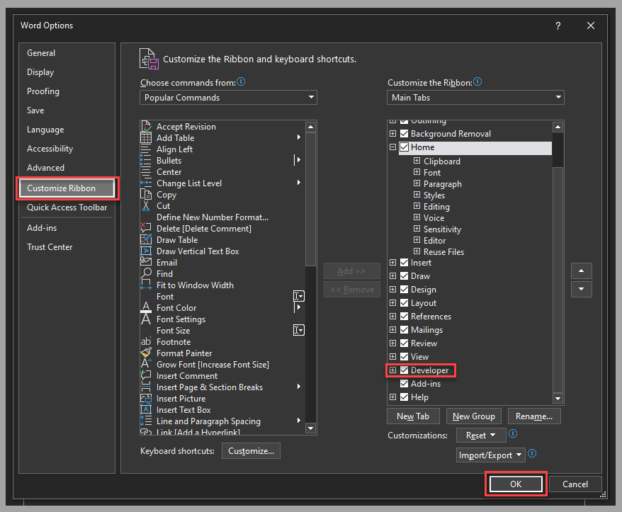
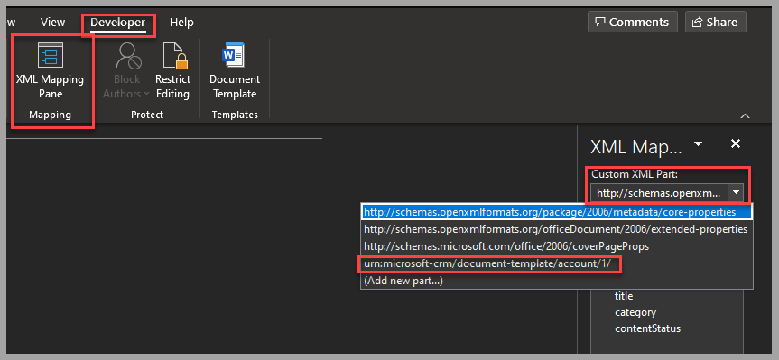
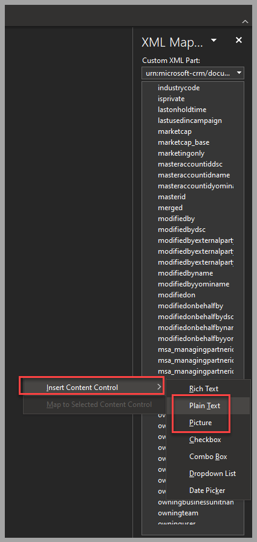
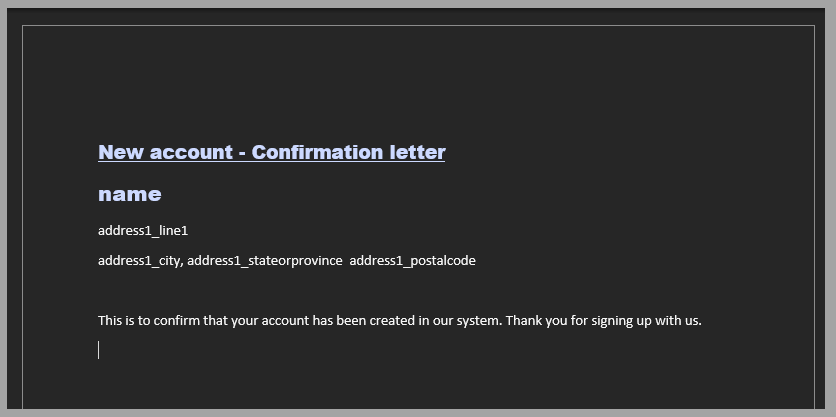
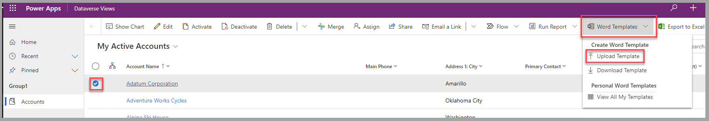
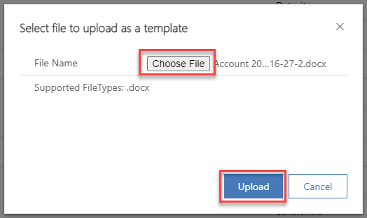
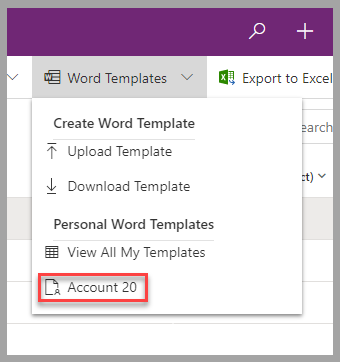
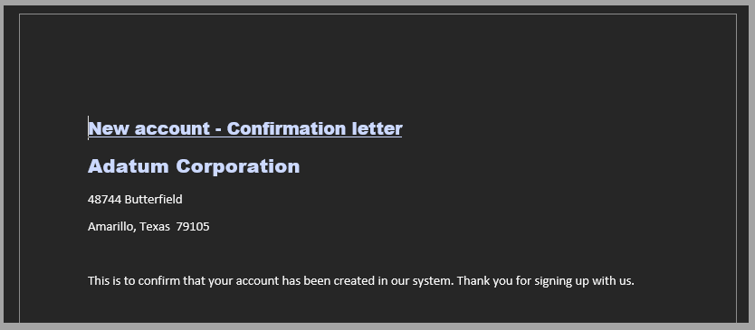

You can create a Word template in Power Apps from two different areas:

-   **Advanced settings** - Using this area requires specific permissions that are available through the System Administrator or System Customizer security roles.

-   **From a specific record** - When the record is open (main form) or selected in a list (view), those templates are available only for the user who created them.

This module will focus on personal templates.

## Create a dynamic Word template

To create a Word template based on Dataverse, follow these steps:

1.  In a model-driven app, select a specific record from a view for a target table. From the **Word Templates** dropdown menu, select **Download Template**.

	> [!div class="mx-imgBorder"]
	> 

1.  In the displayed form, confirm or select another table (entity) and indicate if any records that are related to this table are required in the template (by using the different relationship options). Select **Download** to proceed to the next step.

	> [!div class="mx-imgBorder"]
	> 

1.  Open the generated Word template (downloaded on your local computer). If the **Developer** option isn't available in the menu, enable this option from **Files > Options**. Select **Customize Ribbon**, enable **Developer**, and then select **OK** to confirm.

	> [!div class="mx-imgBorder"]
	> 

1.  Define which fields are available for the template. To do so, select **XML Mapping Pane** on the **Developer** menu. Select the **Custom XML Part** that starts with **urn:microsoft-crm/document-template/**.

	> [!div class="mx-imgBorder"]
	> 

1.  On the **XML Mapping** pane, right-click the fields to add them to the document. Then, select **Plain Text** or **Picture** under the **Insert Content Control** menu.

	> [!div class="mx-imgBorder"]
	> 

1.  Select, position, and format the fields within the document. A document might resemble the following screenshot.

	> [!div class="mx-imgBorder"]
	> 

1.  When the template is ready to be used in the application, upload the saved version of the file. In the same model-driven app and view that you used in a previous step, select a specific record. From the **Word Templates** dropdown menu, select **Upload Template**.

	> [!div class="mx-imgBorder"]
	> 

1.  In the form, select **Choose File** for the newly created template. Select **Upload** to proceed.

	> [!div class="mx-imgBorder"]
	> 

1.  The template will be available to use for any selected record of the table that it uses as a data source. To generate a new document for a record, select the template in the **Personal Word Templates** section of the **Word Templates** dropdown menu.

	> [!div class="mx-imgBorder"]
	> 

The generated document that's uploaded to your local computer is based on the template but with the information from the selected record. The following screenshot shows an example of a generated document.

> [!div class="mx-imgBorder"]
> 

## Next steps

Now, you've learned how to create a Word template that uses Dataverse as a data source to generate standardized documents. Next, you'll learn how to create a work order template.
