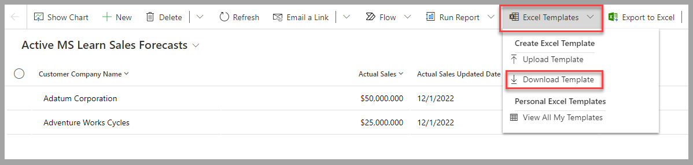
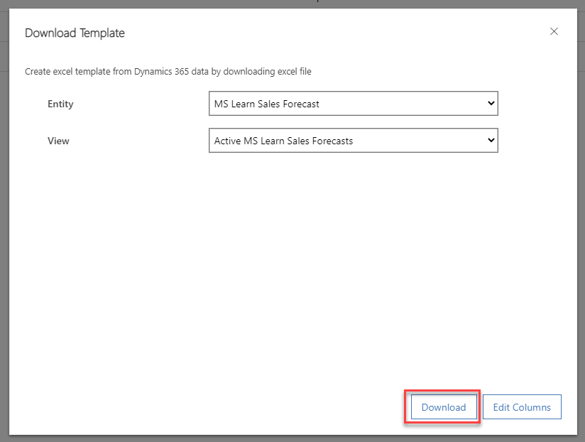
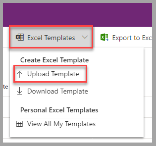
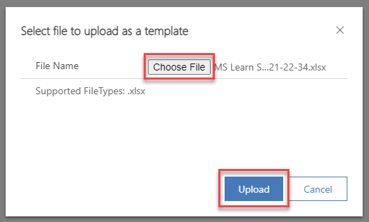
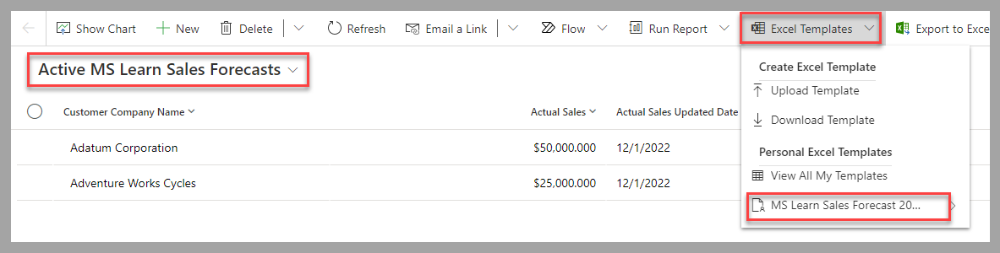
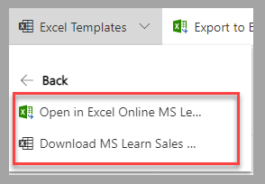

You can create an Excel template in Power Apps from two different areas:

-   **Advanced settings** - Using this area requires specific permissions that are available through the System Administrator or System Customizer security roles.

-   **From a list of records** - In a list (view), templates are available only for the user who created them.

This module focuses on personal templates.

## Create a dynamic Excel template

To create an Excel template based on Dataverse, follow these steps:

1.  In a model-driven app, from a view for the table to generate the report on, select **Download Template** from the **Excel Templates** dropdown menu.

	> [!div class="mx-imgBorder"]
	> 

1.  In the displayed form, confirm or select another table (entity) and view to filter the records that are related to the table that's required in the template. Select **Download** to proceed to the next step.

	> [!div class="mx-imgBorder"]
	> 

1.  Open the generated Excel template (downloaded on your local computer) by using a local version of the application. (Don't use Excel online.) Customize the spreadsheet as required to address your business scenario and then save the file. When the template is ready, upload it to Dataverse by selecting **Upload Template** from the **Excel Templates** dropdown menu for the table's view.

	> [!div class="mx-imgBorder"]
	> 

1.  Select the Excel template file on your computer and then select **Upload**.

	> [!div class="mx-imgBorder"]
	> 

1.  When the template has uploaded, it will be available for you to use for any selected view for the applicable Dataverse table. Select the new template from the **Personal Excel Templates** section from the **Excel Templates** dropdown menu.

	> [!div class="mx-imgBorder"]
	> 

1.  You can locally download the generated file based on the records of the view and the uploaded template, or you can open it in Excel Online.

	> [!div class="mx-imgBorder"]
	> 

## Next steps

You've now learned how to create a dynamic Excel template from Power Apps. Next, you'll learn how to use an Excel template to create a specific sales forecasting spreadsheet that's based on a Dataverse table.
