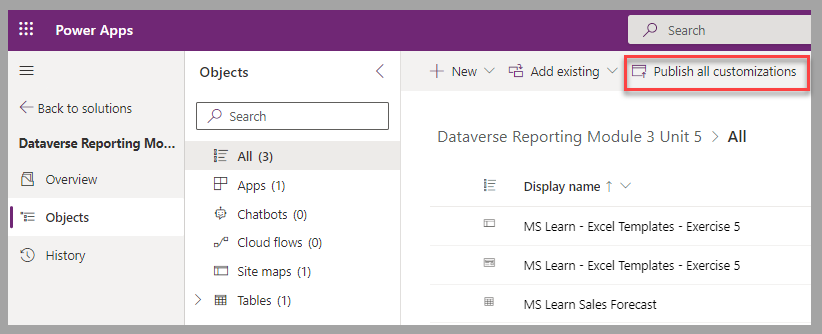
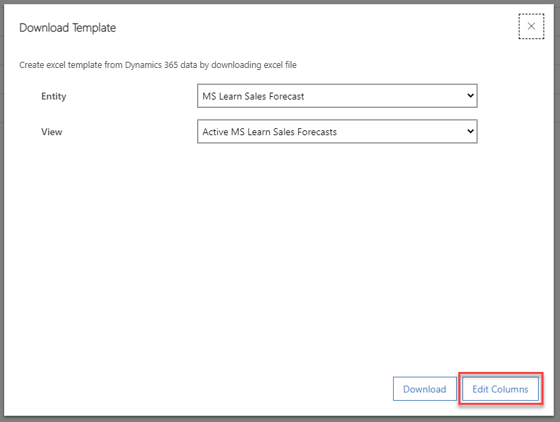

In this exercise, you'll apply your learned knowledge to create an Excel template that presents sales forecasting to colleagues.

## Scenario

You work at a bicycle retail chain and are responsible for your organization's Dataverse environment.

The finance department manager requests that you create a spreadsheet that contains sales forecast information, which the manager will include in an investment business plan. The values must be presented in a column-type graph with values summarized by months for the estimated revenues of the customers. A view on the customer's current revenues is also required.

## Prepare Dataverse

For this exercise, you'll need to create a sales forecasting table to use as the data source for the spreadsheet.

The objective of this module focuses on templates, so to accelerate the next steps, you can download a [file](https://github.com/MicrosoftDocs/mslearn-developer-tools-power-platform/blob/master/power-apps/dataverse-reporting-unit-5/DataverseReportingModule3Unit5_1_0_0_1.zip) that contains the tables that will help you proceed.

Follow these steps in a Dataverse environment where you can proceed with the import of a solution, such as a dedicated training or development environment:

1.  Sign in to the [Power Apps portal](https://make.powerapps.com/?azure-portal=true).

1.  In the left pane, select **Solutions**. In the list of solutions, select **Import solution**.

	> [!div class="mx-imgBorder"]
	> 

1.  In the **Import a solution** form, select **Browse** to find the location of the solution zip file. Select **Next** to proceed to the next step.

	> [!div class="mx-imgBorder"]
	> 

1.  Select **Import** to confirm the process of the file.

	> [!div class="mx-imgBorder"]
	> 

When the solution import process is complete, a notification message should appear in Power Apps.

To ensure that all customizations are applied in the environment, select the newly imported solution and then **Publish all customizations**.

> [!div class="mx-imgBorder"]
> 

## Prepare data

Next, you're going to need some data to your table. Here's some sample data you can input:

| Customer Company Name | Actual Sales | Actual Sales Updated Date | Estimated Revenues | Estimated Revenue Target Date |
|-----------------------|--------------|---------------------------|----------------|---------------------|
|Adatum Corporation|50000000|2022-12-01|150000000|2023-03-01|
|Adventure Works Cycles|25000000|2022-12-01|250000000|2022-12-30|
|Alpine Ski House|15000000|2022-12-01|32500000|2023-01-15|
|Bellows College|5360000|2022-12-01|2780000|2023-01-15|

Alternatively, if you're a little more experienced in importing data, you can download this data as a comma-separated values (CSV) [file](https://github.com/MicrosoftDocs/mslearn-developer-tools-power-platform/blob/master/power-apps/dataverse-sales-forecast/MS%20Learn%20Sales%20Forecast.csv). (For more information, see [Import from an Excel or CSV file](/power-apps/maker/data-platform/data-platform-import-export?azure-portal=true#import-from-an-excel-or-csv-file).)

## Create a spreadsheet template

You've created the sales forecast table and have added records to it. Now, you can create the spreadsheet template.

1. In the imported solution, go to the **MS Learn - Word Templates - Exercise 5** model-driven app and then select **Play**.

	> [!div class="mx-imgBorder"]
	> 

1. For the **Active MS Learn Sales Forecast** view, select **Download Template** from the **Excel Templates** dropdown menu.

	> [!div class="mx-imgBorder"]
	> 

1. In the **Download Template** form, select **Edit Columns** to remove fields that aren't required in the Excel spreadsheet.

	> [!div class="mx-imgBorder"]
	> 

1. In the list of columns, clear the **Name** checkbox. Select **Download** to proceed to the next step.

	> [!div class="mx-imgBorder"]
	> 

1. Open the file that's downloaded in your computer. Save it with a name that will clearly identify the template after it's been uploaded back into Dataverse, such as **Sales Forecast Template.xlsx**. You may be prompted to **Enable editing**, go ahead and do that.

	> [!div class="mx-imgBorder"]
	> 

1.  Records are listed as a data table. The first step to display the estimated revenues by month in a graph is to select **From Table/Range** under **PivotTable** in the **Insert** section of the menu.

	> [!div class="mx-imgBorder"]
	> 

1.  By default, the current table will be set as the Table/Range value. Select **OK** to proceed with the creation of the PivotTable.

	> [!div class="mx-imgBorder"]
	> 

1.  In the newly created worksheet, set up the PivotTable with the formatting (currency) and column selections to display monthly estimated revenues by customers.

	> [!div class="mx-imgBorder"]
	> 

1.  To create the requested graph, select **PivotChart** under **PivotTable Analyze**. Select the **Clustered Column** chart type under the **Column** category. Select **OK** to proceed to the next step.

	> [!div class="mx-imgBorder"]
	> 

1. Resize and move the generated graph over the table. (It isn't required to display the PivotTable.)

	> [!div class="mx-imgBorder"]
	> 

1. The next request from the finance department manager is to list the customers with their actual sales. Proceed the same way as you did for previous steps, except this time, select the **Existing Worksheet** option to place the PivotTable next to the graph.

	> [!div class="mx-imgBorder"]
	> 

1. In the worksheet where the graph and new PivotTable are located, set up the PivotTable with the formatting (currency) and column selections to display actual sales by customers.

	> [!div class="mx-imgBorder"]
	> 

1. To update Dataverse with the new template, save the file and then select **Upload Template** from the **Excel Templates** menu for the applicable view.

	> [!div class="mx-imgBorder"]
	> 

1. Select the Excel template file and then select **Upload** to proceed.

	> [!div class="mx-imgBorder"]
	> 

1. To test the template, modify the sales forecast records with other values. Then, select the **Sales Forecast Template** in the **Personal Excel Templates** section of the **Excel Templates** menu that's available for the table's view.

	> [!div class="mx-imgBorder"]
	> 

1. When you open the generated spreadsheet, if the graph and PivotTables aren't updated with the new values, select **Refresh All** on the **Data** menu.

	> [!div class="mx-imgBorder"]
	> 

## Next steps

You've now learned how to create an Excel template based on a Dataverse table view, which allows you to present this data by using the full analysis and presentation features of Excel. Next, you'll validate the learned concepts for this module.
