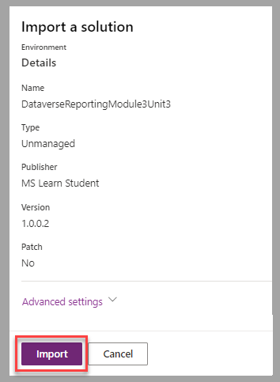

In this exercise, you'll create a Word template that contains work order details to be distributed to technicians.

## Scenario

You work at a bicycle store and are responsible for your company's Dataverse environment.

The service manager asks you to provide technicians with a list of maintenance tasks and repairs that they must complete for customers. The physical environment doesn't allow for computers or tablets to be used efficiently, so the manager wants you to print work order forms for the technicians at the beginning of the work day.

## Prepare Dataverse

For this exercise, we need to create two tables:

- **Work Order** - Header information about a work order.

- **Work Order Detail** - Line items for the work order or list of tasks and repairs that a technician must complete. This will be a child table for the Work Order.

The objective of this module focuses on templates. To accelerate the next steps, you can download this [package file](https://github.com/MicrosoftDocs/mslearn-developer-tools-power-platform/blob/master/power-apps/dataverse-module-3/DataverseReportingModule3Unit3_1_0_0_2.zip) that contains the tables that will help you proceed.

Follow these steps in a Dataverse environment where you can proceed with the import of a solution, such as a dedicated training or development environment:

1. Sign in to the [Power Apps portal](https://make.powerapps.com/?azure-portal=true).

1. In the left pane, select **Solutions**. In the list of solutions, select **Import solution**.

	> [!div class="mx-imgBorder"]
	> 

1. In the **Import a solution** form, select **Browse** to find the location of the solution zip file. Select **Next** to proceed to the next step.

	> [!div class="mx-imgBorder"]
	> 

1. Select **Import** to confirm the process of the file.

	> [!div class="mx-imgBorder"]
	> 

	When the solution import process is complete, a notification message should appear in Power Apps studio, letting you know that the module was imported successfully.

1. To ensure that all customizations are applied in the environment, select the imported solution to open it.

1. From the solution screen, select **Publish all customizations** from the command bar. Once you see the notification **Publish all customizations succeeded**, continue on.

	> [!div class="mx-imgBorder"]
	> 

## Prepare data tables

1. Take a moment to view and prepare the data tables. Select the **MS Learn Work Order** table. In the **columns and data** pane in the lower portion of the screen, ensure that the columns displayed are: Name, Customer Name, Scheduled Date and Service Technician Name. You can do this by selecting the **+[number] more** button on the right side of the column header.

1. In the **Show existing column** dialog, find and select those columns and deselect any others so that your data looks like the image below:

	> [!div class="mx-imgBorder"]
	> 

1. Save your column selections.

1. Now let's look at the Work Order Detail table. From the **Objects** pane on the left side of your screen, find **Tables** and select your **MS Learning Work Order Detail** table.

1. From your **columns and data** pane select the **+[number] more** button and select the columns: Name, Completed, Estimated Effort (Minutes), and Service Item.

1. Next, let's make a lookup column to link it to the Work Order table. Doing this ensures we have a relationship with the Work Order table. Select the **+ [New column]** button on the far right of the column bar.

1. In the **New column** panel, input/select the following:
	- Display name: `Work Order`

	- Data type: `Lookup`

	- Related table: `MS Learn Work Order`

	Select **Save** to continue.

## Add sample data to your tables

Next we need to add some data to our tables, so that we'll have data to produce a work order for our technicians.

Here's some sample data for your work orders (dates aren't important to match):

| Name | Customer Name | Scheduled Date | Service Technician Name |
|------|---------------|----------------|-------------------------|
|Eric Solomon Seat Adjustment| Eric Solomon | 8/11/2023 | Preston Morales |
|Henry Ross Tire Repair|Henry Ross| 8/11/2023 |Rory Nyuyen |

Enter the following information for your work order details:

| Name | Completed | Estimated Effort (Minutes) | Service Item | Work Order |
|------|-----------|----------------------------|--------------|------------|
|Chain Lubricant|No|10|Chain Lubricant|Henry Ross Tire Repair|
|Seat Adjustment|No|20|Seat Adjustment|Eric Solomon Seat Adjustment|
|Tire Repair|No|15|Tire Repair|Henry Ross Tire Repair|

If you're a little more advanced, you can download these comma-separated values (CSV) files and import them into your data:

- A [file](https://github.com/MicrosoftDocs/mslearn-developer-tools-power-platform/blob/master/power-apps/dataverse-work-order/MS%20Learn%20Work%20Order.csv) that contains a list of sample work orders. You can import this directly into your table.

- A [file](https://github.com/MicrosoftDocs/mslearn-developer-tools-power-platform/blob/master/power-apps/dataverse-work-order-detail/MS%20Learning%20Work%20Order%20Detail.csv) that contains a list of sample work order detail lines.

For importing help, see [Import from an Excel or CSV file](/power-apps/maker/data-platform/data-platform-import-export?azure-portal=true#import-from-an-excel-or-csv-file). You may find it easier to manually input data for both tables, if you aren't experienced in importing data.

With our sample data setup, let's get to the crux of the exercise.

## Create a document template

You've created the work order and work order detail tables, and you've added records to each. Now, you can create the document template.

1. In the imported solution, find the **MS Learn - Word Templates - Exercise 3** model-driven app and then select **Play**.

	> [!div class="mx-imgBorder"]
	> 

1. Select one of your work order records and then select **Download Template** from the **Word Templates** dropdown menu.

	> [!div class="mx-imgBorder"]
	> 

1. In the **Download Template** form, leave the **MS Learn Work Order** default table in the **Entity** dropdown menu. To ensure that the list of tasks will be accessible in the template, select **MS Learning Work Order Detail** in the **1:N Relationship** list. Select **Download** to proceed to the next step.

	> [!div class="mx-imgBorder"]
	> 

1. Open the **Word** template file that you downloaded to your computer and enable editing.

1. Select the **Developer** tab and open the **XML Mapping Pane**.

1. In the **XML Mapping Pane**, select the **urn:microsoft-crm/document-template/msls_mslearnworkorder** from the **Custom XML Part** dropdown. Then expand the fields.

1. Create the header portion of the work order form by selecting the **msls_scheduleddate**, **msls_servicetechnicianname**, and **msls_customername**.

	Remember to right click each one, and then insert as plain text. Then enter to a new line on your form to insert the next item.

1. Add a title, formatting, and labels to the template so that technicians can identify the values. Your template should now resemble the following image:

	> [!div class="mx-imgBorder"]
	> 

1. To list the tasks for a work order, you'll need to add a 3-column/2-row table in the template.

1. In the first data row of that table, add the **msls_serviceitem**, **msls_estimatedeffortsinminutes**, and **msls_completed** fields as plain text controls. You can find these fields by expanding **msls_msls_mslearningworkorderdetail_WorkOrder_** table at the bottom of the XML Part list.

	> [!div class="mx-imgBorder"]
	> 

1. For all work order tasks to be listed in the table, select the entire table row. Then, in the **XML Mapping** pane, select the **msls_msls_mslearningworkorderdetail_WorkOrder\_** relationship, right click and  then insert a **Repeating** type of control.

	> [!div class="mx-imgBorder"]
	> 

1. Save the document and then upload it to Dataverse. Select a work order record and then select **Upload Template** from the **Word Templates** dropdown menu.

	> [!div class="mx-imgBorder"]
	> 

1. Select the template Word file on your local computer and then select **Upload**.

	> [!div class="mx-imgBorder"]
	> 

1. After the template has been uploaded, it will be available for you to use for standardized document generation. Select a work order record and then select the new template from the **Personal Word Templates** section of the **Word Templates** dropdown menu.

	> [!div class="mx-imgBorder"]
	> 

1. The generated document will be downloaded to your computer. Open it and then confirm that the result is with the work order details, including the list of tasks for the technician. At this point, you can print it to have it available for the technician.

	> [!div class="mx-imgBorder"]
	> 

## Next steps

You've now learned how to create a Word template based on a set of related Dataverse tables, including a series of records that are repeated based on the number of applicable records. Next, you'll learn how to create a dynamic Excel spreadsheet based on a Dataverse table.
