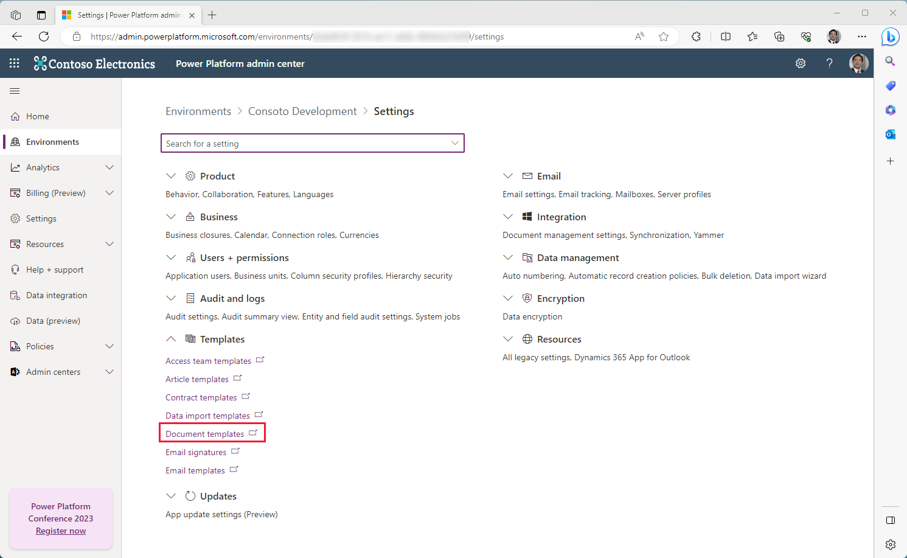
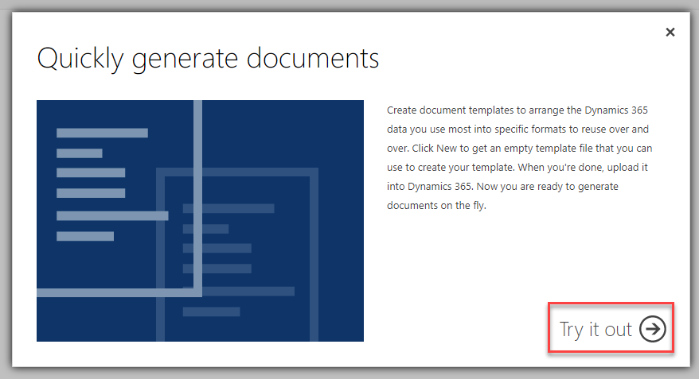

Other than storing data, one main driver behind using a database, such as Microsoft Dataverse, is to use this data in applications and then share it with others through standardized documents. You could address the following sample scenarios by using Microsoft Word and Microsoft Excel templates with Dataverse as the source:

- Provide a work order detail to a field technician.

- Generate an insurance policy certificate for a customer.

- Share a prospect list with a colleague.

## Use Word templates in Power Apps

After a Word template has been uploaded into Dataverse, a user of a model-driven app from Microsoft Power Apps can generate a standardized document that's populated with selected data.

## Use Excel templates in Power Apps

After an Excel template has been uploaded into Dataverse, a user of a model-driven app from Power Apps can use the template to consume relevant data and then share the outcome with other Power Apps users.

## Enable templates in Power Apps

To use the native Word and Excel templates integration with Dataverse, you'll need to first enable the integration through the Power Platform admin center. To proceed, follow these steps:

1. Sign in to the [Power Platform admin center](https://admin.powerplatform.microsoft.com/?azure-portal=true).

1. Select the **Environments** tab, and then select an environment where you want to enable integration.

1. Select **Settings** from the command bar.

1. In the **Settings** screen, expand the **Templates** section.

1. Select **Document templates**. Once you do a separate browser tab will open.

	> [!div class="mx-imgBorder"]
	> 

1. The first time that you access the **Document Templates** section, a confirmation message will display. Select **Try it out** to proceed.

	> [!div class="mx-imgBorder"]
	> 

Once you've opted to **Try it out**, you'll see an **Available Templates View** which will be empty, until you create one. This will be the place where you end up after you select **Document templates** from the **Settings** page for your environment.

For this module, we'll focus on creating templates from Dataverse based on a specific table. You can use the skills you learn here for more complex scenarios in the future.

## Next steps

Now that you've learned the fundamentals of templates for Dataverse and enabled the feature, you'll learn how to create a dynamic Word document based on a Dataverse record.
