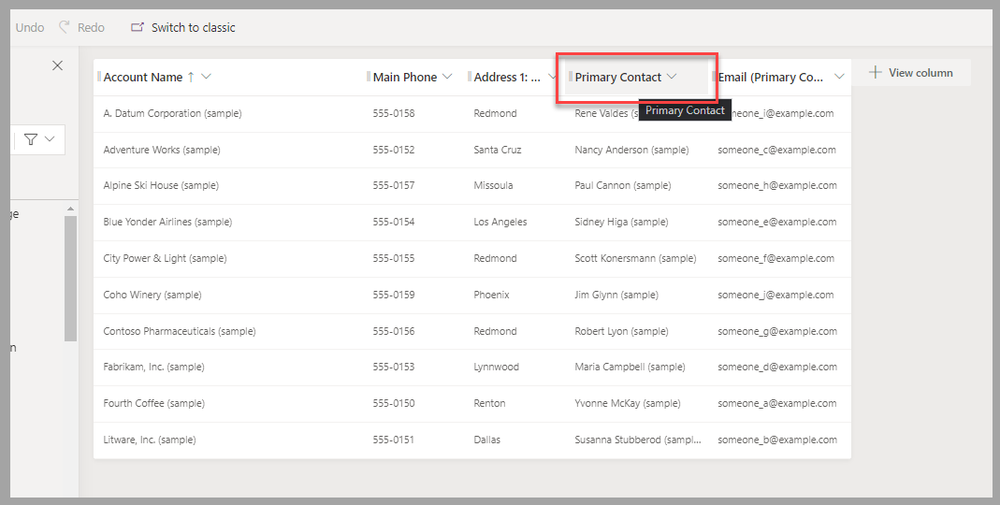
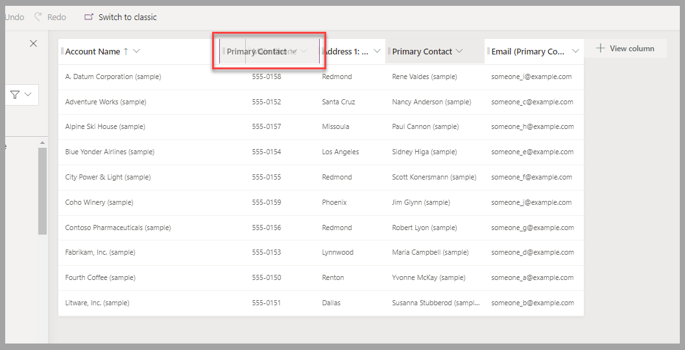
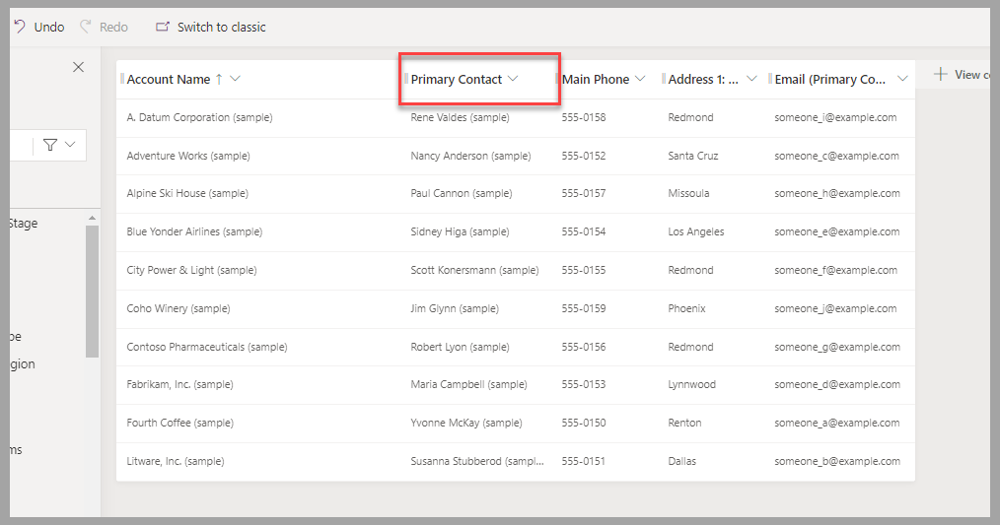
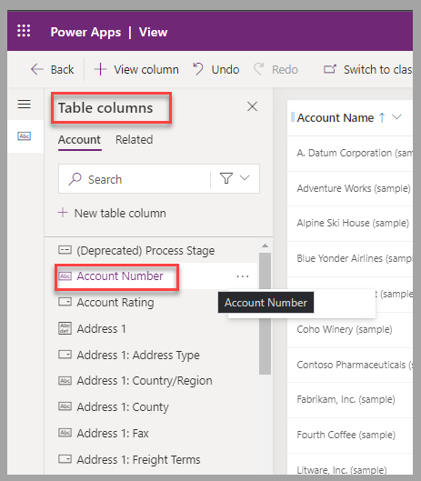
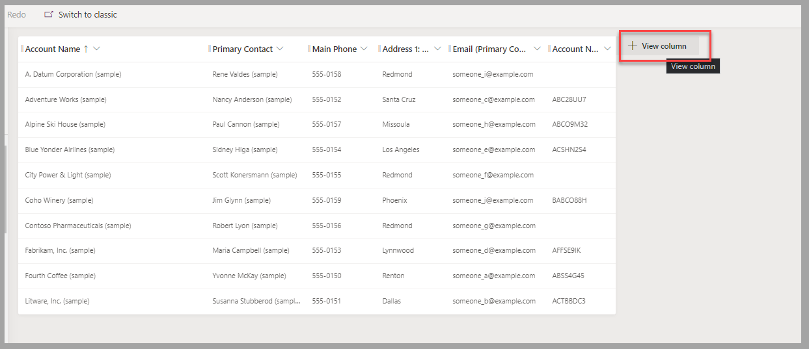
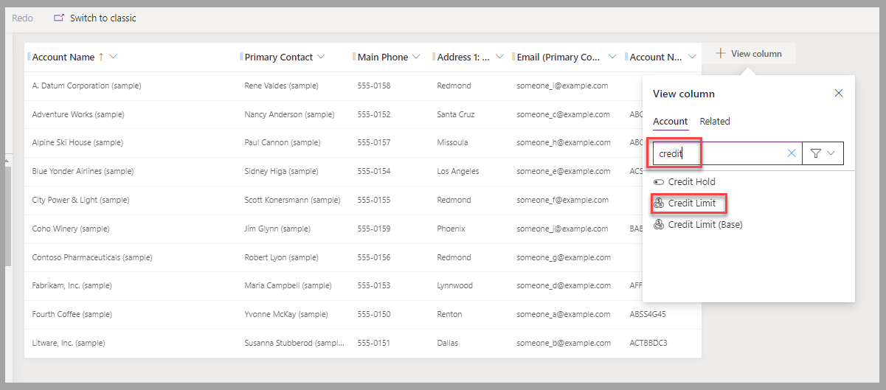
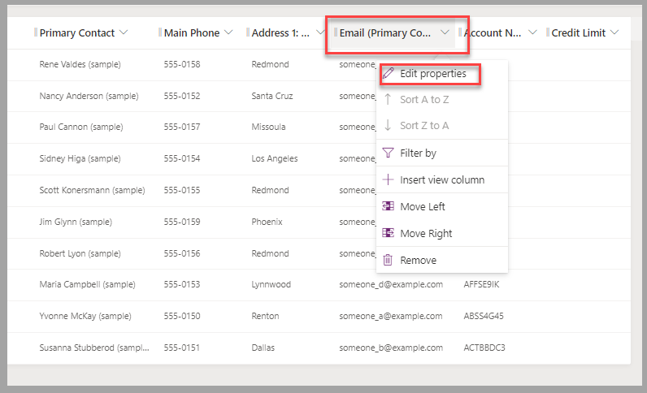
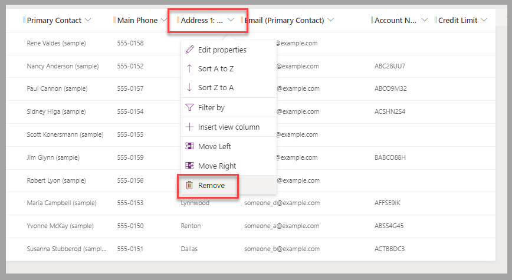

In this exercise, you'll add columns to an existing view.

## Scenario

You work at a bicycle store and are responsible for your organization's Dataverse environment.

The purchase department employees are using an app from Power Apps that you built to help them manage providers and orders. After they use this system for a few weeks, the employees request modifications to it.

For the list of accounts that's presented to them, the employees want to:

- Move the **Primary Contact** column next to the **Account Name** column.

- Add **Account Number** and **Credit Limit** as the last columns.

- Resize the **Email (Primary Contact)** column to be wider (about 150 percent of current size).

- Remove the **City** column.

## Exercise

Go to a Dataverse environment where you can modify the tables, such as a dedicated training or development environment. Then, follow these steps to complete the tasks:

1. Sign in to [Power Apps portals](https://make.powerapps.com/?azure-portal=true).

1. In the left pane, expand **Dataverse** and then select **Tables**.

    > [!div class="mx-imgBorder"]
    > 

1. In the list of tables, select **Account**.

    > [!div class="mx-imgBorder"]
    > 

1. In Power Apps portals, for the Account table, select **Views**.

    > [!div class="mx-imgBorder"]
    > 

1. Select the **Active Accounts** view.

    > [!div class="mx-imgBorder"]
    > 

1. Move the contact name to the requested location. Select the **Primary Contact** column header.

    > [!div class="mx-imgBorder"]
    > 

1. Drag the column heading to the left toward the **Account Name** column.

    > [!div class="mx-imgBorder"]
    > 

1. Drop the column heading next to the **Account Name** column.

    > [!div class="mx-imgBorder"]
    > 

1. Add the **Account Number** column by selecting it in the list of columns in the left pane.

    > [!div class="mx-imgBorder"]
    > 

Now try a different method to add columns.

1. Add the **Credit Limit** column by selecting **+ View column**.

    > [!div class="mx-imgBorder"]
    > 

1. Enter **credit** in the search field and then select **Credit Limit**.

    > [!div class="mx-imgBorder"]
    > 

1. To change the size of a displayed column, you can drag the column separators or proceed through the following steps:

    a. Select the **Email (Primary Contact)** column header, and then select **Edit properties**.

    > [!div class="mx-imgBorder"]
    > 

    b. Modify the **View column width** property. (In this case, the request is to increase by 150 percent, so you'll modify the value to **225** pixels.)

    > [!div class="mx-imgBorder"]
    > 

    c. Select **Apply** to complete the modification.

    > [!div class="mx-imgBorder"]
    > 

1. To remove a column, select the **Address 1: City** column heading and then select **Remove**.

    > [!div class="mx-imgBorder"]
    > 

1. To apply changes and make them available to Power Apps users, select **Save > Publish**.

    > [!div class="mx-imgBorder"]
    > 

## Exercise steps (video)

Watch the following video for a demonstration of the steps that you completed in this exercise.

> [!VIDEO https://www.microsoft.com/videoplayer/embed/RE58QOi]

## Next steps

You've learned how to add, modify, and remove columns in a Dataverse table view. Next, you'll learn how to apply filter criteria to limit the list of records that are presented and how to sort data in Dataverse views.
